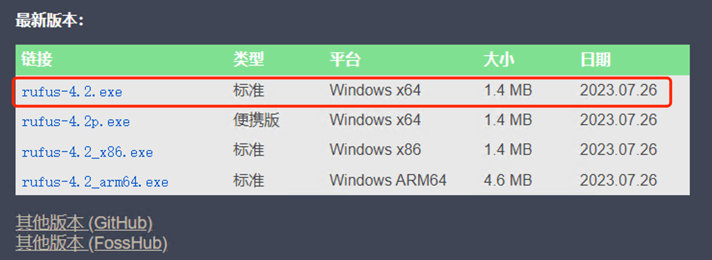
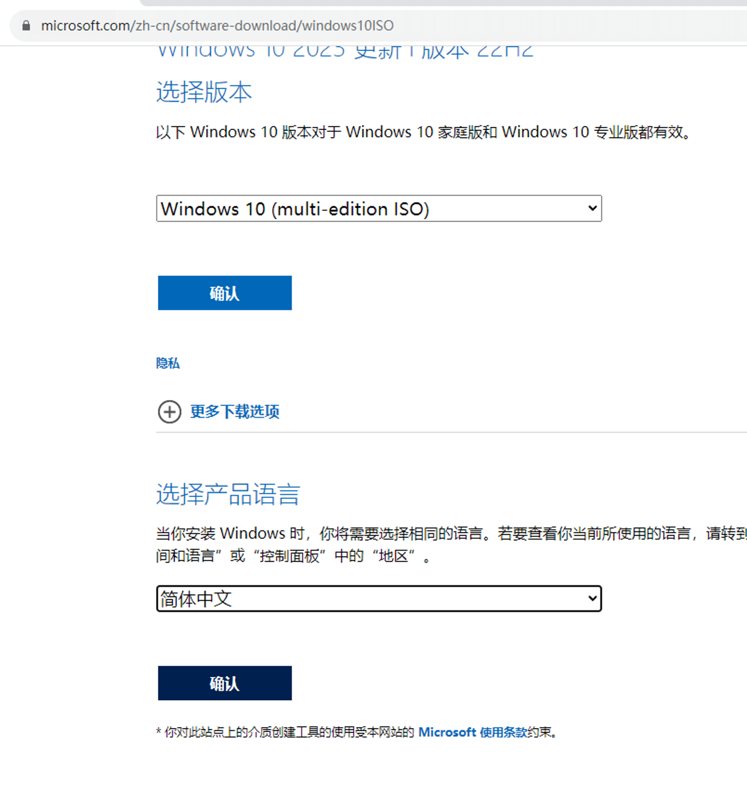
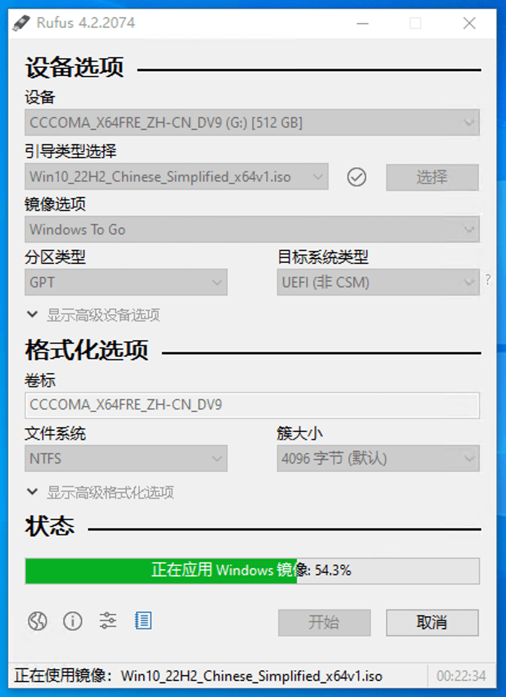

# Steam Deck 如何安装 WinToGo

hello大家好，这期我们来聊聊如何在 Steam Deck 上安装 Windows。因为目前 SteamDeck 官方对双引导的支持还不够好，有可能 SteamOS 系统更新后掉引导，所以我们目前使用 WinToGo 的方式安装 windows，WinToGo 是把 windows 系统安装到 tf 卡里，因为是装到 tf 卡里的，windows 所有的东西都放在这张 tf 卡里，所以不管怎么折腾都不会影响到原来的 SteamOS 系统，大不了把 tf 卡格式化了重新开始，适合喜欢尝鲜，爱折腾的同学。

首先，我们要准备一台 windows 电脑，一张 tf 卡，一个 tf 卡的读卡器。

#### 下载 rufus

[rufus官网](https://rufus.ie/zh/)

下载标准版 x64 的就行。

#### 下载 win10 iso 文件

[微软官方下载ISO](https://www.microsoft.com/zh-cn/software-download/windows10ISO)

这里我是希望大家能自己去搜索资源去下载，毕竟找资源也是一种能力。

如果是在 windows 电脑上直接打开这个链接的话是看不到下载地址的，我们可以右键检查，然后模拟成移动设备，然后刷新页面，就能看到下载地址了。

选择 Multi edition，点击确认。

然后选择中文。确认，选择 64 位的，就开始下载了。

#### 制作 wintogo 启动盘

rufus 和 iso 下载好之后，我们就可以开始做 winToGo 了。

把 tf 卡插入电脑，打开 rufus

设备选择我们的 U 盘，然后载入镜像文件，镜像选项选择 winToGo 的方式。其他的保持默认。

点击开始，选择专业版，勾选阻止 winToGo 访问内部磁盘，这样就不会影响到 SteamOS 系统。

等进度条走完，就制作好了。

然后我们进入 u 盘看看是怎么样的。哎，有没有感觉很熟悉，这是一个 C 盘的目录结构。接下来我们先去下载驱动，放到 u 盘里先。这样等下插到 Steam Deck 里面的话就不用再传一遍了。

#### 下载驱动放到 tf 卡中

[windows 驱动下载](https://help.steampowered.com/zh-cn/faqs/view/6121-ECCD-D643-BAA8)

网址我会贴在评论区，下载的就是这 6 个驱动文件。下载好后我们放到 tf 卡里，就放到下载的文件夹里吧，文件夹是随便放的，没关系。

#### 启动 windows

我现在是已经把 tf 卡插到 steam deck 里了，然后我们要先按住音量减号键，然后再按一下开机键，这个过程要一直按住减号键，直到出现引导界面。

然后我们选择 tf 卡启动。

