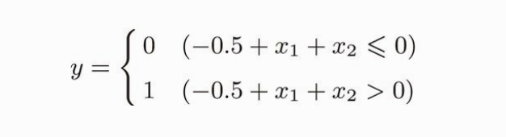
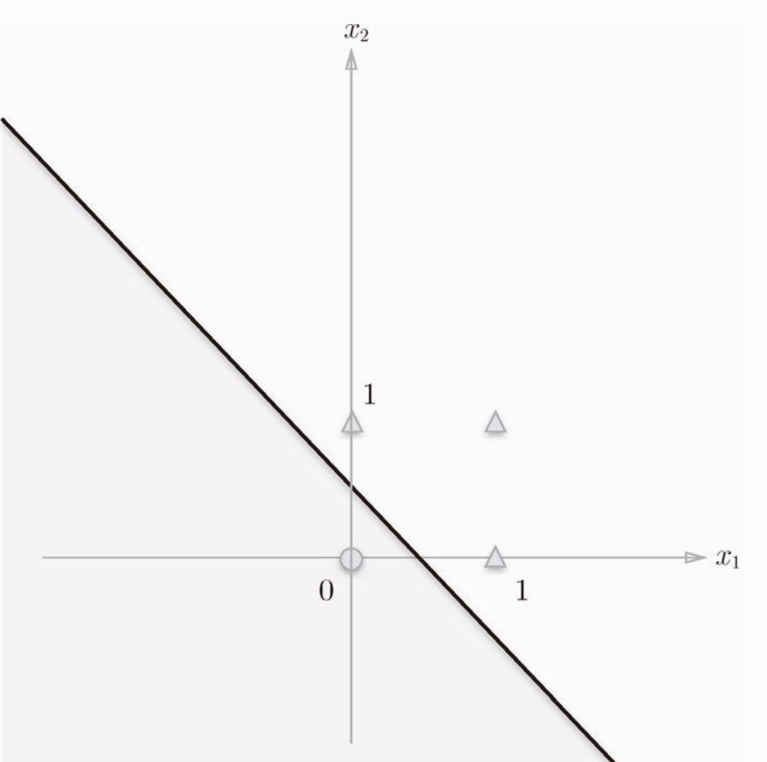
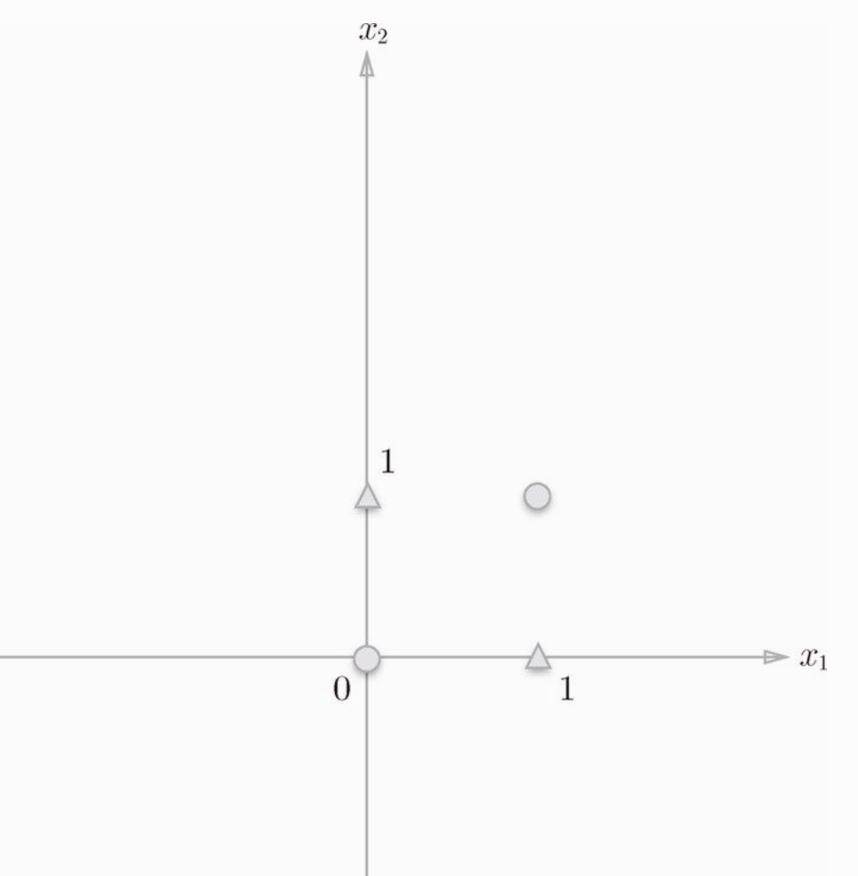
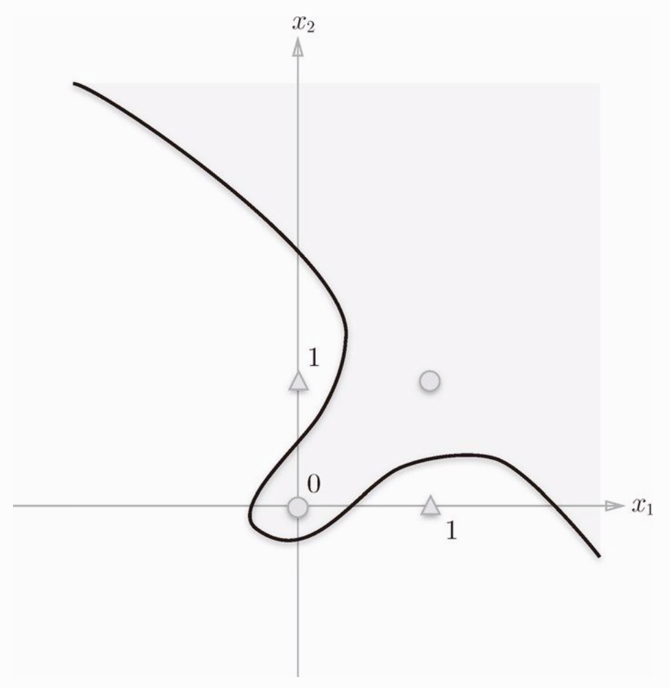
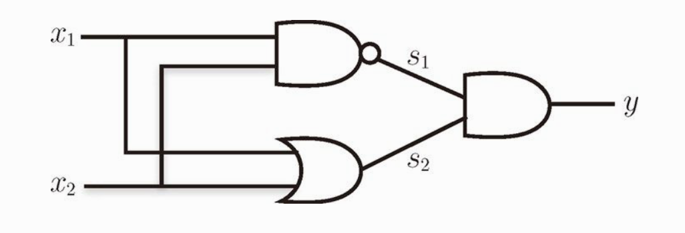
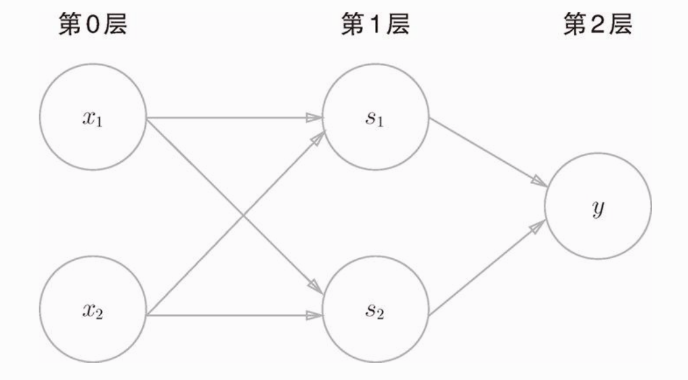

很长一段时间，我都搞不清楚机器学习和深度学习，神经网络之间是什么关系？不懂机器学习可以直接看深度学习吗？神经网络又是啥？后来看了一个大佬的解释才明白，机器学习和深度学习的区别就好像汇编语言和C语言的区别，不懂汇编照样可以学习C语言，可以用C语言做东西，深度学习也一样，当然懂机器学习的话更好。神经网络加深层后就叫做深度学习。

本篇主要是总结最近看的一本《深度学习入门：基于Python的理论与实现》这本书做的一些总结。这本书非常不错，日本人写的书，讲的很细，从零开始手把手教你撸一个深度学习的神经网络。（而且还有 epub 格式的电子书）

目录：

- [python 基础](#python-基础)
- [感知机](#感知机)
- [神经网络](#神经网络)

# python 基础

书的最开篇，按照惯例，事先学习 python（3.x） 的基本语法和 NumPy 计算库，NumPy 库提供了遍历的矩阵操作方法。还有 Matplotlib 库是用来画图的，可以把一些函数用图片的方式直观的展示出来。

NumPy 和 Matplotlib 都是第三方库，需要用 pip install 一下。

NumPy 库中常用的方法说明：

```
import numpy as np

# 创建一个矩阵
A = np.array([[1,2],[3,4]])
# 矩阵 A 的形状，这里返回 (2, 2) ，表示2行2列的矩阵
A.shape
> (2, 2)
B = np.array([[3,0],[0,6]])

# 相当于是进行普通的两个矩阵乘法运算（A * B）
np.dot(A, B)
> array([[ 3, 12],
       [ 9, 24]])

# 以 0.1 为单位，生成0～5的数据
C = np.arange(0, 6, 0.1)
```

Matplotlib 库中常用的方法说明：
```
import matplotlib.pyplot as plt

# 以 0.1 为单位，生成0～5的数据
x = np.arange(0, 6, 0.1)
y = np.sin(x)

# 绘制图形
plt.plot(x, y)
# 显示 x 轴标签
plt.xlabel("x")
# 显示 y 轴标签
plt.ylabel("y")
# 显示图形
plt.show()
```

# 感知机

看完 python 基础，这节我们要来实现一个“感知机”（虽然听不懂，但是好像很牛b的东西）。

感知机是作为神经网络（深度学习）的起源算法。学习感知机能了解神经网络到底是个什么东西。

感知机接收多个输入信号，输出一个信号。这里说的信号可以想像成电流或者河流一样的东西，感知机的信号会形成流，向前方输送信息。但是感知机的信号只有流或不流两种取值（1 或 0），1对应传递信号，0对应不传递信号。

下图是一个有两个输入的感知机的例子：

<div align="center"></div>

x1 和 x2 是输入信号，w1 和 w2 是权重，y 是输出。图中的三个圆圈称为神经元或者节点。输入信号传递到神经元时，会分别乘以固定的权重。y神经元会计算传递过来的信号的总和，只有当这个总和超过了某个阈值(theta)，y神经元才会输出1。

用公式表示就是

<div align="center"></div>

但是考虑到更通用的形式，我们把式子改成如下形式

<div align="center"></div>

θ 符号移到了左边变成了 -θ ，命名为 b ，但表达的内容是完全相同的。w1 和 w2 叫做权重，b 在这里叫做偏置。感知机会计算输入信号和权重的乘积，再加上某个偏置，如果这个值大于0，则输出1，否则输出0。

具体地说，w1 和 w2 是控制输入信号重要性的参数，b 则是调整神经元被激活的容易程度。

那到底感知机有什么用呢？接下来我们用感知机来解决一个简单的问题。

我们用感知机来实现逻辑电路里的"与门"。

与门

| x1 | x2 | y |
|----|----|---|
| 0  | 0 | 0 |
| 0  | 1 | 0 |
| 1  | 0 | 0 |
| 1  | 1 | 1 |

上图中得知，与门是只有在 x1，x2 都为1的情况下，输出才为1。事实上，满足这个条件的参数有无数种，比如 w1，w2 为 0.5，b 为 -0.7，或 w1，w2 为 1.0，b 为 -1.0 都可以。

我们再来看一下"与非门"和"或门",

与非门：

| x1 | x2 | y |
|----|----|---|
| 0  | 0 | 1 |
| 0  | 1 | 1 |
| 1  | 0 | 1 |
| 1  | 1 | 0 |

或门：

| x1 | x2 | y |
|----|----|---|
| 0  | 0 | 0 |
| 0  | 1 | 1 |
| 1  | 0 | 1 |
| 1  | 1 | 1 |

与非门是与门的取反，或门是只要有一个输入信号为1，输出就为1。

那么我们来考虑一下权重w和偏置b。

在 "与非门" 中 w1，w2 为 -0.5，b 为 0.7 就可以，事实上就是与门参数的取反。

"或门" 中 w1，w2 为 1.0，b 为 -0.5 就可以。

这很容易，看图就能看出来。（渐渐骄傲...）

那么，接下来我们来取一下"异或门"的权重和偏置

异或门

| x1 | x2 | y |
|----|----|---|
| 0  | 0 | 0 |
| 0  | 1 | 1 |
| 1  | 0 | 1 |
| 1  | 1 | 0 |

哈哈，想不出来了吧！！！（立即打脸）

事实上，感知机是无法实现这个异或门的！我们可以通过画图来思考其中的原因。

我们看一下 "或门" 的图，如果取 w1，w2 为 1.0，b 为 -0.5，则表达式为

<div align="center"></div>

画成图就是这样：

<div align="center"></div>

那么，灰色区域就是小于等于0的区域，白色区域就是大于0的区域（输出1的区域）。

图片可以看出，把图片三角形和圆形分割开的直线有无数条，所以权重和偏置也有无数种可能。那么，异或门的图是怎样的呢？

<div align="center"></div>

图片可以看到，因为感知机的表达式是一个直线，一条直线是无法把上图中的三角形和圆形分开的，只能用曲线分开，如下图：

<div align="center"></div>

感知机的局限就在于只能表示线性函数，这样弯曲的曲线无法表示。另外，由直线能分割的空间称为线性，曲线才能分割的空间称为非线性。线性，非线性这两个术语在机器学习中很常见。

虽然，我们用单个感知机不能表示异或门，但是我们可以通过叠加层，来表示异或门。

如下图所示：

<div align="center"></div>

组合 与门，与非门，或门

| x1 | x2 | s1 | s2 | y |
|----|----|---|---|---|
| 0  | 0 | 1 | 0 | 0 |
| 0  | 1 | 1 | 1 | 1 |
| 1  | 0 | 1 | 1 | 1 |
| 1  | 1 | 0 | 1 | 0 |

图中，x1 和 x2 通过 "与非门" ，输出 s1。通过 "或门" 输出 s2。再以 s1，s2 为输入，通过 "与门" ，输出 y。实现了异或门。

以神经元的表示方法显示异或门：

<div align="center"></div>

如图，异或门是一个多层结构的神经网络，最左边的输入层称为第0层，中间一列称为第1层，最右边的称为第2层。但是我们在这里把它叫做“2层感知机”，因为有权重的只有两层。

像 "异或门" 这样，还可以解释为“单层感知机无法表示的东西，通过增加一层就可以解决”。也就是说，通过叠加层，可以表示更灵活的东西。

# 神经网络
