很长一段时间，我都搞不清楚机器学习和深度学习，神经网络之间是什么关系？不懂机器学习可以直接看深度学习吗？神经网络又是啥？后来看了一个大佬的解释才明白，机器学习和深度学习的区别就好像汇编语言和C语言的区别，不懂汇编照样可以学习C语言，可以用C语言做东西，深度学习也一样，当然懂机器学习的话更好。神经网络加深层后就叫做深度学习。

本篇主要是总结最近看的一本《深度学习入门：基于Python的理论与实现》做的一些总结，文章中的例子和图片都是从书中截出来的。这本书非常不错，日本人写的书，讲的很细，从零开始手把手教你撸一个深度学习的神经网络。（而且还有 epub 格式的电子书）

# 目录：

- [python 基础](#python-基础)
- [感知机](#感知机)
- [神经网络简介](#神经网络简介)
- [三层神经网络](#三层神经网络的实现)
- [输出层的设计](#输出层的设计)
- [训练数据和测试数据](#训练数据和测试数据)
- [损失函数](#损失函数)
- [导数](#导数)
- [偏导数](#偏导数)
- [梯度](#梯度)
- [梯度下降法](#梯度下降法)
- [手写一个神经网络](#手写一个神经网络)
- [反向传播法](#反向传播法)
- [加法节点的反向传播](#加法节点的反向传播)
- [乘法节点的反向传播](#乘法节点的反向传播)
- [激活函数层的实现](#激活函数层的实现)
- [Affine层的实现](#Affine层的实现)
- [Dropout层](#Dropout层)
- [神经网络-反向传播法版本的实现](#神经网络-反向传播法版本的实现)
- [卷积神经网络](#卷积神经网络)
- [卷积层](#卷积层)
- [填充](#填充)
- [步幅](#步幅)
- [3维数据的卷积运算](#3维数据的卷积运算)
- [池化层](#池化层)
- [卷积层的实现](#卷积层的实现)
- [池化层的实现](#池化层的实现)
- [CNN 的实现](#CNN的实现)
- [深度学习](#深度学习)
- [VGG网络](#VGG网络)
- [几种优化算法](#几种优化算法)
- [基于 keras 的例子](#基于-keras-的例子)


# python 基础

书的最开篇，按照惯例，事先学习 python（3.x） 的基本语法和 NumPy 计算库，NumPy 库提供了遍历的矩阵操作方法。还有 Matplotlib 库是用来画图的，可以把一些函数用图片的方式直观的展示出来。

NumPy 和 Matplotlib 都是第三方库，需要用 pip install 一下。

NumPy 库中常用的方法说明：

```
import numpy as np

# 创建一个矩阵
A = np.array([[1,2],[3,4]])
# 矩阵 A 的形状，这里返回 (2, 2) ，表示2行2列的矩阵
A.shape
> (2, 2)
B = np.array([[3,0],[0,6]])

# 相当于是进行普通的两个矩阵乘法运算（A * B）
np.dot(A, B)
> array([[ 3, 12],
       [ 9, 24]])

# 以 0.1 为单位，生成0～5的数据
C = np.arange(0, 6, 0.1)
```

下图是矩阵乘积的计算方法：

<div align="center">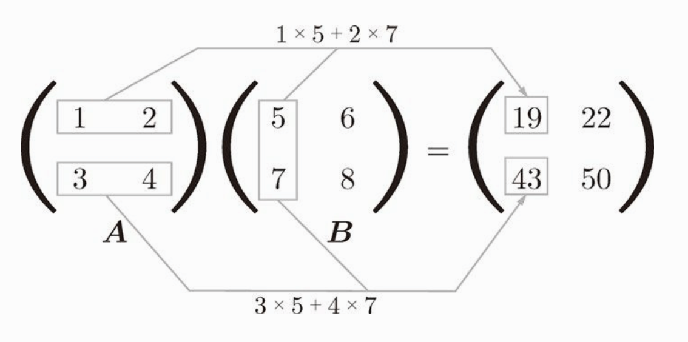</div>


Matplotlib 库中常用的方法说明：
```
import matplotlib.pyplot as plt

# 以 0.1 为单位，生成0～5的数据
x = np.arange(0, 6, 0.1)
y = np.sin(x)

# 绘制图形
plt.plot(x, y)
# 显示 x 轴标签
plt.xlabel("x")
# 显示 y 轴标签
plt.ylabel("y")
# 显示图形
plt.show()
```

# 感知机

看完 python 基础，这节我们要来实现一个“感知机”（虽然听不懂，但是好像很牛b的东西）。

感知机是作为神经网络（深度学习）的起源算法。学习感知机能了解神经网络到底是个什么东西。

感知机接收多个输入信号，输出一个信号。这里说的信号可以想像成电流或者河流一样的东西，感知机的信号会形成流，向前方输送信息。但是感知机的信号只有流或不流两种取值（1 或 0），1对应传递信号，0对应不传递信号。

下图是一个有两个输入的感知机的例子：

<div align="center"></div>

x1 和 x2 是输入信号，w1 和 w2 是权重，y 是输出。图中的三个圆圈称为神经元或者节点。输入信号传递到神经元时，会分别乘以固定的权重。y神经元会计算传递过来的信号的总和，只有当这个总和超过了某个阈值(theta)，y神经元才会输出1。

用公式表示就是

<div align="center">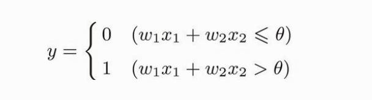</div>

但是考虑到更通用的形式，我们把式子改成如下形式

<div align="center">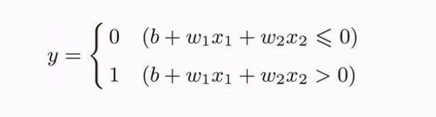</div>

θ 符号移到了左边变成了 -θ ，命名为 b ，但表达的内容是完全相同的。w1 和 w2 叫做权重，b 在这里叫做偏置。感知机会计算输入信号和权重的乘积，再加上某个偏置，如果这个值大于0，则输出1，否则输出0。

具体地说，w1 和 w2 是控制输入信号重要性的参数，b 则是调整神经元被激活的容易程度。

那到底感知机有什么用呢？接下来我们用感知机来解决一个简单的问题。

我们用感知机来实现逻辑电路里的"与门"。

与门

| x1 | x2 | y |
|----|----|---|
| 0  | 0 | 0 |
| 0  | 1 | 0 |
| 1  | 0 | 0 |
| 1  | 1 | 1 |

上图中得知，与门是只有在 x1，x2 都为1的情况下，输出才为1。事实上，满足这个条件的参数有无数种，比如 w1，w2 为 0.5，b 为 -0.7，或 w1，w2 为 1.0，b 为 -1.0 都可以。

我们再来看一下"与非门"和"或门",

与非门：

| x1 | x2 | y |
|----|----|---|
| 0  | 0 | 1 |
| 0  | 1 | 1 |
| 1  | 0 | 1 |
| 1  | 1 | 0 |

或门：

| x1 | x2 | y |
|----|----|---|
| 0  | 0 | 0 |
| 0  | 1 | 1 |
| 1  | 0 | 1 |
| 1  | 1 | 1 |

与非门是与门的取反，或门是只要有一个输入信号为1，输出就为1。

那么我们来考虑一下权重w和偏置b。

在 "与非门" 中 w1，w2 为 -0.5，b 为 0.7 就可以，事实上就是与门参数的取反。

"或门" 中 w1，w2 为 1.0，b 为 -0.5 就可以。

这很容易，看图就能看出来。（渐渐骄傲...）

那么，接下来我们来取一下"异或门"的权重和偏置

异或门

| x1 | x2 | y |
|----|----|---|
| 0  | 0 | 0 |
| 0  | 1 | 1 |
| 1  | 0 | 1 |
| 1  | 1 | 0 |

哈哈，想不出来了吧！！！（立即打脸）

事实上，感知机是无法实现这个异或门的！我们可以通过画图来思考其中的原因。

我们看一下 "或门" 的图，如果取 w1，w2 为 1.0，b 为 -0.5，则表达式为

<div align="center">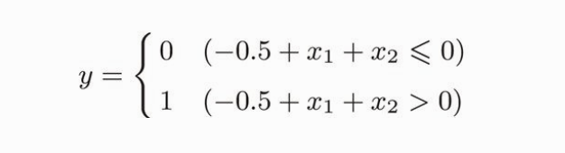</div>

画成图就是这样：

<div align="center">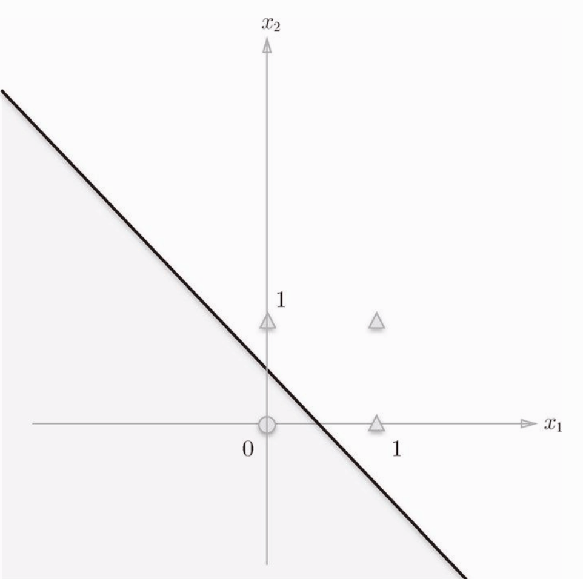</div>

那么，灰色区域就是小于等于0的区域，白色区域就是大于0的区域（输出1的区域）。

图片可以看出，把图片三角形和圆形分割开的直线有无数条，所以权重和偏置也有无数种可能。那么，异或门的图是怎样的呢？

<div align="center"></div>

图片可以看到，因为感知机的表达式是一个直线，一条直线是无法把上图中的三角形和圆形分开的，只能用曲线分开，如下图：

<div align="center"></div>

感知机的局限就在于只能表示线性函数，这样弯曲的曲线无法表示。另外，由直线能分割的空间称为线性，曲线才能分割的空间称为非线性。线性，非线性这两个术语在机器学习中很常见。

虽然，我们用单个感知机不能表示异或门，但是我们可以通过叠加层，来表示异或门。

如下图所示：

<div align="center">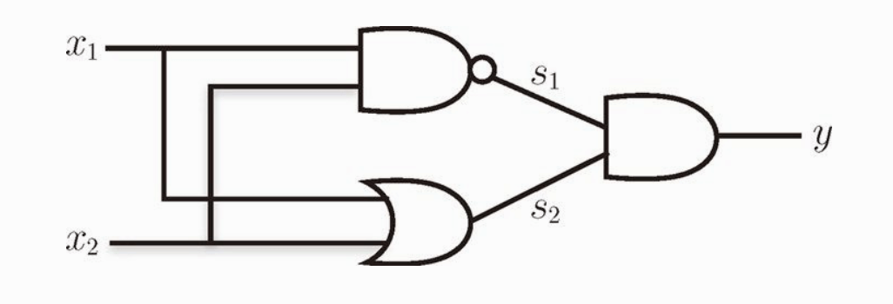</div>

组合 与门，与非门，或门

| x1 | x2 | s1 | s2 | y |
|----|----|---|---|---|
| 0  | 0 | 1 | 0 | 0 |
| 0  | 1 | 1 | 1 | 1 |
| 1  | 0 | 1 | 1 | 1 |
| 1  | 1 | 0 | 1 | 0 |

图中，x1 和 x2 通过 "与非门" ，输出 s1。通过 "或门" 输出 s2。再以 s1，s2 为输入，通过 "与门" ，输出 y。实现了异或门。

以神经元的表示方法显示异或门：

<div align="center">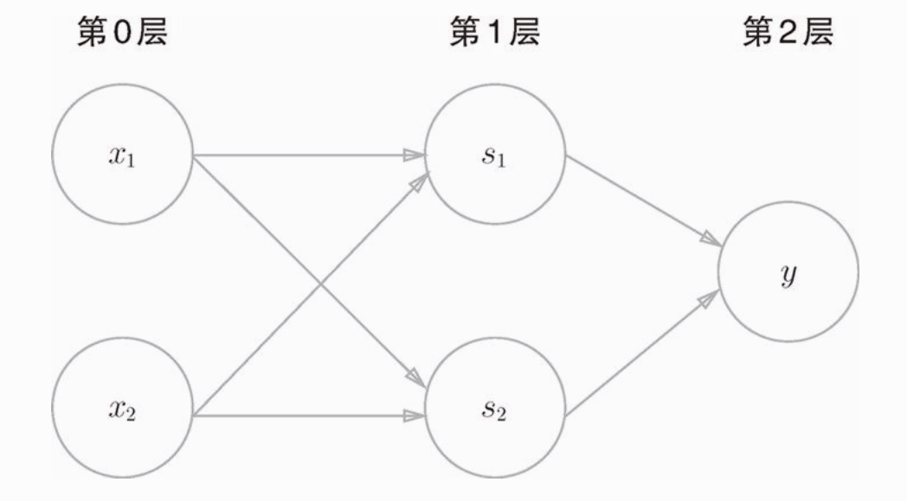</div>

如图，异或门是一个多层结构的神经网络，最左边的输入层称为第0层，中间一列称为第1层，最右边的称为第2层。但是我们在这里把它叫做“2层感知机”，因为有权重的只有两层。

像 "异或门" 这样，还可以解释为“单层感知机无法表示的东西，通过增加一层就可以解决”。也就是说，通过叠加层，可以表示更灵活的东西。

# 神经网络简介

终于到了神经网络了（看这本书不就是为了这个吗），经过上一章感知机的学习，神经网络和感知机有很多共通点。关于感知机，好消息是感知机可以通过叠加层数，来表达复杂的东西。坏消息是我们需要人工设定权重和偏置。

神经网络的出现就是为了解决刚才的坏消息的。具体地说，神经网络可以自动地从数据中学习到合适和权重和偏置。

来看一个神经网络的例子：

<div align="center">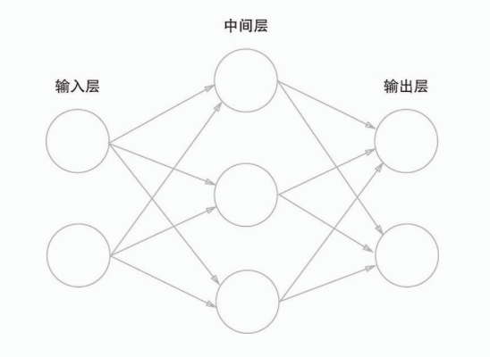</div>

最左边的一列称为输入层，最右边称为输出层，中间的一列称为中间层，也称为隐藏层，因为隐藏层和输入输出层不同，肉眼不可见。也可以把输入层到输出层依次称为第0层，第1层，第2层。上图中一共有3层神经元构成，但实际拥有权重的只有两层，也称为“2层网络”。

然后我们再来看一下之前感知机的公式：

<div align="center"></div>

这个式子分为大于0和小于0两种情况，我们用一个函数来表示这种分情况的动作。也可以写成下面这样：

<div align="center">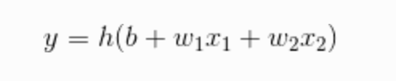</div>

外面套了一个 h() 函数，h() 函数的输入是每个变量的权重和，再经过 h() 内部的转换规则输出 y 值。下图中把偏置b也看作一个输入变量。因为上面的式子可以写成 (b * 1) + (w1 * x1) + (w2 * x2)，输入始终是1，权重为 b 的一个变量。

<div align="center">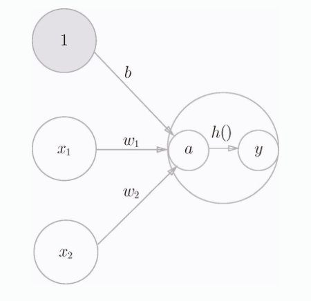</div>

这个 h() 在神经网络中就是 `激活函数` 。如 激活 一词所示，激活函数的作用在于如何来激活输入信号的总和。

> 重点：激活函数就是 h(x)，这里的 x 就是前一层神经元输出信号的总和，这个总和经过本神经元的激活函数后，就是本神经元的输出，这个输出乘以本神经元的权重，再传递给下一个神经元。

在感知机中，激活函数很简单，就是输入信号的总和大于0，则输出1，小于0则输出0。一旦输入超过阈值，就切换输出，这种也叫阶跃函数。因为函数的图形是阶梯状的，如下图：

<div align="center"></div>

事实上，如果将感知机的阶跃函数替换成其他函数，就可以进入神经网络的世界了。

神经网络中经常使用的一个激活函数是 sigmoid 函数，式子是这样的：

<div align="center">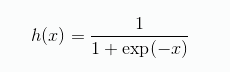</div>

式子中，exp(-x) 表示 e的-x次方，e就是那个自然常数，2.7182...那个（头疼）。虽然式子看起来复杂，但也只是个函数而已。而函数就是给定某个值后，经过一定的转换，输出另一个值的转换器。比如，向 sigmoid 输入 1.0 或 2.0 后，就有某个值被输出。类似h(1.0) = 0.731，h(2.0) = 0.880 这样。

<div align="center">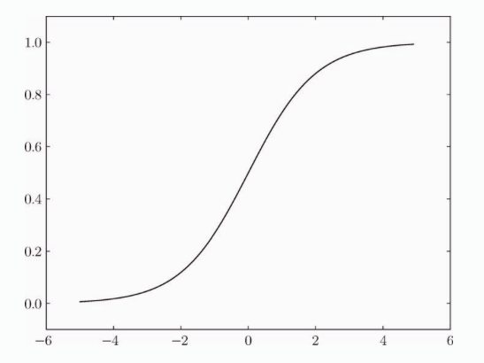</div>

sigmoid 函数图形是这样的，y 的取值为 0 ～ 1 之间。

为什么说把阶跃函数换成sigmoid函数就进入了神经网络的世界了呢？我们来比较一下两个函数，看下图：

<div align="center">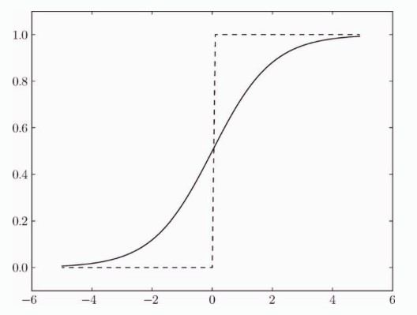</div>

我们注意到，sigmoid 是一条平滑的曲线，而阶跃函数以0为边界，输出发生急剧的变化。而 sigmoid 函数可以输出连续的值，比如：0.7123，0.812等等。而神经网络中的信号流动也是连续的实数值信号，这对神经网络的学习有重要意义。

注：因为是连续的值，对后面求损失函数的最小值非常有帮助。

sigmoid 函数很早就被开始使用了，但是最近则主要使用 ReLU（Rectified Linear Unit） 函数，图形如下图：

<div align="center">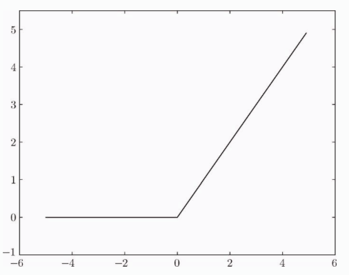</div>

式子是这样：

<div align="center">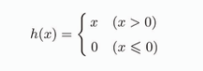</div>

ReLU 函数在输入大于0时，直接输出该值，输入小于0时，输出0。


# 三层神经网络的实现

上面讲了这么多，接下来，我们用 python3 来实现一个三层的神经网络（激动）

假设我们要实现如下这样结构的一个神经网络：

<div align="center">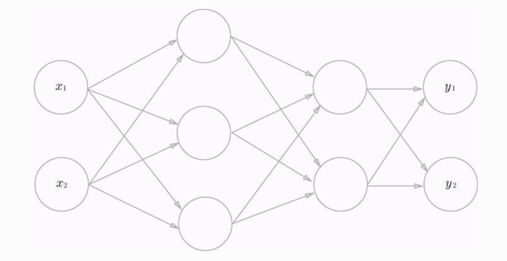</div>

这个神经网络输入层有两个输入参数，中间层（隐藏层）有两层，第一层隐藏层有3个神经元，第二层隐藏层有2个神经元，输出层有两个神经元。

输入层到隐藏层第一层的信号传递是这样的：

<div align="center">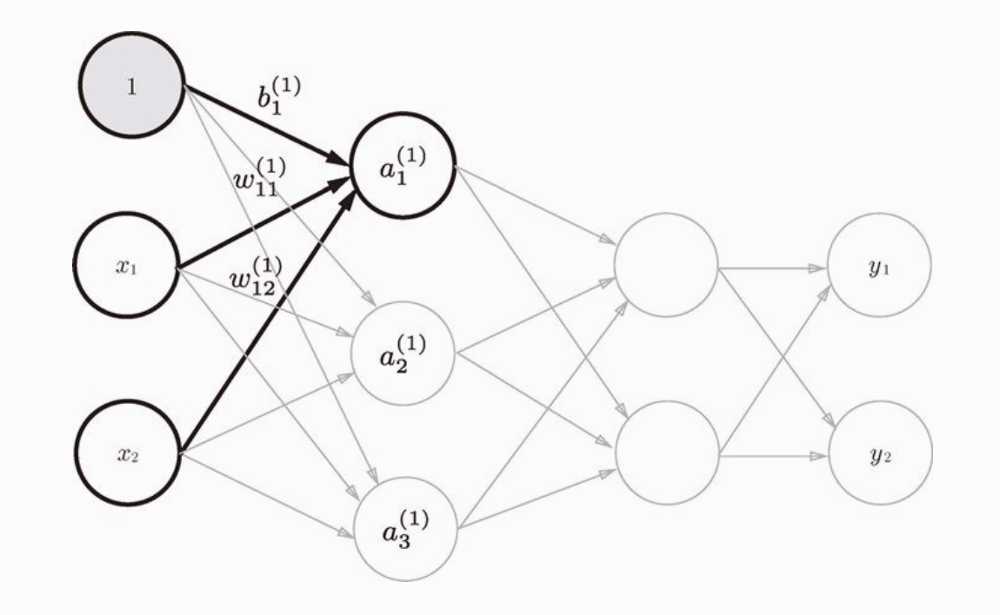</div>

这样可以算出a1

<div align="center"></div>

同理，再算出 a2 和 a3 ，需要三步，但是如果使用矩阵的乘法运算，就可以把这三步合为一步。式子如下图所示：

<div align="center"></div>

注意这张图中是变量向量乘以权重矩阵W，变量在权重矩阵的左边。式子看不懂也没关系，反正拆开来就是上面那三步。这个矩阵公式用 python 表示出来就是：

```
import numpy as np

A = np.dot(X,W) + B
```

然后算出来的A经过第一层隐藏层神经元内部激活函数 h() 的转换，我们用 z 表示，就是会输出z1，z2，z3，作为第二层隐藏层的输入。这里采用 sigmoid 作为激活函数。用 python 代码表示就是：

```
import numpy as np

def sigmoid(x):
  return 1 / (1 + np.exp(-x))

Z = sigmoid(A)
```

这里的 A 和 Z 都是向量，主要是计算方便，一个式子算出三个值（z1，z2，z3）。

第一层算完了，第二层和第一层的计算方法完全相同。这里就略过了。

<div align="center">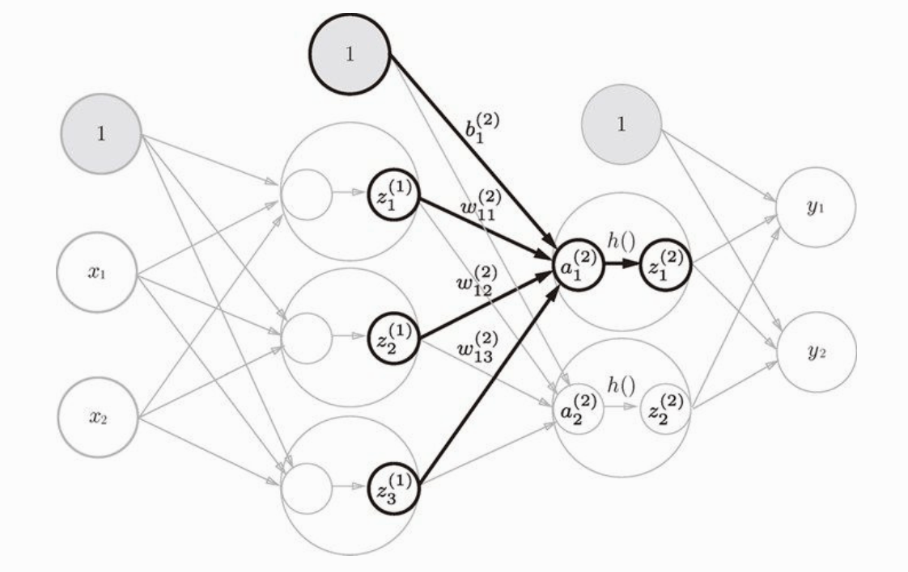</div>

最后是第二层到输出层的信号传递，输出层的实现也和之前的大致相同，唯一不同的是激活函数的不同。

为什么激活函数和隐藏层的不同？主要是输出层的激活函数要根据实际求解问题来决定。一般来说，回归问题可以使用恒等函数，二元分类问题使用 sigmoid 函数，多元分类问题使用 softmax 函数。

一下蹦出这么多术语，懵逼了哈哈，接下来就解释下上面那段的意思。

回归问题的意思是根据某个输入预测一个值，比如预测房价，人的体重等等，所以采用恒等函数会输出某个数值。实际上恒等函数就是原样输出，输入啥输出也是啥，啥也不处理。

二元分类问题就是数据属于哪一类的问题，比如区分图片中的人是男人还是女人。因为 sigmoid 会输出 0～1 之间的数，我们就可以拿这个数和 0.5 比大小就行了，大了属于一类，小了就属于另一类。

多元分类问题也是属于哪一类的问题，不过是很多个类别的归类。 softmax 函数其实就是一个计算概率的函数，它的输出是关于输入向量属于每个类别的概率。softmax 函数在后面会详细讲解。

这里，我们先用恒等函数来作为输出层的激活函数，下面是全部的 python 代码，逻辑就是和上面说的一样，很容易懂。

```
import numpy as np

# 激活函数
def sigmoid(x):
  y = 1 / (1 + np.exp(-x))
  return y

# 恒等函数（输出层的激活函数）
def identity_function(x):
  return x

# 初始化权重和偏置信息
def init_network():
  network = {}
  # 第一层的权重
  network["w1"] = np.array([[0.1,0.3,0.5],[0.2,0.4,0.6]])
  # 第二层的权重
  network["w2"] = np.array([[0.1,0.4],[0.2,0.5],[0.3,0.6]])
  # 第三层的权重
  network["w3"] = np.array([[0.1,0.3],[0.2,0.4]])
  # 第一层的偏置
  network["b1"] = np.array([0.1,0.2,0.3])
  # 第二层的偏置
  network["b2"] = np.array([0.1,0.2])
  # 第三层的偏置
  network["b3"] = np.array([0.1,0.2])
  return network

if __name__ == "__main__":
  # 初始化神经网络的权重和偏置信息
  network = init_network()
  # 初始化输入变量
  x = np.array([1.0, 0.5])

  w1, w2, w3 = network["w1"],network["w2"],network["w3"],
  b1, b2, b3 = network["b1"],network["b2"],network["b3"],
  # 计算出第一隐藏层的权重和
  a1 = np.dot(x, w1) + b1
  # 经过第一层激活函数得出输出，就是第二层的输入
  z1 = sigmoid(a1)
  # 和上面一样
  a2 = np.dot(z1, w2) + b2
  z2 = sigmoid(a2)
  a3 = np.dot(z2, w3) + b3
  # 最后经过输出层神经元的激活函数（恒等函数），得出最后的结果
  y = identity_function(a3)
```

# 输出层的设计

输出层的设计主要设计输出层神经元的数量和神经元的激活函数。

上面我们说到两种输出层的激活函数，恒等函数和 softmax 函数，恒等函数会将输入原样输出，不加任何改动。我们主要讲讲 softmax 函数。

softmax 函数的式子如下所示：

<div align="center">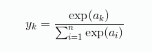</div>

exp(x) 表示 e 的 x 次方。e 是自然常数。式子中假设输出层有 n 个神经元，计算第 k 个神经元的输出。仔细观察这个式子的话，分母是把每个输入的指数都加起来，分子是当前那个神经元的输入的指数，我不知道这里为什么要加上指数，但是如果把指数去掉的话，就很好理解了，就是把当前项除以所有项的和，不就是当前项的概率吗？事实上，虽然式子中加上了指数，但是输出的结果也还是表示每一项的概率，其中每项值的结果相加等于1（y1 + y2 + ... + yn = 1），很适合解决多元分类问题。

# 训练数据和测试数据

在进行神经网络的学习前，先介绍训练数据和测试数据。

训练数据是给神经网络学习用的，测试数据则是测试神经网络学习的结果。首先，使用训练数据进行学习，寻找最优参数，然后，使用测试数据评价训练得到的模型的实际能力。训练数据也称为监督数据，训练数据中，不仅包含数据本身，也要包含数据正确识别的结果。

# 损失函数

前面说到，神经网络的一个好处是能从数据中自动学习权重参数，不用人工去设定。接下来我们就讲讲原理。

为了使神经网络能够进行学习，将导入损失函数这一指标。损失函数到底是个什么东西呢？举个栗子。

<div align="center"></div>

这是我网上随便找的一张图，途中的蓝点是训练数据，要想画一条直线经过这些所有的点当然是不可能的，所以我们找的是最符合（拟合）这些点的直线，就是途中的红色虚线。当然你也可以不用直线表示，你可以画一条曲线经过所有的点，但是这样就过拟合了（过度拟合）。这里我们还是假设学习到的函数是直线。那么我们怎么判断这条直线是最优的那条呢？是否还有一条直线，和图中的红色直线相比，只是微微的倾斜了一点，为什么它不是最优的那条呢？那我们可以根据这样一个规则，就是计算图中的每个蓝点（真实的值）到直线（预测的值）的距离，把这些距离相加起来，总和最小的那个是不是就可以说明这条直线是最优的呢？

这个规则我们可以写成一个函数，输入就是训练数据，输出是训练数据预测的值和真实值之间的误差。事实上，这个函数就是损失函数。损失函数是估量模型预测的值和真实值之间不一致的程度。

可以用作损失函数的函数有很多，最有名的是均方误差。式子如下：

<div align="center">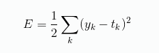</div>

这里的 yk 表示模型预测的值， tk 表示真实值，式子中是计算他们之差的平方，再求总和。意思是一样的。

> 网上找到了一个均方误差式子的解释，感觉讲的比较好：为什么前面要有一个 1/2，因为要对损失函数求导，这样后面的平方和1/2就约掉了。关于为什么要用平方，能不能把平方去掉，这个是不行的，因为这样正误差和负误差会相互抵消。还有关于把平方换成绝对值的说法，说平方比较好因为平方对大误差的惩罚更大，而且对求导运算也比较方便。

还有一个经常使用的损失函数是 `交叉熵误差` ，式子如下：

<div align="center">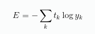</div>

这个式子我是这样理解的， E 看作是信息量，yk 表示一个事件发生的概率，应该是一个 0 ～ 1 之间的值。如果一个事件发生的概率为1，也就是 100% 会发生，那么这个事件所带的信息量就为 0。如果一个事件发生的概率比较小，那么所带的信息量就比较大。而我们在训练时要做的，就是通过调整神经网络的权重和偏置，最小化这个 E 值。E 值小了，就说明 yk 预测正确的那个值就大了。

这个式子就不详细讲了，反正作用和上面均方误差的作用是一样的，都是表示预测值和真实值之间的误差。

# 导数

假如你在10分钟内跑了2千米，如果要计算奔跑速度，则为 2 / 10 = 0.2 千米/分钟。不过，这计算的是10分钟内的平均速度。而导数是表示某个瞬间的变化量。因此，将10分钟尽可能缩短，比如计算前1分钟的奔跑距离，前一秒钟，前0.1秒的奔跑距离...这样就可以获得某个瞬间的变化量。

综上，他可以定义成下列式子：

<div align="center">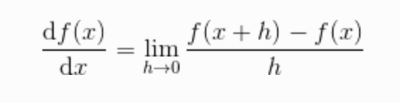</div>

式子中，等号左边的意思就是就是函数f(x)关于x的导数，d 就是导数的符号。式子表示的含义是，x的 “微小变化” 将导致f(x)的值在多大程度上发生变化。其中，微小变化的 h 无限趋近于0，表示为一个 lim （极限符号）。

接下来我们就可以用 python 实现一下求导数的式子：

```
def numerical_diff(f, x):
  h = 1e-4 # 0.0001
  return (f(x + h) - f(x)) / h
```

微小值我们用的是 0.0001 ，如果太小的话计算机识别可能有误差，可能会直接转为0。

> 虽然这个式子求出来的导数和用数学公式推导出的导数并不一致，但是误差很小，可以认为基本一致。

我们接下来使用一下这个函数，我们求一下这个式子在 x = 5 和 x = 10 处的导数。

<div align="center"></div>

代码如下，很容易理解，完全就是照着上面公式写的：

```
# 计算导数
def numerical_diff(f, x):
  h = 1e-4 # 0.0001
  return (f(x+h) - f(x)) / h

# 测试的函数
def function_1(x):
  return 0.01 * x ** 2 + 0.1 * x

# 构建切线函数
def tangent_line(f, x):
  d = numerical_diff(f,x)
  # 偏移量，没有b的话，直线是经过原点的
  b = f(x) - d * x
  def f2(t):
    return d * t + b
  return f2

if __name__ == "__main__":
  # 画出 function_1 函数图形
  x = np.arange(0,20.0,0.1)
  y = function_1(x)
  plt.xlabel("x")
  plt.ylabel("f(x)")
  plt.plot(x, y)

  # 画处 x = 5 位置的切线
  f2 = tangent_line(function_1, 5)
  y2 = f2(x)
  plt.plot(x, y2)

  # 画处 x = 10 位置的切线
  f3 = tangent_line(function_1, 10)
  y3 = f3(x)
  plt.plot(x, y3)
  
  # 显示图像
  plt.show()
```

<div align="center">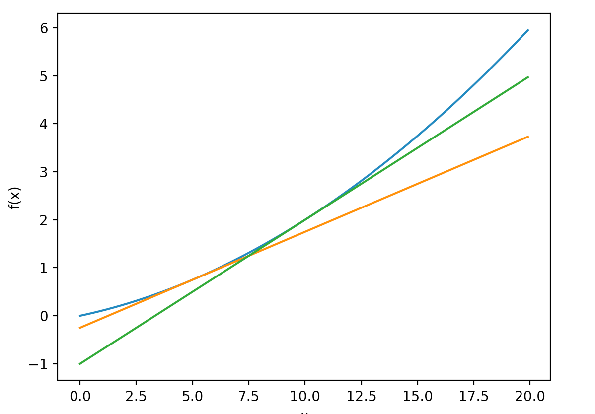</div>

由图片中可以看出，确实是在 x = 5 和 x = 10 两个点花了切线，说明我们求导数的函数是对的。利用微小差分的方式求导数也叫做数值微分。

# 偏导数

因为大多数函数都不只有一个变量，而可能有多个变量x1，x2，x3这样。求偏导数只需要将某一个变量定位目标变量，再将其他变量定为常量。如：求函数f(x1,x2,x3)关于x1的偏导数，可以先把 x2，x3 看成常数，得出 x1 的导数就叫做 x1 的偏导数，同理，可以得出 x2，x3 的偏导数。

# 梯度
在上面偏导数的例子中，我们可以求出 x1,x2,x3 的偏导数。另外，由全部变量的偏导数汇总而成的向量叫做梯度。梯度是表示各点处函数值变化最多的那个方向。

注意：梯度是表示函数某一个点的梯度，每个点的梯度都不一样。

以下是用 python 实现求梯度的算法：

```
def numerical_gradient(f, x):
  h = 1e-4
  # 生成和x形状相同的数组
  grad = np.zeros_like(x)
  # 计算每个变量的偏导数
  for idx in range(x.size):
    tmp_val = x[idx]
    x[idx] = tmp_val + h
    fxh1 = f(x)
    x[idx] = tmp_val
    fxh2 = f(x)
    # 设置梯度
    grad[idx] = (fxh1 - fxh2) / h
  return grad
```

我们来看下面这个式子，式子的函数图形是这样的：

<div align="center">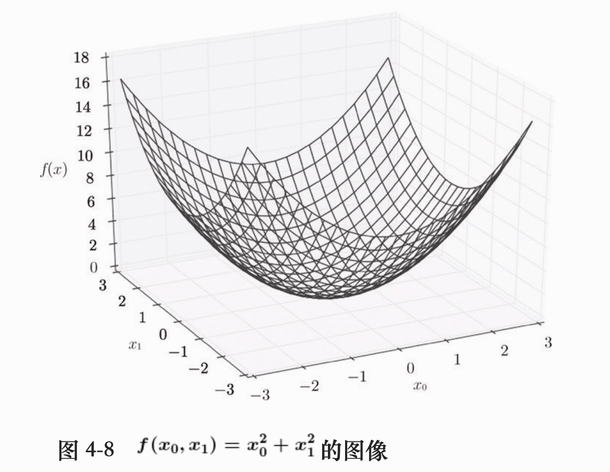</div>

下面我们用来画出该函数各点处的梯度：

```
import numpy as np
import pickle
import matplotlib.pylab as plt
from dataset.mnist import load_mnist
from common.gradient import gradient_descent

def _numerical_gradient_no_batch(f, x):
    h = 1e-4 # 0.0001
    grad = np.zeros_like(x)
    for idx in range(x.size):
        tmp_val = x[idx]
        x[idx] = float(tmp_val) + h
        fxh1 = f(x) # f(x+h)

        x[idx] = tmp_val - h 
        fxh2 = f(x) # f(x-h)
        grad[idx] = (fxh1 - fxh2) / (2*h)
        
        x[idx] = tmp_val # 还原值
    return grad

def numerical_gradient(f, X):
  if X.ndim == 1:
    return _numerical_gradient_no_batch(f, X)
  else:
    grad = np.zeros_like(X)
    for idx, x in enumerate(X):
      grad[idx] = _numerical_gradient_no_batch(f, x)
    return grad

def function_2(x):
  if x.ndim == 1:
    return np.sum(x**2)
  else:
    return np.sum(x**2, axis=1)
     
if __name__ == '__main__':
  # 根据 x0，y0生成一组网格点
  x0 = np.arange(-2, 2.5, 0.25)
  x1 = np.arange(-2, 2.5, 0.25)
  X, Y = np.meshgrid(x0, x1)
  
  # 展开成一维数组
  X = X.flatten()
  Y = Y.flatten()
  
  grad = numerical_gradient(function_2, np.array([X, Y]) )
  plt.quiver(X, Y, -grad[0], -grad[1],  angles="xy",color="#666666")#,headwidth=10,scale=40,color="#444444")
  plt.xlim([-2, 2])
  plt.ylim([-2, 2])
  plt.xlabel('x0')
  plt.ylabel('x1')
  plt.grid()
  plt.show()
```

输出的图形是这样的：

<div align="center">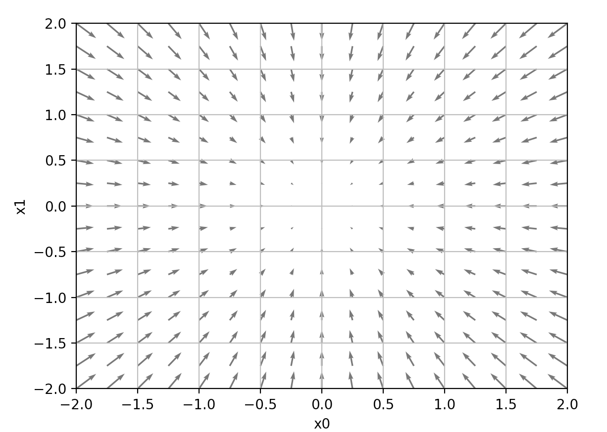</div>

注意，`plt.quiver` 函数的参数，我们传的是 `-grad[0]` 和 `-grad[1]` ，也就是说我们这里画的是负梯度的方向，可以看到梯度的负方向是指向函数减小最多的方向，所以梯度下降法中负梯度的方向就是变量更新的方向。

# 梯度下降法

神经网络学习时的主要任务是找出最优参数（权重和偏置），这里所说的最优参数是指损失函数取最小值时的参数。一般而言，损失函数很复杂，参数空间庞大，我们不知道他在何处能取到最小值。但我们巧妙地以梯度为线索，沿着梯度的方向更新一点点，再重新计算梯度，再沿梯度的方向更新一点点，这样来寻找函数的最小值的方法就是梯度下降法。

注意，这里梯度是指向函数值减少最多的方向，但是无法保证梯度所指的方向就是函数真正的最小值方向，有可能只是某个范围内的最小值。

梯度下降法的公式如下：

<div align="center">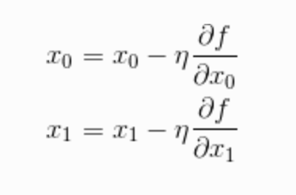</div>

式子中我们没有更新整个梯度，而是只更新梯度的一部分。这里的 `η` 乘以梯度就是每次更新的量。我们把 `η` 叫做学习率。学习率需要事先确定好某个值，比如0.01或0.001，一般而言，这个值过大或过小都不能抵达一个"好的位置"。在神经网络的学习中，我们有时候会一边改变学习率，一边确认学习是否在正确进行。

接下来我们用代码实现一下梯度下降算法：

```
# f 表示损失函数
# init_x 表示损失函数的参数，就是权重
# lr 代表学习率
# step_num 表示迭代次数
def gradient_descent(f, init_x, lr = 0.01, step_num = 100):
  x = init_x
  for i in range(step_num):
    grad = numerical_gradient(f, x)
    x = x - lr * grad
  return x
```

函数多了一个 step_num 参数，表示的是变量更新多少次后结束，因为变量更新一定次数后，会在最小值附近跳动，这时候就没必要再更新了。

# 手写一个神经网络

了解了上面的损失函数，梯度下降法这些理论知识后，接下来我们就根据前面所学的知识来手写一个2层的神经网络(隐藏层为1层)。神经网络中最重要的就是学习的过程，等学习到合适的权重参数后，就可以用来预测新数据的结果了。

神经网络中的学习步骤是这样的：

```
步骤1：从所有数据中随机筛选出一小部分数据（mini-batch），我们的目标是减少 mini-batch 损失函数的最小值
步骤2：计算损失函数的梯度
步骤3：将权重参数沿着梯度的方向进行微小更新
步骤4：跳回步骤1，重复一定的次数
```

因为这里是随机选择的 mini-batch ，所以又称为 `随机梯度下降法` ，简称 `SGD` （stochastic gradient descent），这个术语在机器学习领域经常出现，要记住的。下面直接贴代码：

```
# two_layer_net.py

import numpy as np
from common.functions import *
from common.gradient import numerical_gradient
import collections

class TwoLayerNet:
  # 初始化权重
  # input_size 输入层的神经元个数
  # hidden_size 隐藏层的神经元个数
  # output_size 输出层的神经元个数
  def __init__(self, input_size, hidden_size, output_size, weight_init_std=0.1):
    self.params = {}
    # 初始化第一层和第二层权重和偏置参数为一些随机值
    self.params["W1"] = weight_init_std * np.random.randn(input_size, hidden_size)
    self.params["W2"] = weight_init_std * np.random.randn(hidden_size, output_size)
    self.params["b1"] = np.zeros(hidden_size)
    self.params["b2"] = np.zeros(output_size)

  # 预测
  def predict(self, x):
    # 取出权重和偏置
    w1, w2 = self.params["W1"], self.params["W2"]
    b1, b2 = self.params["b1"], self.params["b2"]
    # 经过第一层的输出
    a1 = np.dot(x, w1) + b1
    # 经过第一层的激活函数
    z1 = sigmoid(a1)
    # 经过第二层的输出
    a2 = np.dot(z1, w2) + b2
    # 经过输出层的激活函数
    y = sigmoid(a2)
    return y

  # 计算损失函数的值
  def loss(self, x, t):
    y = self.predict(x)
    return cross_entropy_error(y, t)

  # 计算权重参数的梯度
  def gradient(self, x, t):
    def f(W):
      return self.loss(x, t)
    grads = {}
    # 第二个参数 self.params["W1"] 并不是传给 f函数 作为参数用的，而是在 numerical_gradient 内部有一个循环，正确执行循环用的，
    # 这里不写 grads["W1"] = numerical_gradient(self.loss, self.params["W1"]) 是因为 self.loss 由三个参数，而 numerical_gradient 内部会把 self.params["W1"] 传给 self.loss 作为参数，这是不对的，所以我们上面重新定义了一个函数 f(W)
    # 保存第一层的权重梯度
    grads["W1"] = numerical_gradient(f, self.params["W1"])
    # 保存第一层的偏置梯度
    grads["b1"] = numerical_gradient(f, self.params["b1"])
    # 保存第二层的权重梯度
    grads["W2"] = numerical_gradient(f, self.params["W2"])
    # 保存第二层的偏置梯度
    grads["b2"] = numerical_gradient(f, self.params["b2"])
    return grads
```

其中， numerical_gradient ， cross_entropy_error ， sigmoid 这三个函数都是之前实现过的，由 common.functions 和 common.gradient import 进来的，这里就不重复贴了。

神经网络的核心代码已经实现了，那么怎么用呢？我们下面的这个例子是使用 MNIST 手写数字图像集，MNIST 是机器学习领域最有名的数据集之一，被应用于从简单的实验到发表论文研究等各种场合。

MNIST 数据集由 0-9 的数字图像构成，训练集有6w张，测试集有1w张，可用于神经网络的学习和预测。如下图：

<div align="center">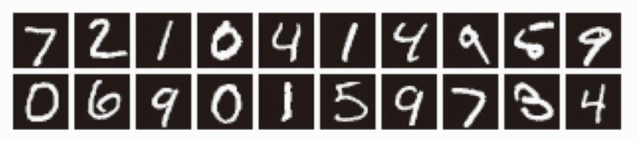</div>

每张图片数据是 28 * 28 的灰度图像。每个图像数据都相应地标有正确的“7”，“2”，“1”等标签。

```
import numpy as np
from dataset.mnist import load_mnist
from common.gradient import gradient_descent
from two_layer_net import TwoLayerNet

if __name__ == '__main__':
  # 使用 load_mnist 导入 x_train 训练集，t_train 训练真实标签，x_test 测试集，t_test 测试真实标签
  (x_train, t_train), (x_test, t_test) = load_mnist(normalize=True, one_hot_laobel = True)
  # 记录每次更新权重后，损失函数的值如何变化
  train_loss_list = []

  # 超参数
  # 权重迭代次数
  iters_num = 10000
  # 训练集大小
  train_size = x_train.shape[0]
  # 每个 batch 的大小
  batch_size = 100
  # 学习率
  learning_rate = 0.1

  # 初始化神经网络，输入层神经元784个（因为是高宽 28 * 28 的图像），隐藏层神经元50个（自定义），输出层10个（识别 0-9 十个数字）
  network = TwoLayerNet(input_size=784, hidden_size=50, output_size=10)

  for i in range(iters_num):
    # 步骤1：获取 mini-batch，从6w个训练集中随机获取100个，组成一个batch，batch_mask里面是0-6w的随机数字
    batch_mask = np.random.choice(train_size, batch_size)
    # 根据随机数字取出训练集和训练监督标签
    x_batch = x_train[batch_mask]
    t_batch = t_train[batch_mask]

    # 步骤2：计算一个 batch 的梯度
    grad = network.gradient(x_batch, t_batch)

    # 步骤3：将权重参数沿着梯度的方向进行微小更新
    for key in ('W1', 'b1', 'W2', 'b2'):
      network.params[key] -= learning_rate * grad[key]
    # 记录学习过程
    loss = network.loss(x_batch, t_batch)
    print(loss)
    train_loss_list.append(loss)
    # 步骤4：步骤1-3重复 iters_num 次
```

上面有个超参数的概念，这个超参数表示人为设定的参数，比如学习率，权重迭代的次数等等。和权重偏置那些参数是不一样的。

以上的代码运行后，我们把每次计算的 loss 变量打印出来，可以看到 loss 的值越来越小，这是神经网络正常学习的信号。

但是真实的情况是，上面代码运行后 `print(loss)` 这行代码一值没有输出，原因是一直卡在了 `grad = network.gradient(x_batch, t_batch)` 这句。主要原因是我们使用数值微分的方法计算梯度，计算量实在太大。所以以上代码理论上可行，但是实际应用中不可能使用类似 numerical_gradient 这种方式计算梯度的。我们需要更快的计算梯度的方法。

# 反向传播法

上一章，我们用了数值微分的方法求梯度，然后沿着梯度的方向前进一点点，再求梯度，再前进一点点，如此反复，到达损失函数的最小值的位置。但是这有一个致命的缺点，就是计算速度非常慢，达到了不能忍受的范围。接下来介绍的方向传播法可以用来快速求出梯度。

前面我们用数值微分求了每一层的梯度，而每层的梯度是当前层中每一个神经元的权重变量的偏导数合成的向量。而 `反向传播法` 可以反向推导出每个神经元权重的偏导数，接下来让我们看看是怎么做到的。

我们使用 `计算图` 的方法来直观的展示以下，计算图是将计算过程用数据结构图表示出来，如下面这个例子：

<div align="center">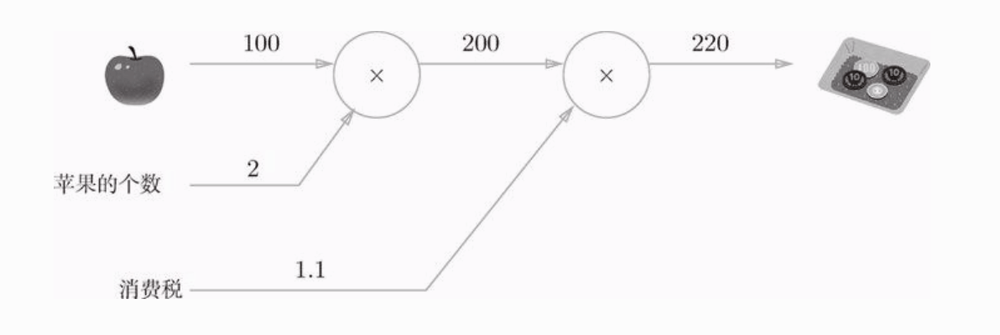</div>

假设一个苹果的价格为100，苹果的个数为2个，消费税为1.1，那么买两个苹果需要220元。在上面这个图中，我们从左向右进行计算叫做 `正向传播` 。正向传播是从计算图的出发点到结束点的传播。既然有正向传播，当然也有反向传播（从图上看的话，就是从右向左的传播），反向传播在计算导数时发挥重要作用。

如前所述，“支付金额关于苹果价格的导数”的值可以根据反向传播计算出来。我们先来看以下结果：

<div align="center">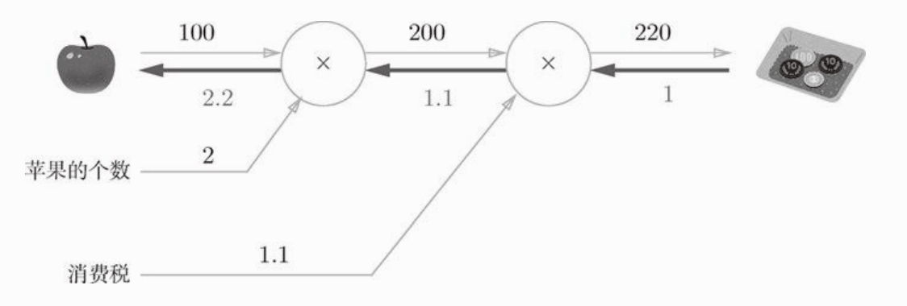</div>

反向传播使用与正方向相反的箭头（粗线）表示，反向传播传递局部导数，将导数的值写在箭头下方。注意，反向传播传递的是导数。从图中可知，“支付金额关于苹果价格的导数”是2.2，反向传播是从结尾开始的，因为最后输出的是一个常数，常数的导数为1，所以一般反向传播最开始的值都为1，接下来讲讲反向传播是怎么传递导数的。

我们来看一个使用计算图反向传播的栗子：

<div align="center">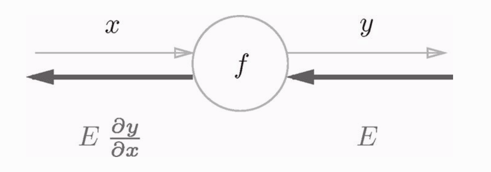</div>

假设f节点的输入是x，内部经过函数f(x)，输出y。假设反向传播中，传给f节点的导数是E，那么这个信号E要乘以f节点的局部导数，就是f内部函数的导数，然后将结果传给下一个节点。比如：假设 `y=f(x)=x**2` ，`**2` 表示平方的意思，根据高数中导数那一章可以快速求出这个函数的导数是 `2x` ，把这个函数的导数 `2x` 乘以上游传过来的值（这里为 `E` ），然后传给前面的节点。

这就是反向传播的计算过程，这种计算可以高效的计算导数的值。

但是一个节点的函数可能是一个复合函数，比如激活函数这种都是很复杂的，我们假设节点f的函数是：`z=(x+y)**2` ，`**2` 表示平方的意思，那么它的计算图是：

<div align="center">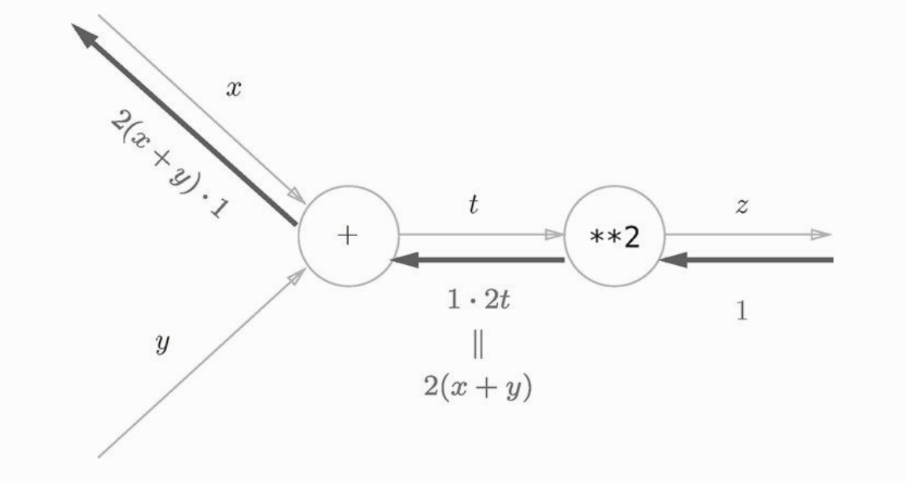</div>

我们假设反向传播时上游输入的值是1，那么经过 `**2` 节点后，值变成了 `2(x+y)` ，再经过加法节点，加法节点的函数是 (x+y) ，这个函数的两个变量的偏导数都为1，那么传给x和y路径的导数都为 `2(x+y)*1` 。

注：这里的两个输入变量 x 和 y 对应到神经网络中是什么意思呢？意思就是梯度不是一个标量，而是一个向量，梯度是由x的偏导数和y的偏导数组成的，x 和 y 的偏导数根据反向传播已经算出来了，所以梯度也就知道了。

# 加法节点的反向传播

接下来我们单独分析加法节点：

<div align="center">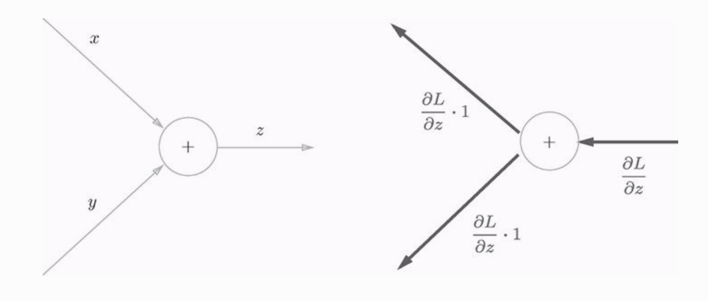</div>

直接看图我们可以看到加法节点是直接传递上游传过来的导数的，啥都不做。

然后我们用 python 实现一下加法节点，这里暂且把节点称为 `层` ：

```
# 加法层
class AddLayer:
  # pass 表示啥都不做
  def __init__(self):
    pass

  # 正向传播时的算法
  def forward(self, x, y):
    # 加法节点直接把两个变量相加
    return x + y

  # 反向传播时的算法，参数 dout 是上游传过来的导数
  def backward(self, dout):
    # 加法节点直接返回上游传过来的值
    return dout
```

# 乘法节点的反向传播

再来看一下乘法节点：

<div align="center">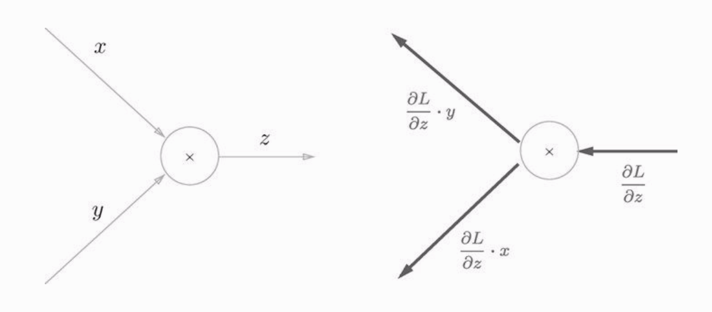</div>

光看图的画可能没那么直观，图片中将的是反向传播时一个导数从上游传进来，假设导数为1，经过乘法节点，传给x方向的偏导数是y，y方向的偏导数是x。这个函数是 `z=xy` ，这个式子中求 x 的偏导数是把y看成常数，那么x的偏导数就是y，同理，y的偏导数是x。所以从z方向传给x就要乘以x的偏导数，这里就是y。

同样，我们用 python 实现一下乘法层：

```
# 乘法层
class MulLayer:
  def __init__(self):
    self.x = None
    self.y = None
  
  # 正向传播的算法，x，y为输入变量
  def forward(self, x, y):
    self.x = x
    self.y = y
    return x * y

  # 反向传播的算法，dout为上游传过来的导数
  def backward(self, dout):
    dx = dout * self.y
    dy = dout * self.x
    return dx, dy
```

和加法层不同的是，乘法层需要记录正向传播时的 x 和 y 值，用于反向传播的计算。

# 激活函数层的实现

现在，我们把计算图的思想用于神经网络。这里，我们把构成神经网络的层实现为一个类。上面我们说过，神经网络的激活函数一般有 ReLU 和 Sigmoid 两种函数，输出层的激活函数需要根据情况选择，需要分类就用 softmax 函数，下面我们就来依次实现。

激活函数的 ReLU 式子如下：

<div align="center">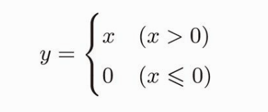</div>

那么它的导数也分为两部分，如下：

<div align="center">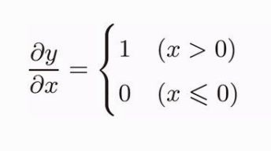</div>

那么，我们用 python 来实现一下：

```
# ReLU 层
class Relu:
  def __init__(self):
    self.mask = None

  # 这里的变量 x 在神经网络中通常都是向量，因为从上游传过来的基本上都是梯度
  def forward(self, x):
    self.mask = (x <= 0)
    out = x.copy()
    # 把out向量中 mask 序号的值都设为0
    out[self.mask] = 0
    return out

  # 反向传播算法
  def backward(self, dout):
    dout[self.mask] = 0
    dx = dout
    return dx
```

注意，在神经网络中，这些变量都是向量，这里不能当作一个标量来处理。

sigmoid 层的实现，我直接贴出代码了，实现的思路是按照 sigmoid 的公式来的，但是式子比较复杂，意思就是这么个意思。

<div align="center"></div>

```
# Sigmoid 层的实现
class Sigmoid:
  def __init__(self):
    self.out = None

  def forward(self, x):
    out = 1 / (1 + np.exp(-x))
    self.out = out
    return out

  def backward(self, dout):
    dx = dout * (1.0 - self.out) * self.out
    return dx
```

softmax 层有些特殊，神经网络有学习和推理阶段，推理阶段通常不经过 softmax 函数处理，而是直接取最大的那个值，因为经过 softmax 转成概率后，最大的那个还是最大的。所以只有在学习阶段才会使用，而学习的阶段最后通常会用到损失函数计算误差，所以这里就叫 softmaxWithLoss 层

softmax 式子：

<div align="center"></div>

softmaxWithLoss 层代码如下：

```
class SoftmaxWithLoss:
  def __init__(self):
    self.t = None
    self.y = None

  # 输出层正向传播输出的是损失函数的值
  def forward(self, x, t):
    self.t = t
    self.y = softmax(x)
    self.loss = cross_entropy_error(self.y, self.t)
    return self.loss

  # 反向传播算法，最后一层的 dout 为 1 
  def backward(self, dout=1):
    batch_size = self.t.shape[0]
    # 除以 batch_size 批次，得出的是单个数据的误差
    dx = (self.y - self.t) / batch_size
    return dx
```

# Affine层的实现

Affine 层对应神经网络中的计算加权信号的总和这一层，这里的计算都是使用矩阵乘积运算，Affine意思是 `仿射变换` ，几何中的仿射变换包括一次线性变换和一次平移，对应神经网络中的加权运算和加偏置运算。Affine 层的计算图是这样的，注意这里的变量都是矩阵（多维数组），各个变量的上方标记了该矩阵的形状。

<div align="center">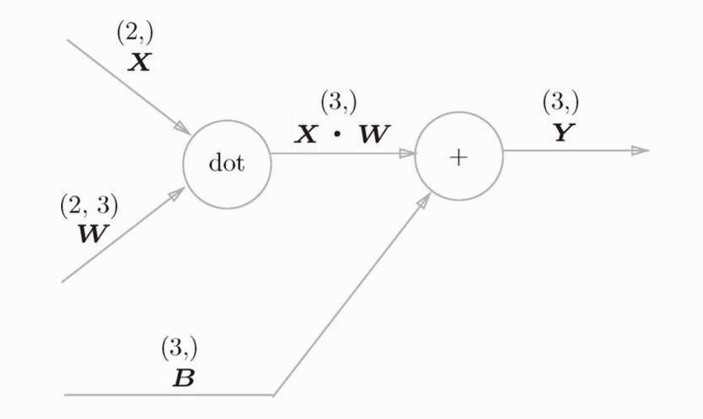</div>

计算图的反向传播是这样的，书中省略了推导过程（即使不省略我也看不懂啊，哈哈），这里就不详细说了，我们直接看结果就好。

<div align="center">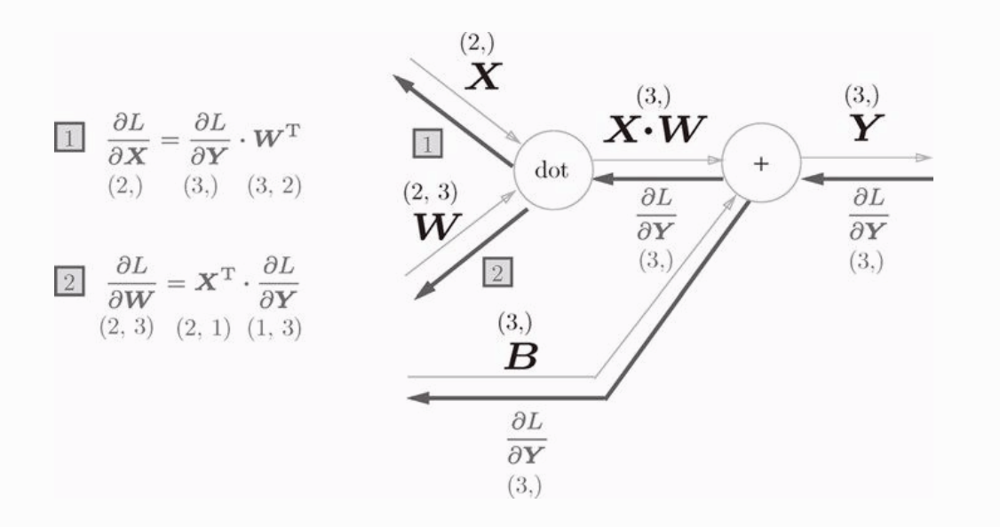</div>

直接贴出 Affine 层的代码：

```
class Affine:
  def __init__(self, W, b):
    self.W = W
    self.b = b
    self.x = None
    # 保存矩阵W的导数
    self.dW = None
    # 保存偏置b的导数
    self.db = None

  def forward(self, x):
    self.x = x
    out = np.dot(x, self.W) + self.b
    return out

  def backward(self, dout):
    dx = np.dot(dout, self.W.T)
    self.dW = np.dot(self.x.T, dout)
    self.db = np.sum(dout, axis=0)
    return dx
```

这一层正向传播的算法很好懂，不解释了。虽然反向传播的算法我们看不懂（可能只有我看不懂），但是我们可以在上面代码中看到，Affine 层在反向传播时，除了计算给下一个节点的 dx ，还计算了dW 和 db ，这两个表示的是权重的梯度和偏置的梯度，只要有了这两个值，我们就可以更新这一层的权重和偏置了。

至此，神经网络所有的层都已经实现了，把他们串起来是这样的：

<div align="center">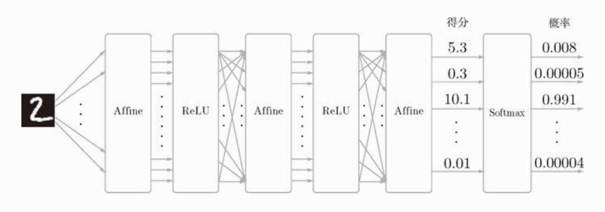</div>

比如手写数字识别时，输入图像通过 Affine 层和 ReLU 层进行转换，上图中的 ReLU 层表示一个神经元，Affine 层则表示前一个神经元的输出到下一个神经元的输入间的加权加偏置的计算过程，也就是说一个 Affine 层和一个 ReLU 层一起称为神经网络中的1层。最后，输出层的激活函数不使用 ReLU ，而是使用 softmax 代替，输出每个类别的概率。

# Dropout层

Dropout 层通过随机删除部分神经元的方法，来抑制过拟合。

训练时， Dropout 层会随机挑选一些神经元，让他们不进行信号的正向和反向传递。

测试时，所有信号都参数信号传递，但是要乘以删除比率。

代码大致是这样的：

```
class Dropout:
  def __init__(self, dropout_ratio=0.5):
    self.dropout_ratio = dropout_ratio
    self.mask = None

  def forward(self, x, train_flg):
    if train_flg:
      # 训练时，随机删除一些神经元
      self.mask = np.random.rand(*x.shape) > self.dropout_ratio
      # 把删除的神经元的信号置为0
      return x * self.mask
    else:
      # 测试时
      return x * (1 - self.dropout_ratio)

  def backward(self, dout):
    return dout * self.mask
```

# 神经网络-反向传播法版本的实现

上面我们已经实现了神经网络中所有层的正向和方向传播算法。接下来我们只需要像组装乐高积木那样，就可以实现一个神经网络。

下面先直接贴代码，再单独对代码片段进行分析：

```
from common.layers import *
import numpy as np
from collections import OrderedDict

class TwoLayerNet:
  def __init__(self, input_size, hidden_size, output_size, weight_init_std=0.01):
    # 初始化权重和偏置参数
    self.params = {}
    # 初始化第一层的权重
    self.params["W1"] = weight_init_std * np.random.randn(input_size, hidden_size)
    # 初始化第一层的偏置
    self.params["b1"] = np.zeros(hidden_size)
    # 初始化第二层的权重
    self.params["W2"] = weight_init_std * np.random.randn(hidden_size, output_size)
    # 初始化第二层的偏置
    self.params["b2"] = np.zeros(output_size)

    # 初始化各种层
    self.layers = OrderedDict()
    self.layers["Affine1"] = Affine(self.params["W1"], self.params["b1"])
    self.layers["Relu1"] = Relu()
    self.layers["Affine2"] = Affine(self.params["W2"], self.params["b2"])
    self.layers["Relu2"] = Relu()
    self.lastLayer = SoftmaxWithLoss()

  def predict(self, x):
    for layer in self.layers.values():
      x = layer.forward(x)
    return x

  def loss(self, x, t):
    y = self.predict(x)
    return self.lastLayer.forward(y, t)

  # 用反向传播计算各层的梯度
  def gradient(self, x, t):
    # forward
    self.loss(x, t)

    # backward
    dout = 1
    dout = self.lastLayer.backward(dout)

    layers = list(self.layers.values())
    layers.reverse()
    for layer in layers:
      dout = layer.backward(dout)
    
    # 从 layer 中提取梯度
    grad = {}
    grad["W1"] = self.layers["Affine1"].dW
    grad["b1"] = self.layers["Affine1"].db
    grad["W2"] = self.layers["Affine2"].dW
    grad["b2"] = self.layers["Affine2"].db
    return grad
```

上面代码中，实现了一个 TwoLayerNet 神经网络类，这个类提供了预测方法和计算梯度的方法，这里梯度的计算用的是反向传播法，梯度的更新则需要在外部实现。

在 `__init__` 方法中，我们初始化了权重偏置参数，这和之前的一样，这里 `np.random.randn` 会根据指定维度生成 [0,1) 之间的数据。比如 `np.random.randn(2,3)` 会生成一个2行3列的矩阵，里面的值都是0～1之间的数字。

`__init__` 方法中，和之前不同的是我们增加了初始化各种层的操作。 `OrderedDict` 是一个有序字典，会记录向字典添加元素的顺序，因此，神经网络的正向传播只需按照添加的顺序依次调用各层的 forward 方法就行了，而反向传播只需要按照相反的顺序调用 backward 方法就行了。

接下来我们用用 TwoLayerNet 这个类，代码如下：

```
import numpy as np
from dataset.mnist import load_mnist
from two_layer_net_bp import TwoLayerNet

if __name__ == '__main__':
  # 使用 load_mnist 导入 x_train 训练集，t_train 训练真实标签，x_test 测试集，t_test 测试真实标签
  (x_train, t_train), (x_test, t_test) = load_mnist(one_hot_label=True,normalize=True)
  # 记录每次更新权重后，损失函数的值如何变化
  train_loss_list = []

  # 超参数
  # 权重迭代次数
  iters_num = 10000
  # 训练集大小
  train_size = x_train.shape[0]
  # 每个 batch 的大小
  batch_size = 100
  # 学习率
  learning_rate = 0.1

  # 初始化神经网络，输入层神经元784个（因为是高宽 28 * 28 的图像），隐藏层神经元50个（自定义），输出层10个（识别 0-9 十个数字）
  network = TwoLayerNet(input_size=784, hidden_size=50, output_size=10)

  for i in range(iters_num):
    # 获取 mini-batch，从6w个训练集中随机获取100个，组成一个batch，batch_mask里面是0-6w的随机数字
    batch_mask = np.random.choice(train_size, batch_size)
    # 根据随机数字取出训练集和训练监督标签
    x_batch = x_train[batch_mask]
    t_batch = t_train[batch_mask]

    # 计算一个 batch 的梯度
    grad = network.gradient(x_batch, t_batch)

    # 更新参数
    for key in ('W1', 'b1', 'W2', 'b2'):
      network.params[key] -= learning_rate * grad[key]
    # 记录学习过程
    loss = network.loss(x_batch, t_batch)
    train_loss_list.append(loss)
    print(loss)
```

使用的方式和数值微分版本的神经网络是一样的。这次的计算速度就快多了，我们可以看到print出来的loss趋势都在变小。

# 卷积神经网络

上面我们实现了一个基础的神经网络。但是神经网络会根据求解的问题做一些改进，比如卷积神经网络（Convolutional Neural Network），简称 CNN 。CNN 被广泛用于图像识别。接下来介绍一下 CNN 的结构。

之前介绍的神经网络中，相邻层的神经元之间都有连接，我们称之为 `全连接`（full connected） 。我们用 Affine 层实现了全连接层。如果使用这个 Affine 层，一个5层的全连接神经网络可以用如下图表示：

<div align="center">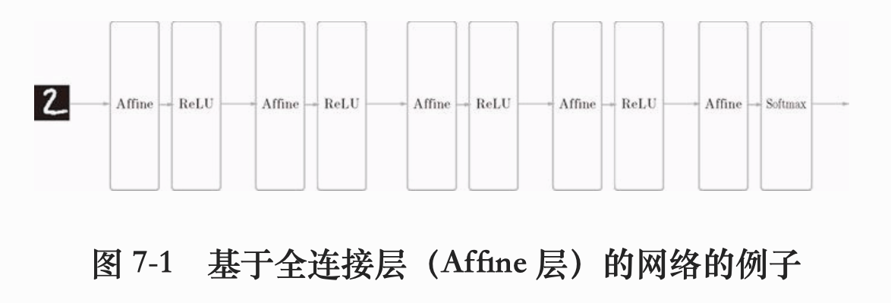</div>

全连接的神经网络中，这里使用了 ReLU 层作为激活函数层，也可以使用 Sigmoid 作为激活函数，然后输出层的激活函数这里用的是 Softmax。

那么，CNN 的神经网络结构是什么样的呢？看下面这个 CNN 的例子：

<div align="center">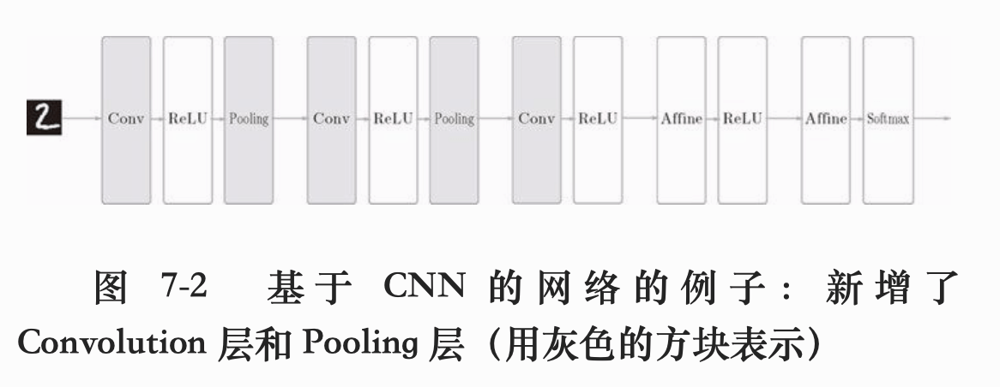</div>

如上图所示，CNN 中增加了 Convolution 层和 Pooling 层，称为卷积层和池化层。CNN 层的连接顺序是 `Convolution -> ReLU -> Pooling`，这样一整个作为神经网络的一层，Pooling 层有时候也会省略。而且在靠近输出层的地方，还是使用了原来的 `Affine -> ReLU` 全连接层这种搭配。上图都是一般的 CNN 中比较常见的结构。

# 卷积层

上面出现了一个术语，叫 `卷积层` 。为什么 CNN 中使用卷积层代替 Affine 全连接层呢？

全连接层存在什么问题呢？那就是数据的形状被忽略了， CNN 主要处理图片数据，图片是有高宽的，还有 RGB 3个通道的数据，是个三维数据。如果使用全连接层，需要将图片拉伸成一维，把每个像素作为一个变量输入。前面提到的手写数字识别例子中，输入图像是1通道，宽高都是28像素，但却被排成一列，以784个变量的形式输入到最开始的全连接层。

图像是3维形状，相邻的像素间具有相似的值，RGB 的各个通道间也可能有某种关联。3维形状中可能隐藏着更本质的东西，所以我们使用卷积层代替全连接层。

卷积层可以保持形状不变，当输入数据是图像是，卷积层会以三维的数据形式接收数据，并同样以三维数据的形式传递给下一层。

我们来看看卷积层是怎么处理的。以下是一个二维数据的例子，就是通道数为1的灰度图像。

<div align="center">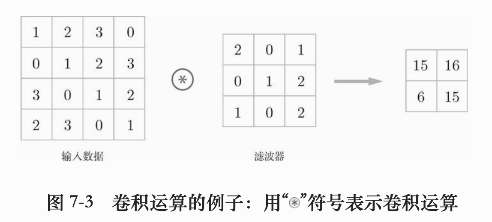</div>

卷积层内部进行的运算叫做卷积运算。卷积运算相当于图像处理中的 `滤波器` 。这里也可以称为 `核` 或 `卷积核` 。卷积运算对输入数据应用滤波器，上图中，输入数据有高宽，滤波器也有高宽。下面来看看滤波器的运算过程：

<div align="center">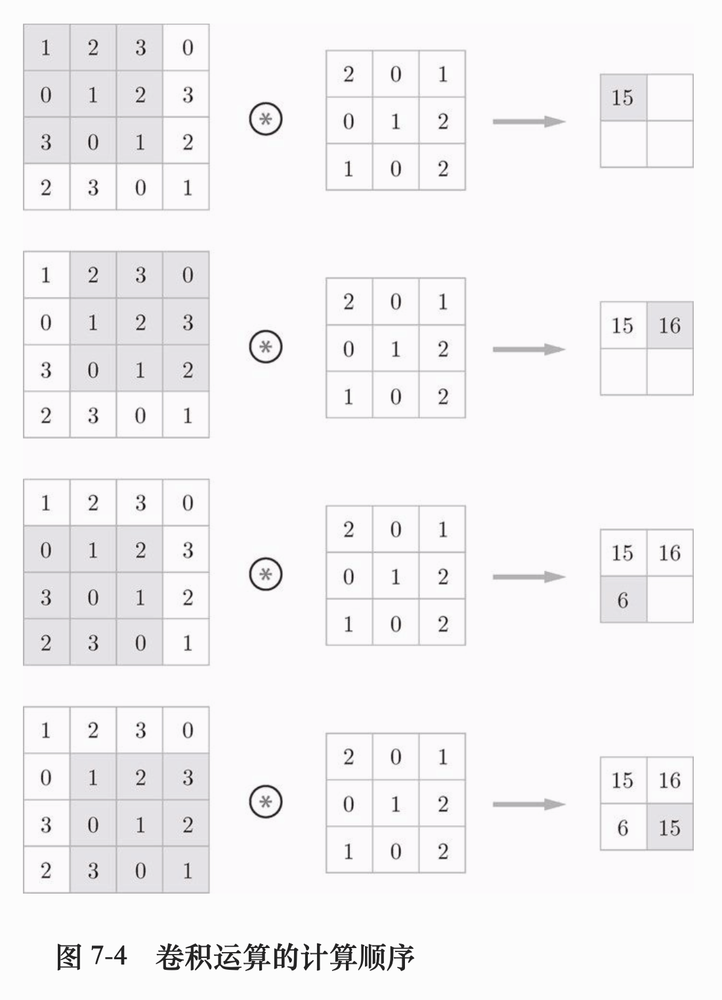</div>

卷积运算以一定间隔滑动滤波器的窗口，这里说的窗口是上图的灰色区域。将滤波器和图片数据对应位置上的值相乘再求和，将结果保存到输出的对应位置，就可以得到卷积运算的输出。这个滤波器详单于就是全连接层里面的权重。

全连接层除了权重还有偏置，CNN 中也有偏置，CNN 的偏置是向应用了滤波器的数据再加上某个值，偏置通常只有一个（1 * 1），如下图：

<div align="center">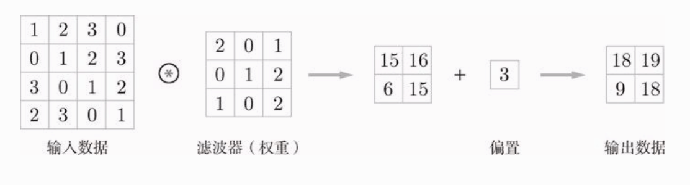</div>

# 填充

上面的卷积运算图中，一个 4 * 4 大小的图像，经过 3 * 3 的滤波器处理后，输出了 2 * 2 的特征图（卷积层的输入输出数据称为特征图），图像缩小了。如果反复进行多次卷积运算的话，那么在某个时刻大小就啃呢个变为1，会导致无法在应用卷积运算。为了避免这样的情况，我们需要使用填充（padding）。

如下图，我们将填充的幅度设为1，那么相对于输入大小 4 * 4，输出大小也是 4 * 4，因此，卷积运算就可以一直进行下去。

<div align="center">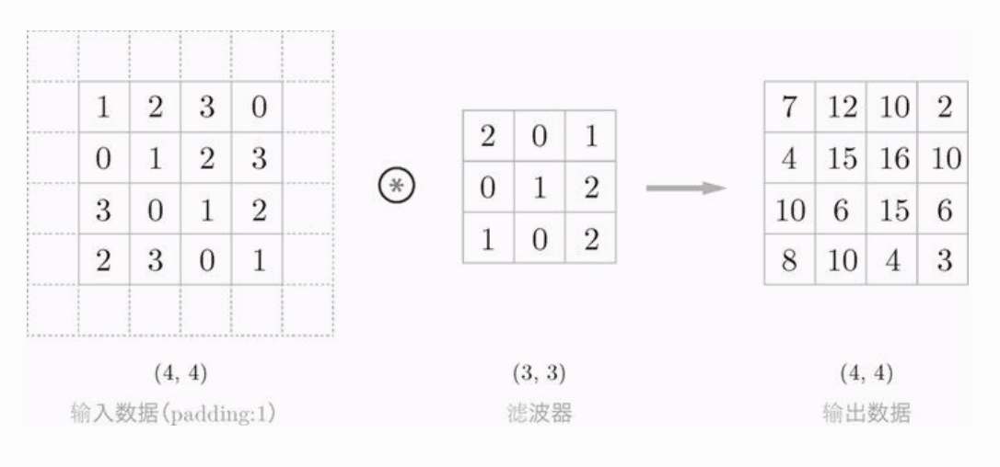</div>

# 步幅

步幅（stride）指定应用滤波器的间隔，看下图：

<div align="center">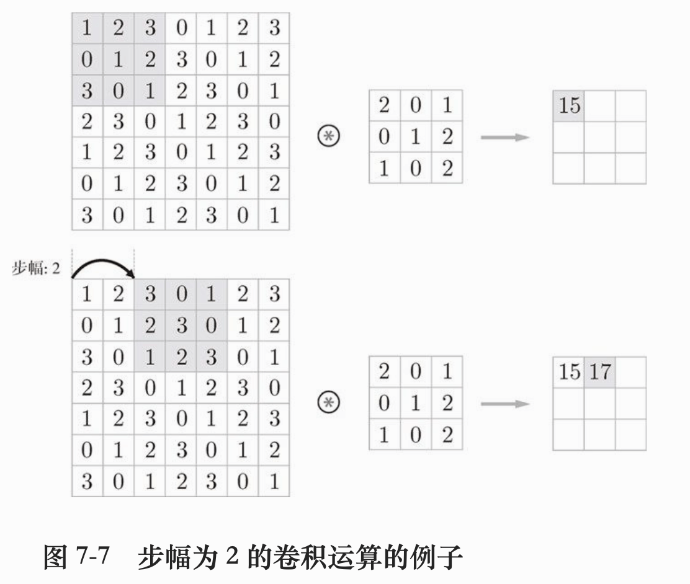</div>

综上，增大步幅后，输出会变小。而增大填充，输出会变大。我们就可以根据这两个变量调整每层卷积层的输出特征图了。

# 3维数据的卷积运算

之前的卷积运算都是2维的，都是通道数为1的灰度图像，三维的就是有 RGB 三个通道的图像，通俗理解就是彩色图像。

我们来看一下三维数据的卷积运算例子：

<div align="center">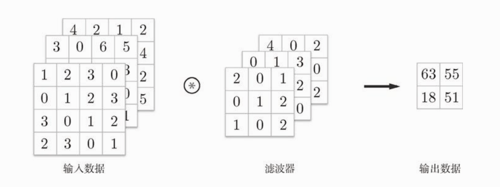</div>

计算过程是这样的：

<div align="center">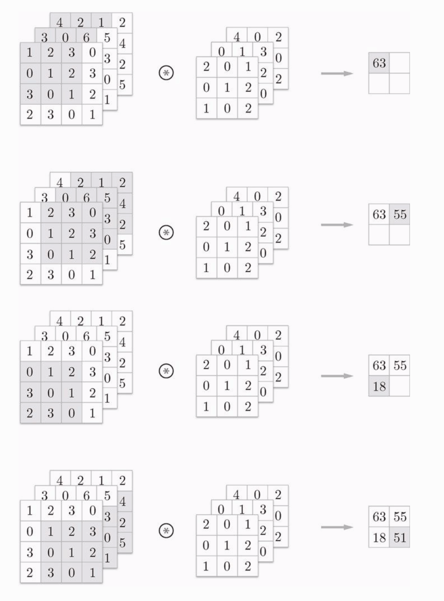</div>

在三维数据的卷积运算中，输入特征图变成了3份（RGB），滤波器也分成了3份（分别对应输入特征图的三个特征图），他们会按照通道进行卷积运算，并将结果相加，从而得到输出。`三张输入特征图` 经过滤波器后，变为 `一张输出特征图` 。

这里要注意的是，输入数据和滤波器的通道数一定要相同。

将数据和滤波器结合方块来，3维数据的卷积运算会很容易理解。三维数据表示为多维数组时，书写顺序为（channel，height，width），我们假设输入图像的通道数为C，高为H，宽为W，滤波器的通道也为C，高为FH，宽为FW，如下图：

<div align="center">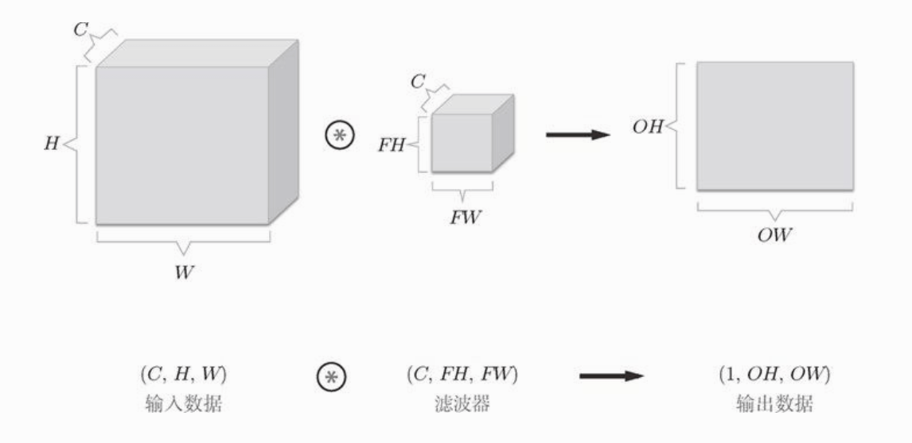</div>

这个例子中，输出的是一张特征图，也可以看作是一通道的图像。那么，如果我们想在通道方向上也输出多个特征图，要怎么做呢？我们需要用到多个滤波器（权重）。

以下是基于多个滤波器的例子：

<div align="center">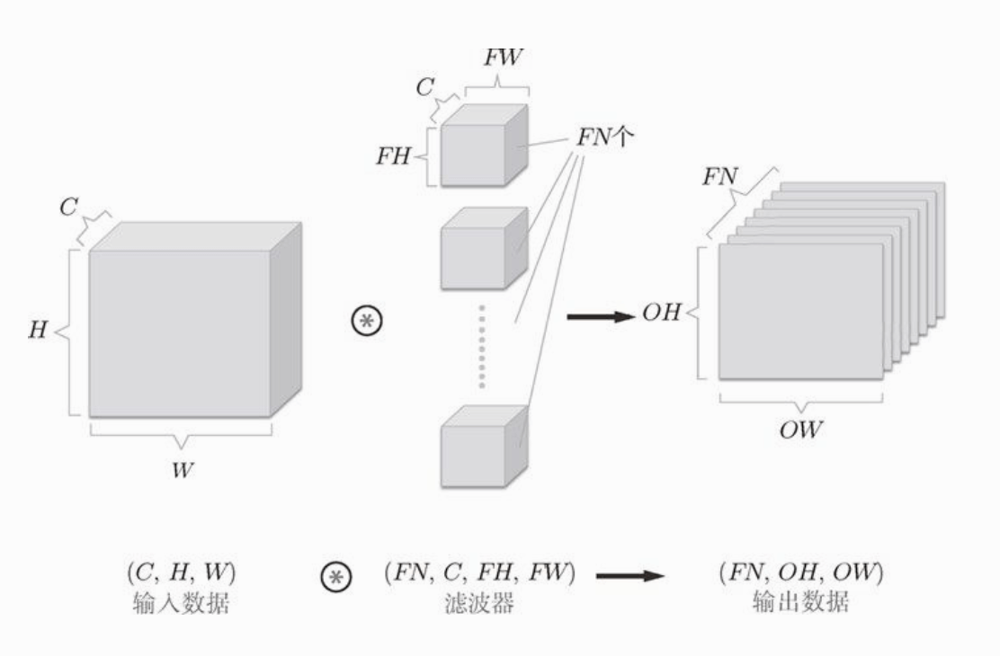</div>

输入图像通过 FN 个滤波器，输出了FN个特征图，这 FN 个输出特征图再传给下一层，就是 CNN 的处理流。

上图中，滤波器又加了数量这个维度，所以我们要按（output_channel, input_channel, height, width）这中格式书写。 output_channel 就是输出特征图的数量，等于滤波器的数量。

多个滤波器的卷积运算中也存在多个偏置。偏置的形状是（FN，1，1），经过滤波器输出的多通道特征图后，每个通道的特征图都要加上相应通道的偏置。如下图：

<div align="center">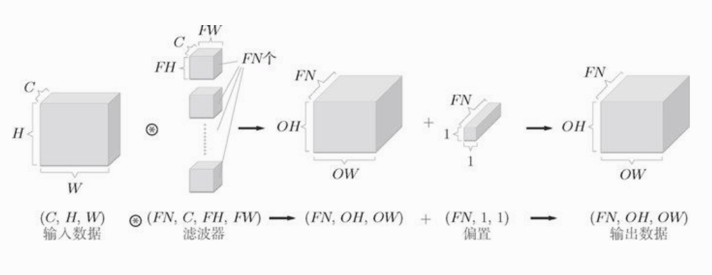</div>

# 池化层

池化是缩小高宽方向上的空间的运算，如下图：

<div align="center">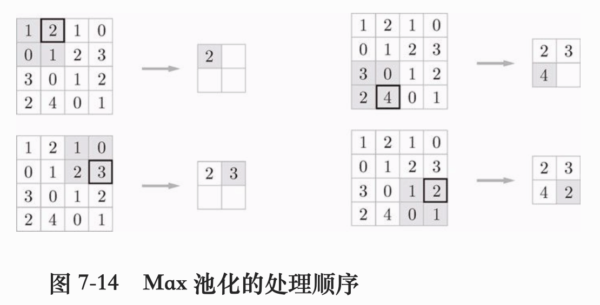</div>

图中的例子是按照步幅为2进行的 2 * 2 的 `Max池化` 处理。 `Max池化` 是获取最大值的运算。除了 `Max池化` 外，还有 `Average池化`（获取目标区域的平均值） 等。

池化层有什么用呢？下面讲讲池化层的几个特点：
1. 减少计算量
2. 提高感受野大小
3. 增加平移不变性

看看视频感受一下：

<div align="center">
  <video controls="controls" preload="none" poster="">
    <source src="./videos/pooling_layer.mp4" type="video/mp4">
  </video>
</div>


# 卷积层的实现

前面我们详细介绍了卷积层和池化层，接下来我们用pthon实现卷积层的代码。

卷积层也和之前 Affine 等层类似，具有 forward 和 backward 方法，对应前向传播和反向传播的算法。

大家可能会感觉卷积层和池化层实现起来很复杂，但实际上，我们通过使用某种技巧，就可以很轻松的实现。下面来讲讲这个技巧。

如前所述， CNN 中各个层之间传递的是四维数据，如（20，1，28，28）表示20张高为28，宽为28，通道数为1的图像。用python表示的话，就是

```
# 四维数据
x = np.random.rand(10, 1, 28, 28)
# 访问第一个元素(第一张图像)
x[0]
# 访问第二个元素(第二张图像)
x[1]
# 访问第一个元素的第一个通道
x[0][0]
```

接下来，我们使用 `im2col` 这个技巧，卷积运算就会变得简单。

`im2col` 这个名称是 `image to column` 的缩写。翻译过来就是 “图像到矩阵” 的变换。在 Caffe、Chainer 等深度学习框架中都有名为 im2col 的函数。

`im2col` 是一个函数，将四维数据转换成二维数据（二维矩阵）。`im2col` 对于输入数据，将滤波器应用到的每个区域都会横行展开为一列。

<div align="center">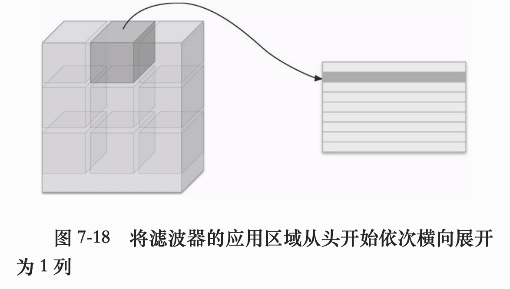</div>

上图左边只拿了一条数据作为例子，为了便于观察，我们把步幅设置的和宽一样长，就看到滤波器会依次处理图中的方块了，但实际情况下，步幅不会设置的很大，所以展开后的元素个数会多于原方块的元素。注意，展开后的每一列表示的不是一张图像数据，而是滤波器需要应用的一个区域。

之后，只需将滤波器纵向展开为一列（如果有多个滤波器则有多列），并计算两个矩阵的乘积即可。我们知道，两个矩阵的乘积是左边矩阵的行乘以右边矩阵的列，这里相当于在进行卷积运算。然后再将乘积结果矩阵转换(reshape)为输出数据的大小。

<div align="center">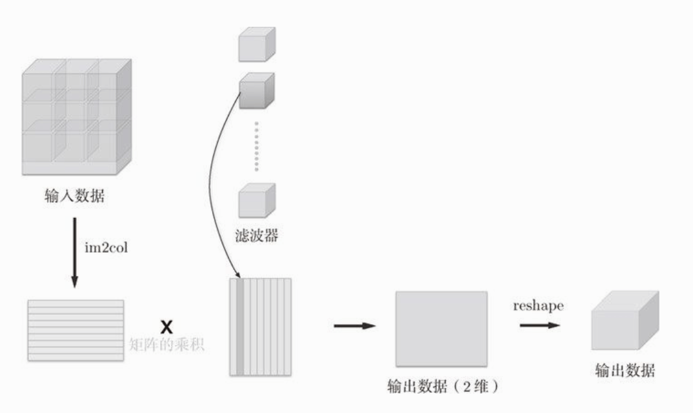</div>

原理讲完了。

接下来我们看看 python 的实现

```
def im2col(input_data, filter_h, filter_w, stride=1, pad=0):
    """

    Parameters
    ----------
    input_data : 由(数据量, 通道, 高, 长)的4维数组构成的输入数据
    filter_h : 滤波器的高
    filter_w : 滤波器的长
    stride : 步幅
    pad : 填充

    Returns
    -------
    col : 2维数组
    """

    # 输入数据的形状
    N, C, H, W = input_data.shape
    # 输出特征图的高
    out_h = (H + 2*pad - filter_h)//stride + 1
    # 输出特征图的宽
    out_w = (W + 2*pad - filter_w)//stride + 1

    # 填充图像周边的像素
    img = np.pad(input_data, [(0,0), (0,0), (pad, pad), (pad, pad)], 'constant')
    # 转换后的矩阵，初始化为0
    col = np.zeros((N, C, filter_h, filter_w, out_h, out_w))

    for y in range(filter_h):
        y_max = y + stride*out_h
        for x in range(filter_w):
            x_max = x + stride*out_w
            col[:, :, y, x, :, :] = img[:, :, y:y_max:stride, x:x_max:stride]

    col = col.transpose(0, 4, 5, 1, 2, 3).reshape(N*out_h*out_w, -1)
    return col


def col2im(col, input_shape, filter_h, filter_w, stride=1, pad=0):
    """

    Parameters
    ----------
    col :
    input_shape : 输入数据的形状（例：(10, 1, 28, 28)）
    filter_h :
    filter_w
    stride
    pad

    Returns
    -------

    """
    N, C, H, W = input_shape
    out_h = (H + 2*pad - filter_h)//stride + 1
    out_w = (W + 2*pad - filter_w)//stride + 1
    col = col.reshape(N, out_h, out_w, C, filter_h, filter_w).transpose(0, 3, 4, 5, 1, 2)

    img = np.zeros((N, C, H + 2*pad + stride - 1, W + 2*pad + stride - 1))
    for y in range(filter_h):
        y_max = y + stride*out_h
        for x in range(filter_w):
            x_max = x + stride*out_w
            img[:, :, y:y_max:stride, x:x_max:stride] += col[:, :, y, x, :, :]

    return img[:, :, pad:H + pad, pad:W + pad]

```

`im2col` 函数会考虑滤波器大小，步幅，填充，将输入数据展开为2维数组。`col2im` 函数是 `im2col` 函数的逆处理，应用于反向传播时的计算。

我们可以将 `im2col` 和 `col2im` 函数作为一个黑盒使用。

接下来就是卷积层的实现：

```
class Convolution:
  def __init__(self, W, b, stride=1, pad=0):
    self.W = W
    self.b = b
    self.stride = stride
    self.pad = pad
    # 中间数据，反向传播要用
    self.x = None
    self.db = None
    self.dW = None
    self.col = None
    self.col_W = None

  def forward(self, x):
    # 滤波器的形状
    FN, C, FH, FW = self.W.shape
    # 输入数据的形状
    N, C, H, W = self.x.shape
    # 输出特征图的高和宽
    out_h = int(1 + (H + 2*self.pad = FH) / self.stride)
    out_w = int(1 + (W + 2*self.pad = FW) / self.stride)
    # 将输入数据展开为二维矩阵
    col = im2col(x, FH, FW, self.stride, self.pad)
    # 滤波器的展开
    col_W = self.W.reshape(FN, -1).T
    out = np.dot(col, col_W) + self.b
    # 将二维矩阵转换回输出特征图
    out = out.reshape(N, out_h, out_w, -1).transpose(0, 3, 1, 2)
    
    self.x = x
    self.col = col
    self.col_W = col_W
    return out

  def backward(self, dout):
    # 滤波器的形状
    FN, C, FH, FW = self.W.shape
    dout = dout.transpose(0,2,3,1).reshape(-1, FN)

    self.db = np.sum(dout, axis=0)
    self.dW = np.dot(self.col.T, dout)
    # 转回滤波器的形状
    self.dW = self.dW.transpose(1, 0).reshape(FN, C, FH, FW)

    dcol = np.dot(dout, self.col_W.T)
    dx = col2im(dcol, self.x.shape, FH, FW, self.stride, self.pad)
    return dx
```

其中，forward 的计算过程和我们前面讲的一致，我们讲讲 `reshape` 和 `transpose` 的意思。在最后，我们调用了 `out.reshape(N, out_h, out_w, -1).transpose(0, 3, 1, 2)` 这行代码，reshape 会改变数据的维数，这里把二维数据转成了四维数据，而且四维数据的结构是 (数据的份数, 输出特征图的高, 输出特征图的宽, -1)，最后一个 -1 表示自动计算每个维度上的元素个数，使每个维度的元素个数相等。最后的 `transpose` 是改变轴的顺序，因为reshape后的顺序是(数据的份数, 输出特征图的高, 输出特征图的宽, 通道数)，传给下一层之前要把通道数放在第二个维度，参考下图：

<div align="center">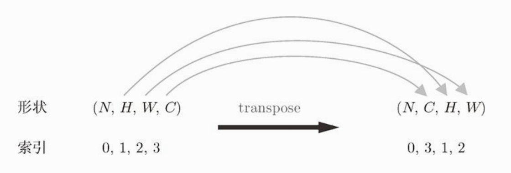</div>

# 池化层的实现

池化层的实现和卷积层相同，都需要使用 `im2col` 展开。不过，和卷积层不同的是，池化的情况下，在通道方向上是独立的。

如下图：

<div align="center">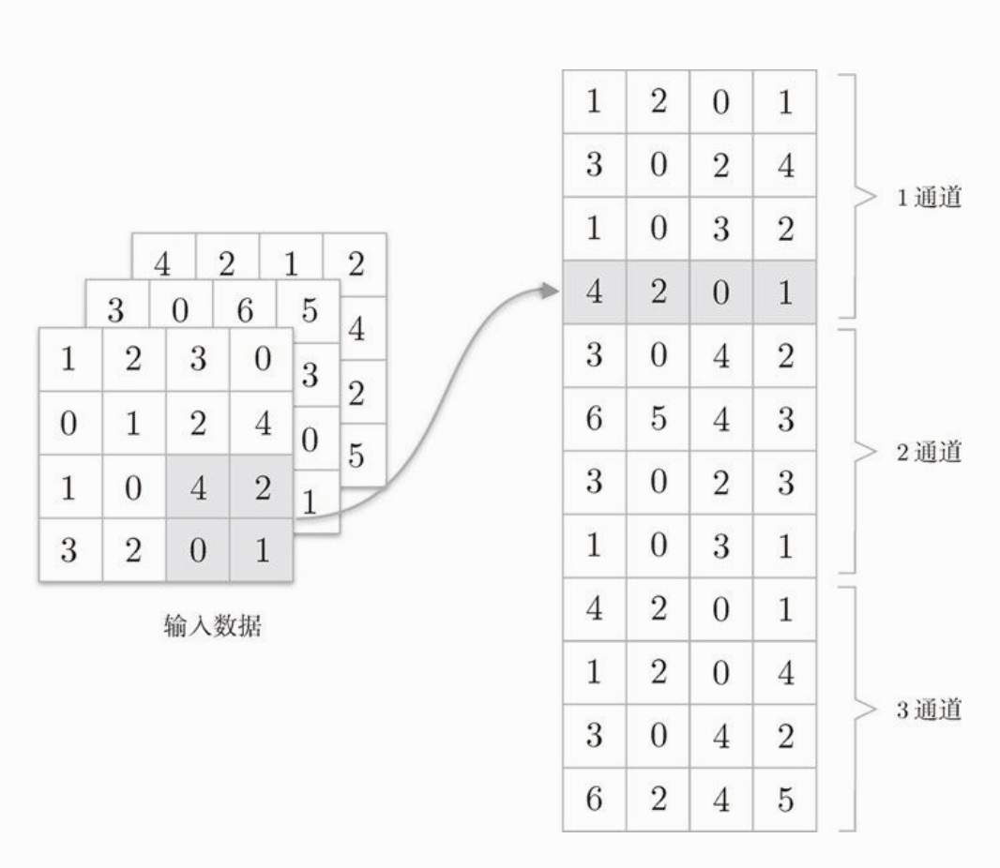</div>

卷积层的一行可以包含多个通道，池化层则是按通道分块，再按池化区域分行。

整个池化的过程如下图所示：

<div align="center">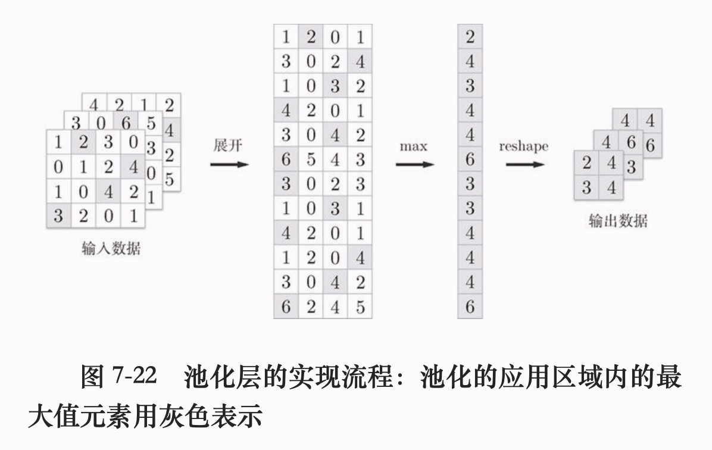</div>

实现池化层的代码：

```
class Pooling:
  def __init__(self, pool_h, pool_w, stride, pad):
    self.pool_h = pool_h
    self.pool_w = pool_w
    self.stride = stride
    self.pad = pad

  def forward(self, x):
    N, C, H, W = x.shape
    # 池化层输出特征图的宽高
    out_h = int(1 + (H - self.pool_h) / self.stride)
    out_w = int(1 + (W - self.pool_w) / self.stride)

    # 展开
    col = im2col(x, self.pool_h, self.pool_w, self.stride, self.pad)
    col = col.reshape(-1, self.pool_h * self.pool_w)

    # 求各行最大值
    out = np.max(col, axis=1)

    # 转换回来
    out.reshape(N, out_h, out_w, C).transpose(0, 3, 1, 2)
    return out

  def backward(self, dout):
    dout = dout.transpose(0, 2, 3, 1)
    
    pool_size = self.pool_h * self.pool_w
    dmax = np.zeros((dout.size, pool_size))
    dmax[np.arange(self.arg_max.size), self.arg_max.flatten()] = dout.flatten()
    dmax = dmax.reshape(dout.shape + (pool_size,)) 
    
    dcol = dmax.reshape(dmax.shape[0] * dmax.shape[1] * dmax.shape[2], -1)
    dx = col2im(dcol, self.x.shape, self.pool_h, self.pool_w, self.stride, self.pad)
    
    return dx
```

# CNN的实现

我们已经实现了卷积层和池化层，现在我们通过组合这些层，来实现一个手写数字识别的卷积神经网络。实现如下图所示的 CNN ：

<div align="center">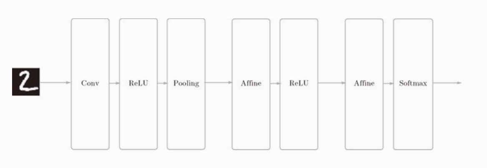</div>

我们将它实现为名为 SimpleConvNet 类：

```
import numpy as np
from common.functions import *
from common.gradient import numerical_gradient
from common.layers import *
import collections

class SimpleConvNet:
  # input_dim 输入数据的维度（通道数，高，宽）
  # conv_param 卷积层的超参数
  def __init__(self, input_dim=(1,28,28), conv_param={'filter_num': 30, 'filter_size': 5, 'pad': 0, 'stride': 1}, hidden_size=100, output_size=10, weight_init_std=0.01):
    # 滤波器的数量
    filter_num = conv_param["filter_num"]
    # 滤波器的大小
    filter_size = conv_param["filter_size"]
    # 滤波器的步幅
    filter_stride = conv_param["stride"]
    # 填充
    filter_pad = conv_param["pad"]
    # 输入图像的高宽
    input_size = input_dim[1]
    # 卷积层输出特征图高宽
    conv_output_size = (input_size - filter_size + 2 * filter_pad) / filter_stride + 1
    # 池化层输出图像高宽
    pool_output_size = int(filter_num * (conv_output_size / 2) * (conv_output_size / 2))

    # 初始化权重
    self.params = {}
    self.params["W1"] = weight_init_std * np.random.randn(filter_num, input_dim[0], filter_size, filter_size)
    self.params["b1"] = np.zeros(filter_num)
    self.params["W2"] = weight_init_std * np.random.randn(pool_output_size, hidden_size)
    self.params["b2"] = np.zeros(hidden_size)
    self.params["W3"] = weight_init_std * np.random.randn(hidden_size, output_size)
    self.params["b3"] = np.zeros(output_size)

    # 初始化层
    self.layers = collections.OrderedDict()
    self.layers["Conv1"] = Convolution(self.params["W1"], self.params["b1"], filter_stride, filter_pad)
    self.layers["Relu1"] = Relu()
    self.layers["Pool1"] = Pooling(pool_h=2, pool_w=2, stride=2)
    self.layers["Affine1"] = Affine(self.params["W2"], self.params["b2"])
    self.layers["Relu2"] = Relu()
    self.layers["Affine2"] = Affine(self.params["W3"], self.params["b3"])
    self.last_layer = SoftmaxWithLoss()

  def predict(self, x):
    for layer in self.layers.values():
      x = layer.forward(x)
    return x

  def loss(self, x, t):
    y = self.predict(x)
    return self.last_layer.forward(y, t)

  def gradient(self, x, t):
    self.loss(x, t)

    dout = 1
    dout = self.last_layer.backward(dout)

    layers = list(self.layers.values())
    layers.reverse()
    for layer in layers:
      dout = layer.backward(dout)
    
    grads = {}
    grads["W1"] = self.layers["Conv1"].dW
    grads["b1"] = self.layers["Conv1"].db
    grads["W2"] = self.layers["Affine1"].dW
    grads["b2"] = self.layers["Affine1"].db
    grads["W3"] = self.layers["Affine2"].dW
    grads["b3"] = self.layers["Affine2"].db
    return grads
```

属于你的卷积神经网络就已经实现了！！！

# 深度学习

深度学习是加深了层的神经网络。基于之前创建的神经网络，只需通过叠加层，就能创建深度网络。

接下来介绍以下常用的三个卷积神经网络。

# VGG网络

VGG 是由卷积层和池化层构成的基础的 CNN 。它的特点是将有权重的层叠加至 16 层或 19 层，具备了深度。

<div align="center">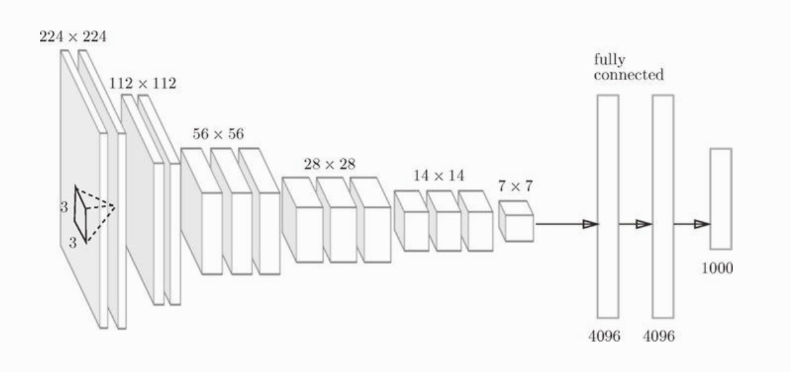</div>

VGG 中需要注意的是，上图中基于 3 * 3 滤波器的卷积运算是连续进行的，卷积运算连续 2 - 4 次，再由池化层将图片大小减半，最后由全连接层输出结果。

VGG 在 2014 年的比赛中获得了第二名，但因为 VGG 结构简单，应用性强，所以很多技术人员都喜欢使用基于 VGG 的网络。

# 介绍几种优化算法

### SGD 

SGD 就是随机梯度下降法，每次沿着梯度的方向更新权重。如下图：

<div align="center">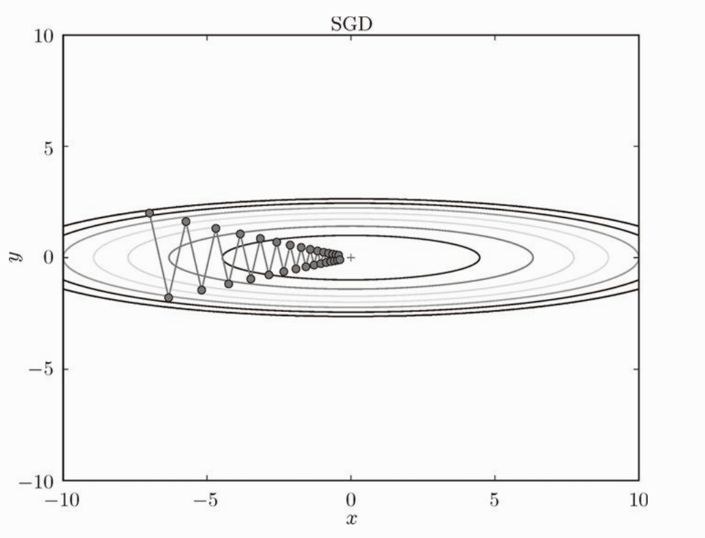</div>

更新权重的代码也很简单：

```
class SGD:
  def __init__(self, lr):
    self.lr = lr
  
  def update(self, params, grads):
    for key in params.keys():
      params[key] -= self.lr * grads[key]
```

### Momentum 

Momentum 是动量的意思，可以看成物理中的速度，这种方式更新权重会受到之前梯度的影响。发现相比 SGD ，使用 Momentum 算法“之”字形的程度减轻了。好像有速度一样。

<div align="center">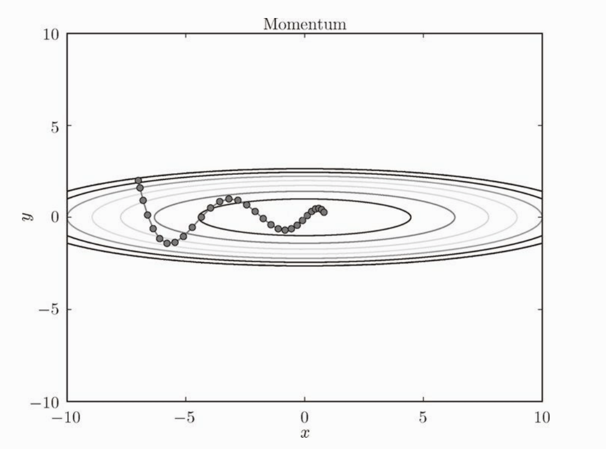</div>

更新权重的代码：

```
class Momentum:
  def __init__(self, lr, momentum=0.9):
    self.lr = lr
    self.momentum=momentum
    self.v = None
  
  def update(self, params, grads):
    if self.v is None:
      self.v = {}
      for key, val = params.items():
        self.v[key] = np.zeros_like(val)
    for key in params.keys():
      self.v[key] = self.momentum * self.v[key] - self.lr * grads[key]
      params[key] += self.v[key]
```

第一次调用 update 时，初始化变量v。

### Adagrad

这是一种学习率衰减的方法。随着学习的进行，学习率逐渐减小。 Adagrad 会为每个元素适当地调整学习率， Adagrad 更新算法如下：

<div align="center">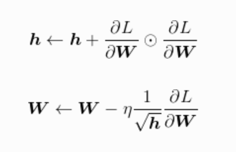</div>

这里出现了新变量 h ，它保存了以往所有梯度值的平方和。梯度的更新越大， h 值变动越大，然后在更新权重的时候 W 更新幅度越小。

<div align="center">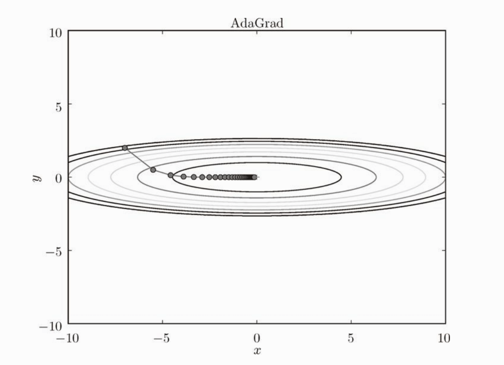</div>

代码如下：

```
class AdaGrad:
  def __init__(self, lr=0.01):
    self.lr = lr
    self.h = None

  def update(self, params, grads):
    if self.h is None:
      self.h = {}
      for key, val in params.items():
        self.h[key] = np.zero_like(val)
    for key in params.keys():
      self.h[key] += grads[key] * grads[key]
      params[key] -= self.lr *  self.h[key] / (np.sqrt(self.h[key]) + 1e-7)
```

### Adam

Adam 融合了 Momentum 和 Adagrad 两种算法。

<div align="center">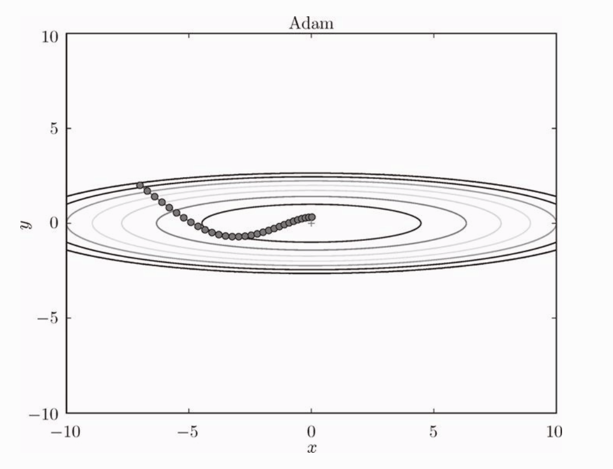</div>

也有 Momentum 类似的运动轨迹，但是程度有所减轻，得益于 Adagrad 的学习率衰减。

Adam 会设置三个参数，一个是学习率，另外两个是一次momentum系数和二次momentum系数。这两个参数标准值是 0.9 和 0.999 。大部分情况下都能顺利运行。


# 基于 keras 的例子

接下来，我们用 keras 实现一个识别猫狗的深度神经网络。

先贴全部代码：

```
import numpy as np
from keras.models import Sequential
from keras.layers import Dense, Conv2D, Activation, MaxPooling2D, Flatten, Dropout, BatchNormalization
from keras.preprocessing import image
from PIL import Image
from collections import OrderedDict

def load_data():
  """
  生成训练数据和

  """
  # 输入目录的路径，并生成批量的增强/标准化的数据。
  gen = image.ImageDataGenerator(
    rescale=1.0/255, # 标准化数据，默认为 None。如果是 None 或 0，不进行缩放，否则将数据乘以所提供的值（在应用任何其他转换之前）
    rotation_range=20, # 随机旋转的度数范围
    width_shift_range=0.2, # 进行水平位移
    height_shift_range=0.2, # 进行垂直位移
    shear_range=0.2, # 剪切强度（以弧度逆时针方向剪切角度）
    zoom_range=0.5, # 随机缩放范围
    horizontal_flip=True, # 随机水平翻转
    )
  # 训练数据
  train_flow = gen.flow_from_directory(directory='./c_vs_d/train/', target_size=(224,224), batch_size=100, class_mode='categorical')
  return train_flow

def createModel():
  """
  创建用于深度学习的神经网络

  """
  # 搭建网络
  model = Sequential()

  # 第一层
  model.add(Conv2D(filters=6, kernel_size=(11, 11), strides=(4, 4), padding='valid', activation='relu', input_shape=(224, 224, 3)))
  model.add(BatchNormalization())
  model.add(MaxPooling2D(pool_size=(3, 3), strides=(2, 2), padding='valid'))

  # 第二层
  model.add(Conv2D(filters=256, kernel_size=(5, 5), strides=(1, 1), padding='same', activation='relu'))
  model.add(BatchNormalization())
  model.add(MaxPooling2D(pool_size=(3, 3), strides=(2, 2), padding='valid'))

  # 第三层
  model.add(Conv2D(filters=384, kernel_size=(3, 3), strides=(1, 1), padding='same', activation='relu'))
  model.add(BatchNormalization())
  model.add(Conv2D(filters=384, kernel_size=(3, 3), strides=(1, 1), padding='same', activation='relu'))
  model.add(BatchNormalization())
  model.add(Conv2D(filters=356, kernel_size=(3, 3), activation='relu'))
  model.add(BatchNormalization())
  model.add(MaxPooling2D(pool_size=(3, 3), strides=(2, 2), padding='valid'))

  # 第四层
  model.add(Flatten())
  model.add(Dense(4096, activation='relu'))
  model.add(Dropout(0.5))

  # 第五层
  model.add(Dense(4096, activation='relu'))
  model.add(Dropout(0.5))

  # 第六层
  model.add(Dense(1000, activation='relu'))
  model.add(Dropout(0.5))

  # 输出层
  model.add(Dense(2))
  model.add(Activation('softmax'))
  model.compile(optimizer='sgd', loss='categorical_crossentropy', metrics=['accuracy'])
  return model


def predict(img_path):
  im = Image.open(img_path)
  resizedIm = im.resize((224,224))
  im_arr = np.array(resizedIm)
  normaliza_im_arr = im_arr / 255
  dict = OrderedDict()
  dict[0] = normaliza_im_arr
  li = list(dict.values())
  li = np.array(li)

  model = createModel()
  model.load_weights("cat_vs_dog_weight.h5")
  pred = model.predict(li)
  if pred.argmax() == 0:
    print("cat")
  else:
    print("dog")

def train():
  train_flow = load_data()
  # 查看 train_flow 自动生成的分类
  print(train_flow.class_indices)

  # 创建 model
  model = createModel()

  # 训练模型
  his = model.fit_generator(train_flow, steps_per_epoch=10, epochs=1, verbose=1)
  print(his.history)

  model.save_weights('cat_vs_dog_weight.h5')
  print("训练完成")

if __name__ == '__main__':
  # 预测
  # predict('./c_vs_d/train/cat/cat.0.jpg')

  # 训练
  train()

```

我们一个一个方法来说明：

### load_data

`load_data` 函数用来准备训练数据，这里我们用 `keras.preprocessing.image` 对象的 `ImageDataGenerator` 方法来创建，ImageDataGenerator 的参数有很多，都是用来数据扩充的，通过把图片旋转，位移，裁剪来生成新图像。只不过使用 ImageDataGenerator 这种方式对目录有一定的要求，要求每个分类一个目录，然后它会生成分类，后面的 `print(train_flow.class_indices)` 会打印 `{'cat': 0, 'dog': 1}` 。

后面再通过使用 flow_from_directory 来准备数据（训练的图片都要统一大小，指定 batch_size 等...）。

### createModel

这个是重点函数，用来生成神经网络的结构。有了上面学过的知识，实际看代码很好懂。就是创建各种层叠加起来。 `Dense` 就是我们前面学过的全连接层。优化算法 optimizer 是 sgd ，就是前面学过的随机梯度下降法。最后，返回 model 模型。

model 的训练有三种方式，`fit` 和 `fit_generator` 和 `train_on_batch` 。

fit: 最普通的就是 fit 了，使用 fix 需要自己准备训练数据和训练标签作为变量传入，训练的时候就使用原始数据来训练。对于小型，简单化的数据集，fix 完全够用了。

fit_generator: 但是真实世界的数据集往往没那么简单，一个是真实世界的数据集通常太大而无法全部放入内存中，另一个是我们需要对数据集进行增强（对图像进行翻转，剪切，收缩等操作）来避免过拟合并增加我们模型的泛化能力。这时候可以使用 fit_generator 。

train_on_batch: 函数接受单批数据，执行反向传播，然后更新模型参数。用于对模型精细控制，一般用不到。

### history 
训练函数返回的 history 对象保存了训练过程数据。利用 history 可以很容易地画出 loss 和 accuracy 迭代曲线。

### 保存训练好的模型

等训练完成后，调用 save_weights 把训练完成的 model 的权重保存到一个文件里。然后在 predict 预测函数中，我们先生成同等结构的 model ，然后调用 load_weights 载入这个权重文件。

与之相似的还有 save 和 load_model 方法，这两个方法是保存模型到 h5 文件，包括模型的结构，权重，训练配置（损失函数，优化器等），优化器的状态，以便从上次训练中断的地方再次训练。

相似的还有 to_json() 和 model_from_json() 方法，这个方法只保存模型的结构。

### predict

预测函数，传入图片的途径。经过预处理后传给 model 预测，model 预测的结果是一个数组，里面是每个分类的概率，我们用 argmax 取出最大值的索引，就是预测的分类。

# Q.A

- 标准差

我们在初始化权重的时候都使用了 `np.random.randn()` 这个方法，randn 方法会生成均值为0，标准差为1的正态分布数据。这是上面意思呢？

我们经过研究发现，很多情况下的数据都是成正态分布的，比如所有人的身高，肺活量，考试成绩等等，都是成正态分布的，这是一个神奇的自然现象。所以我们想权重的值的分布也是符合正态分布的。正态分布有两个参数，均值和标准差，就是生成均值为多少，标准差为多少的正态分布数据。

均值就是所有值加起来，除以个数。标准差是一组数据平均值分散程度的一种度量。一个较大的标准差，代表大部分数值和其平均值之间差异较大；一个较小的标准差，代表这些数值较接近平均值。

- 权重为什么都初始化为一个很小的值

我们在上面的代码中可以看到生成正态分布的数据后，会乘以 `weight_init_std` 这个变量，让标准差变小，也让每个权重的值也变小，生成比较小的随机权重值是为了如果神经网络中有 Sigmoid 作为激活函数，如果权重很大，激活后的值也可能很大或很小，这种情况很可能停在函数平坦的区域，导致梯度很小，就导致学习的很慢。

- one-hot 什么意思

one-hot 表示仅正确解标签为1，其余皆为0的数组。比如一个十元分类问题的正确解是第二类，则表示为[0,1,0,0,0,0,0,0,0,0]，不是 one-hot 则表示为 2 。

最后，再次推荐大家《深度学习入门：基于Python的理论与实现》这本书，如果你对深度学习感兴趣，那绝对有相见恨晚的感觉。