很长一段时间，我都搞不清楚机器学习和深度学习，神经网络之间是什么关系？不懂机器学习可以直接看深度学习吗？神经网络又是啥？后来看了一个大佬的解释才明白，机器学习和深度学习的区别就好像汇编语言和C语言的区别，不懂汇编照样可以学习C语言，可以用C语言做东西，深度学习也一样，当然懂机器学习的话更好。神经网络加深层后就叫做深度学习。

本篇主要是总结最近看的一本《深度学习入门：基于Python的理论与实现》做的一些总结，文章中的例子和图片都是从书中截出来的。这本书非常不错，日本人写的书，讲的很细，从零开始手把手教你撸一个深度学习的神经网络。（而且还有 epub 格式的电子书）

# 目录：

- [python 基础](#python-基础)
- [感知机](#感知机)
- [神经网络简介](#神经网络简介)
- [三层神经网络](#三层神经网络的实现)
- [输出层的设计](#输出层的设计)
- [训练数据和测试数据](#训练数据和测试数据)
- [损失函数](#损失函数)
- [导数](#导数)
- [偏导数](#偏导数)
- [梯度](#梯度)
- [梯度下降法](#梯度下降法)
- [手写一个神经网络](#手写一个神经网络)
- [反向传播法](#反向传播法)

# python 基础

书的最开篇，按照惯例，事先学习 python（3.x） 的基本语法和 NumPy 计算库，NumPy 库提供了遍历的矩阵操作方法。还有 Matplotlib 库是用来画图的，可以把一些函数用图片的方式直观的展示出来。

NumPy 和 Matplotlib 都是第三方库，需要用 pip install 一下。

NumPy 库中常用的方法说明：

```
import numpy as np

# 创建一个矩阵
A = np.array([[1,2],[3,4]])
# 矩阵 A 的形状，这里返回 (2, 2) ，表示2行2列的矩阵
A.shape
> (2, 2)
B = np.array([[3,0],[0,6]])

# 相当于是进行普通的两个矩阵乘法运算（A * B）
np.dot(A, B)
> array([[ 3, 12],
       [ 9, 24]])

# 以 0.1 为单位，生成0～5的数据
C = np.arange(0, 6, 0.1)
```

下图是矩阵乘积的计算方法：

<div align="center">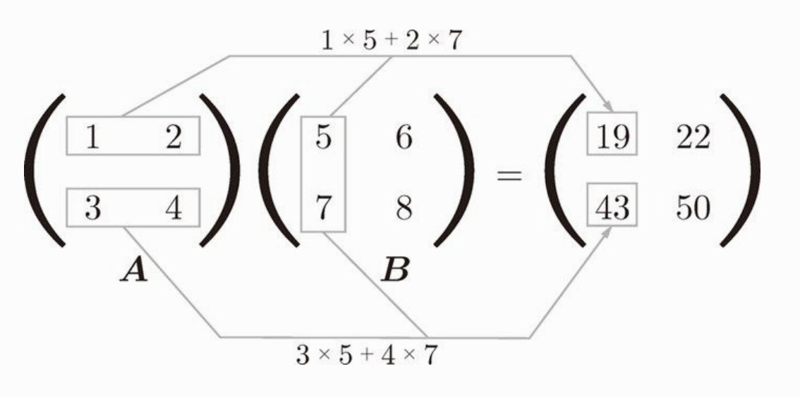</div>


Matplotlib 库中常用的方法说明：
```
import matplotlib.pyplot as plt

# 以 0.1 为单位，生成0～5的数据
x = np.arange(0, 6, 0.1)
y = np.sin(x)

# 绘制图形
plt.plot(x, y)
# 显示 x 轴标签
plt.xlabel("x")
# 显示 y 轴标签
plt.ylabel("y")
# 显示图形
plt.show()
```

# 感知机

看完 python 基础，这节我们要来实现一个“感知机”（虽然听不懂，但是好像很牛b的东西）。

感知机是作为神经网络（深度学习）的起源算法。学习感知机能了解神经网络到底是个什么东西。

感知机接收多个输入信号，输出一个信号。这里说的信号可以想像成电流或者河流一样的东西，感知机的信号会形成流，向前方输送信息。但是感知机的信号只有流或不流两种取值（1 或 0），1对应传递信号，0对应不传递信号。

下图是一个有两个输入的感知机的例子：

<div align="center"></div>

x1 和 x2 是输入信号，w1 和 w2 是权重，y 是输出。图中的三个圆圈称为神经元或者节点。输入信号传递到神经元时，会分别乘以固定的权重。y神经元会计算传递过来的信号的总和，只有当这个总和超过了某个阈值(theta)，y神经元才会输出1。

用公式表示就是

<div align="center"></div>

但是考虑到更通用的形式，我们把式子改成如下形式

<div align="center"></div>

θ 符号移到了左边变成了 -θ ，命名为 b ，但表达的内容是完全相同的。w1 和 w2 叫做权重，b 在这里叫做偏置。感知机会计算输入信号和权重的乘积，再加上某个偏置，如果这个值大于0，则输出1，否则输出0。

具体地说，w1 和 w2 是控制输入信号重要性的参数，b 则是调整神经元被激活的容易程度。

那到底感知机有什么用呢？接下来我们用感知机来解决一个简单的问题。

我们用感知机来实现逻辑电路里的"与门"。

与门

| x1 | x2 | y |
|----|----|---|
| 0  | 0 | 0 |
| 0  | 1 | 0 |
| 1  | 0 | 0 |
| 1  | 1 | 1 |

上图中得知，与门是只有在 x1，x2 都为1的情况下，输出才为1。事实上，满足这个条件的参数有无数种，比如 w1，w2 为 0.5，b 为 -0.7，或 w1，w2 为 1.0，b 为 -1.0 都可以。

我们再来看一下"与非门"和"或门",

与非门：

| x1 | x2 | y |
|----|----|---|
| 0  | 0 | 1 |
| 0  | 1 | 1 |
| 1  | 0 | 1 |
| 1  | 1 | 0 |

或门：

| x1 | x2 | y |
|----|----|---|
| 0  | 0 | 0 |
| 0  | 1 | 1 |
| 1  | 0 | 1 |
| 1  | 1 | 1 |

与非门是与门的取反，或门是只要有一个输入信号为1，输出就为1。

那么我们来考虑一下权重w和偏置b。

在 "与非门" 中 w1，w2 为 -0.5，b 为 0.7 就可以，事实上就是与门参数的取反。

"或门" 中 w1，w2 为 1.0，b 为 -0.5 就可以。

这很容易，看图就能看出来。（渐渐骄傲...）

那么，接下来我们来取一下"异或门"的权重和偏置

异或门

| x1 | x2 | y |
|----|----|---|
| 0  | 0 | 0 |
| 0  | 1 | 1 |
| 1  | 0 | 1 |
| 1  | 1 | 0 |

哈哈，想不出来了吧！！！（立即打脸）

事实上，感知机是无法实现这个异或门的！我们可以通过画图来思考其中的原因。

我们看一下 "或门" 的图，如果取 w1，w2 为 1.0，b 为 -0.5，则表达式为

<div align="center"></div>

画成图就是这样：

<div align="center"></div>

那么，灰色区域就是小于等于0的区域，白色区域就是大于0的区域（输出1的区域）。

图片可以看出，把图片三角形和圆形分割开的直线有无数条，所以权重和偏置也有无数种可能。那么，异或门的图是怎样的呢？

<div align="center"></div>

图片可以看到，因为感知机的表达式是一个直线，一条直线是无法把上图中的三角形和圆形分开的，只能用曲线分开，如下图：

<div align="center"></div>

感知机的局限就在于只能表示线性函数，这样弯曲的曲线无法表示。另外，由直线能分割的空间称为线性，曲线才能分割的空间称为非线性。线性，非线性这两个术语在机器学习中很常见。

虽然，我们用单个感知机不能表示异或门，但是我们可以通过叠加层，来表示异或门。

如下图所示：

<div align="center"></div>

组合 与门，与非门，或门

| x1 | x2 | s1 | s2 | y |
|----|----|---|---|---|
| 0  | 0 | 1 | 0 | 0 |
| 0  | 1 | 1 | 1 | 1 |
| 1  | 0 | 1 | 1 | 1 |
| 1  | 1 | 0 | 1 | 0 |

图中，x1 和 x2 通过 "与非门" ，输出 s1。通过 "或门" 输出 s2。再以 s1，s2 为输入，通过 "与门" ，输出 y。实现了异或门。

以神经元的表示方法显示异或门：

<div align="center"></div>

如图，异或门是一个多层结构的神经网络，最左边的输入层称为第0层，中间一列称为第1层，最右边的称为第2层。但是我们在这里把它叫做“2层感知机”，因为有权重的只有两层。

像 "异或门" 这样，还可以解释为“单层感知机无法表示的东西，通过增加一层就可以解决”。也就是说，通过叠加层，可以表示更灵活的东西。

# 神经网络简介

终于到了神经网络了（看这本书不就是为了这个吗），经过上一章感知机的学习，神经网络和感知机有很多共通点。关于感知机，好消息是感知机可以通过叠加层数，来表达复杂的东西。坏消息是我们需要人工设定权重和偏置。

神经网络的出现就是为了解决刚才的坏消息的。具体地说，神经网络可以自动地从数据中学习到合适和权重和偏置。

来看一个神经网络的例子：

<div align="center">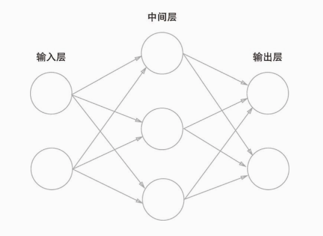</div>

最左边的一列称为输入层，最右边称为输出层，中间的一列称为中间层，也称为隐藏层，因为隐藏层和输入输出层不同，肉眼不可见。也可以把输入层到输出层依次称为第0层，第1层，第2层。上图中一共有3层神经元构成，但实际拥有权重的只有两层，也称为“2层网络”。

然后我们再来看一下之前感知机的公式：

<div align="center"></div>

这个式子分为大于0和小于0两种情况，我们用一个函数来表示这种分情况的动作。也可以写成下面这样：

<div align="center"></div>

外面套了一个 h() 函数，h() 函数的输入是每个变量的权重和，再经过 h() 内部的转换规则输出 y 值。下图中把偏置b也看作一个输入变量。因为上面的式子可以写成 (b * 1) + (w1 * x1) + (w2 * x2)，输入始终是1，权重为 b 的一个变量。

<div align="center">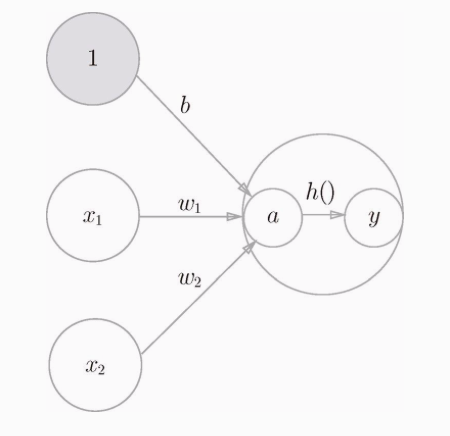</div>

这个 h() 在神经网络中就是 `激活函数` 。如 激活 一词所示，激活函数的作用在于如何来激活输入信号的总和。

在感知机中，激活函数很简单，就是输入信号的总和大于0，则输出1，小于0则输出0。一旦输入超过阈值，就切换输出，这种也叫阶跃函数。因为函数的图形是阶梯状的，如下图：

<div align="center">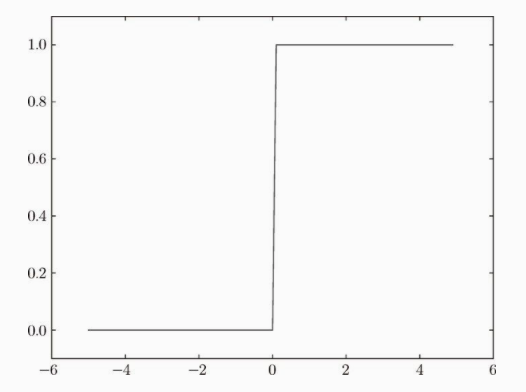</div>

事实上，如果将感知机的阶跃函数替换成其他函数，就可以进入神经网络的世界了。

神经网络中经常使用的一个激活函数是 sigmoid 函数，式子是这样的：

<div align="center"></div>

式子中，exp(-x) 表示 e的-x次方，e就是那个自然常数，2.7182...那个（头疼）。虽然式子看起来复杂，但也只是个函数而已。而函数就是给定某个值后，经过一定的转换，输出另一个值的转换器。比如，向 sigmoid 输入 1.0 或 2.0 后，就有某个值被输出。类似h(1.0) = 0.731，h(2.0) = 0.880 这样。

<div align="center">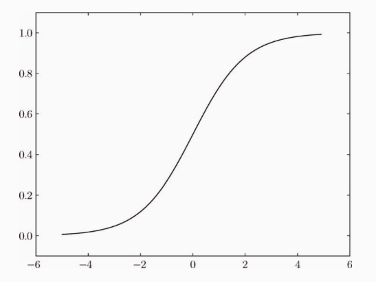</div>

sigmoid 函数图形是这样的，y 的取值为 0 ～ 1 之间。

为什么说把阶跃函数换成sigmoid函数就进入了神经网络的世界了呢？我们来比较一下两个函数，看下图：

<div align="center">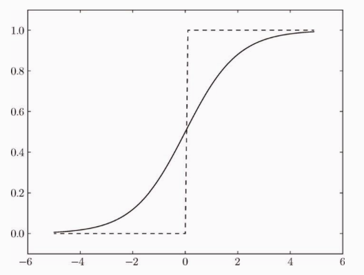</div>

我们注意到，sigmoid 是一条平滑的曲线，而阶跃函数以0为边界，输出发生急剧的变化。而 sigmoid 函数可以输出连续的值，比如：0.7123，0.812等等。而神经网络中的信号流动也是连续的实数值信号，这对神经网络的学习有重要意义。

注：因为是连续的值，对后面求损失函数的最小值非常有帮助。

sigmoid 函数很早就被开始使用了，但是最近则主要使用 ReLU（Rectified Linear Unit） 函数，图形如下图：

<div align="center">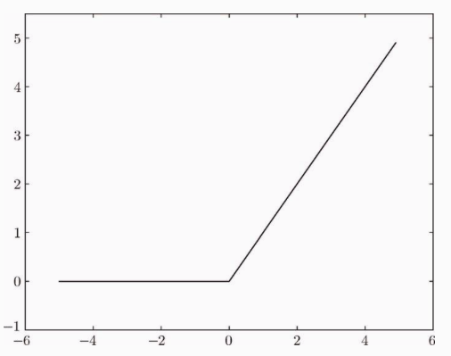</div>

式子是这样：

<div align="center">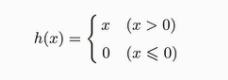</div>

ReLU 函数在输入大于0时，直接输出该值，输入小于0时，输出0。


# 三层神经网络的实现

上面讲了这么多，接下来，我们用 python3 来实现一个三层的神经网络（激动）

假设我们要实现如下这样结构的一个神经网络：

<div align="center">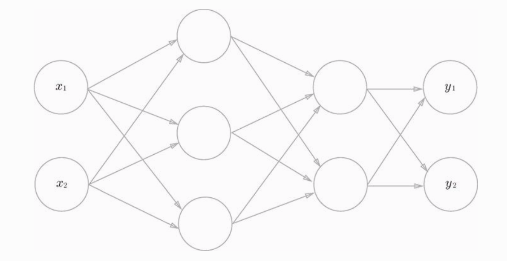</div>

这个神经网络输入层有两个输入参数，中间层（隐藏层）有两层，第一层隐藏层有3个神经元，第二层隐藏层有2个神经元，输出层有两个神经元。

输入层到隐藏层第一层的信号传递是这样的：

<div align="center">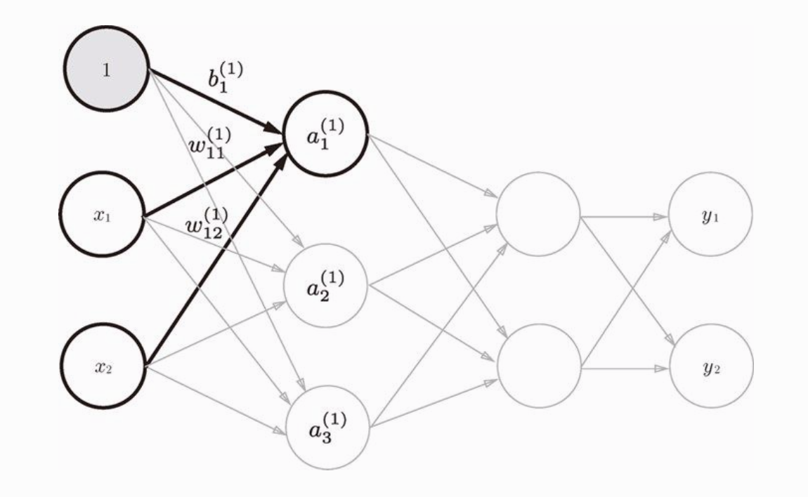</div>

这样可以算出a1

<div align="center">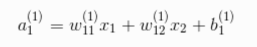</div>

同理，再算出 a2 和 a3 ，需要三步，但是如果使用矩阵的乘法运算，就可以把这三步合为一步。式子如下图所示：

<div align="center">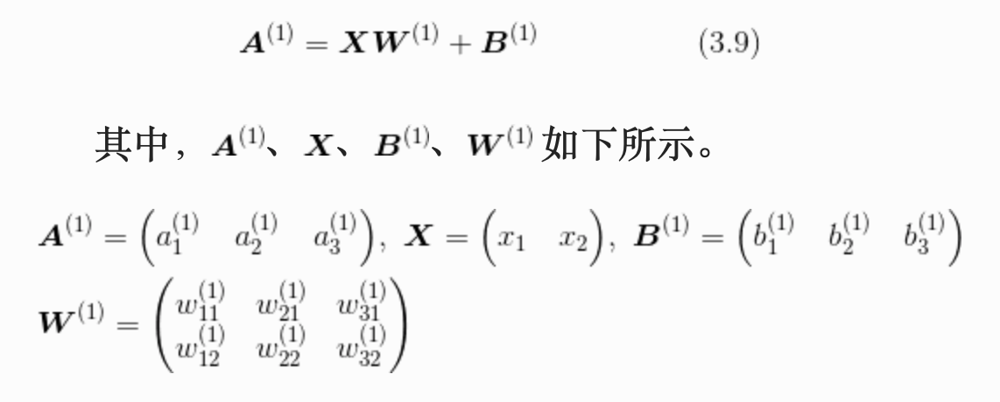</div>

注意这张图中是变量向量乘以权重矩阵W，变量在权重矩阵的左边。式子看不懂也没关系，反正拆开来就是上面那三步。这个矩阵公式用 python 表示出来就是：

```
import numpy as np

A = np.dot(X,W) + B
```

然后算出来的A经过第一层隐藏层神经元内部激活函数 h() 的转换，我们用 z 表示，就是会输出z1，z2，z3，作为第二层隐藏层的输入。这里采用 sigmoid 作为激活函数。用 python 代码表示就是：

```
import numpy as np

def sigmoid(x):
  return 1 / (1 + np.exp(-x))

Z = sigmoid(A)
```

这里的 A 和 Z 都是向量，主要是计算方便，一个式子算出三个值（z1，z2，z3）。

第一层算完了，第二层和第一层的计算方法完全相同。这里就略过了。

<div align="center">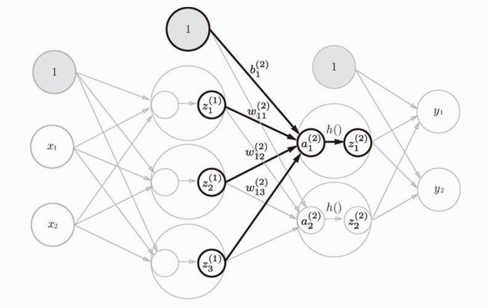</div>

最后是第二层到输出层的信号传递，输出层的实现也和之前的大致相同，唯一不同的是激活函数的不同。

为什么激活函数和隐藏层的不同？主要是输出层的激活函数要根据实际求解问题来决定。一般来说，回归问题可以使用恒等函数，二元分类问题使用 sigmoid 函数，多元分类问题使用 softmax 函数。

一下蹦出这么多术语，懵逼了哈哈，接下来就解释下上面那段的意思。

回归问题的意思是根据某个输入预测一个值，比如预测房价，人的体重等等，所以采用恒等函数会输出某个数值。实际上恒等函数就是原样输出，输入啥输出也是啥，啥也不处理。

二元分类问题就是数据属于哪一类的问题，比如区分图片中的人是男人还是女人。因为 sigmoid 会输出 0～1 之间的数，我们就可以拿这个数和 0.5 比大小就行了，大了属于一类，小了就属于另一类。

多元分类问题也是属于哪一类的问题，不过是很多个类别的归类。 softmax 函数其实就是一个计算概率的函数，它的输出是关于输入向量属于每个类别的概率。softmax 函数在后面会详细讲解。

这里，我们先用恒等函数来作为输出层的激活函数，下面是全部的 python 代码，逻辑就是和上面说的一样，很容易懂。

```
import numpy as np

# 激活函数
def sigmoid(x):
  y = 1 / (1 + np.exp(-x))
  return y

# 恒等函数（输出层的激活函数）
def identity_function(x):
  return x

# 初始化权重和偏置信息
def init_network():
  network = {}
  # 第一层的权重
  network["w1"] = np.array([[0.1,0.3,0.5],[0.2,0.4,0.6]])
  # 第二层的权重
  network["w2"] = np.array([[0.1,0.4],[0.2,0.5],[0.3,0.6]])
  # 第三层的权重
  network["w3"] = np.array([[0.1,0.3],[0.2,0.4]])
  # 第一层的偏置
  network["b1"] = np.array([0.1,0.2,0.3])
  # 第二层的偏置
  network["b2"] = np.array([0.1,0.2])
  # 第三层的偏置
  network["b3"] = np.array([0.1,0.2])
  return network

if __name__ == "__main__":
  # 初始化神经网络的权重和偏置信息
  network = init_network()
  # 初始化输入变量
  x = np.array([1.0, 0.5])

  w1, w2, w3 = network["w1"],network["w2"],network["w3"],
  b1, b2, b3 = network["b1"],network["b2"],network["b3"],
  # 计算出第一隐藏层的权重和
  a1 = np.dot(x, w1) + b1
  # 经过第一层激活函数得出输出，就是第二层的输入
  z1 = sigmoid(a1)
  # 和上面一样
  a2 = np.dot(z1, w2) + b2
  z2 = sigmoid(a2)
  a3 = np.dot(z2, w3) + b3
  # 最后经过输出层神经元的激活函数（恒等函数），得出最后的结果
  y = identity_function(a3)
```

# 输出层的设计

输出层的设计主要设计输出层神经元的数量和神经元的激活函数。

上面我们说到两种输出层的激活函数，恒等函数和 softmax 函数，恒等函数会将输入原样输出，不加任何改动。我们主要讲讲 softmax 函数。

softmax 函数的式子如下所示：

<div align="center">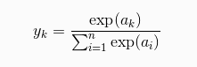</div>

exp(x) 表示 e 的 x 次方。e 是自然常数。式子中假设输出层有 n 个神经元，计算第 k 个神经元的输出。仔细观察这个式子的话，分母是把每个输入的指数都加起来，分子是当前那个神经元的输入的指数，我不知道这里为什么要加上指数，但是如果把指数去掉的话，就很好理解了，就是把当前项除以所有项的和，不就是当前项的概率吗？事实上，虽然式子中加上了指数，但是输出的结果也还是表示每一项的概率，其中每项值的结果相加等于1（y1 + y2 + ... + yn = 1），很适合解决多元分类问题。

# 训练数据和测试数据

在进行神经网络的学习前，先介绍训练数据和测试数据。

训练数据是给神经网络学习用的，测试数据则是测试神经网络学习的结果。首先，使用训练数据进行学习，寻找最优参数，然后，使用测试数据评价训练得到的模型的实际能力。训练数据也称为监督数据，训练数据中，不仅包含数据本身，也要包含数据正确识别的结果。

# 损失函数

前面说到，神经网络的一个好处是能从数据中自动学习权重参数，不用人工去设定。接下来我们就讲讲原理。

为了使神经网络能够进行学习，将导入损失函数这一指标。损失函数到底是个什么东西呢？举个栗子。

<div align="center">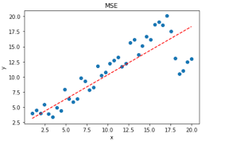</div>

这是我网上随便找的一张图，途中的蓝点是训练数据，要想画一条直线经过这些所有的点当然是不可能的，所以我们找的是最符合（拟合）这些点的直线，就是途中的红色虚线。当然你也可以不用直线表示，你可以画一条曲线经过所有的点，但是这样就过拟合了（过度拟合）。这里我们还是假设学习到的函数是直线。那么我们怎么判断这条直线是最优的那条呢？是否还有一条直线，和图中的红色直线相比，只是微微的倾斜了一点，为什么它不是最优的那条呢？那我们可以根据这样一个规则，就是计算图中的每个蓝点（真实的值）到直线（预测的值）的距离，把这些距离相加起来，总和最小的那个是不是就可以说明这条直线是最优的呢？

这个规则我们可以写成一个函数，输入就是训练数据，输出是训练数据预测的值和真实值之间的误差。事实上，这个函数就是损失函数。损失函数是估量模型预测的值和真实值之间不一致的程度。

可以用作损失函数的函数有很多，最有名的是均方误差。式子如下：

<div align="center">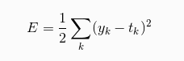</div>

这里的 yk 表示模型预测的值， tk 表示真实值，式子中是计算他们之差的平方，再求总和。意思是一样的。

还有一个经常使用的损失函数是 交叉熵误差 ，式子如下：

<div align="center">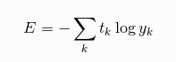</div>

这个式子就不详细讲了，反正作用和上面均方误差的作用是一样的，都是表示预测值和真实值之间的误差。

# 导数

假如你在10分钟内跑了2千米，如果要计算奔跑速度，则为 2 / 10 = 0.2 千米/分钟。不过，这计算的是10分钟内的平均速度。而导数是表示某个瞬间的变化量。因此，将10分钟尽可能缩短，比如计算前1分钟的奔跑距离，前一秒钟，前0.1秒的奔跑距离...这样就可以获得某个瞬间的变化量。

综上，他可以定义成下列式子：

<div align="center"></div>

式子中，等号左边的意思就是就是函数f(x)关于x的导数，d 就是导数的符号。式子表示的含义是，x的 “微小变化” 将导致f(x)的值在多大程度上发生变化。其中，微小变化的 h 无限趋近于0，表示为一个 lim （极限符号）。

接下来我们就可以用 python 实现一下求导数的式子：

```
def numerical_diff(f, x):
  h = 1e-4 # 0.0001
  return (f(x + h) - f(x)) / h
```

微小值我们用的是 0.0001 ，如果太小的话计算机识别可能有误差，可能会直接转为0。

注：虽然这个式子求出来的导数和用数学公式推导出的导数并不一致，但是误差很小，可以认为基本一致。

我们接下来使用一下这个函数，我们求一下这个式子在 x = 5 和 x = 10 处的导数。

<div align="center">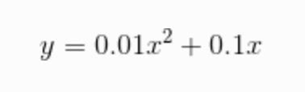</div>

代码如下，很容易理解，完全就是照着上面公式写的：

```
# 计算导数
def numerical_diff(f, x):
  h = 1e-4 # 0.0001
  return (f(x+h) - f(x)) / h

# 测试的函数
def function_1(x):
  return 0.01 * x ** 2 + 0.1 * x

# 构建切线函数
def tangent_line(f, x):
  d = numerical_diff(f,x)
  # 偏移量，没有b的话，直线是经过原点的
  b = f(x) - d * x
  def f2(t):
    return d * t + b
  return f2

if __name__ == "__main__":
  # 画出 function_1 函数图形
  x = np.arange(0,20.0,0.1)
  y = function_1(x)
  plt.xlabel("x")
  plt.ylabel("f(x)")
  plt.plot(x, y)

  # 画处 x = 5 位置的切线
  f2 = tangent_line(function_1, 5)
  y2 = f2(x)
  plt.plot(x, y2)

  # 画处 x = 10 位置的切线
  f3 = tangent_line(function_1, 10)
  y3 = f3(x)
  plt.plot(x, y3)
  
  # 显示图像
  plt.show()
```

<div align="center"></div>

由图片中可以看出，确实是在 x = 5 和 x = 10 两个点花了切线，说明我们求导数的函数是对的。利用微小差分的方式求导数也叫做数值微分。

# 偏导数

因为大多数函数都不只有一个变量，而可能有多个变量x1，x2，x3这样。求偏导数只需要将某一个变量定位目标变量，再将其他变量定为常量。如：求函数f(x1,x2,x3)关于x1的偏导数，可以先把 x2，x3 看成常数，得出 x1 的导数就叫做 x1 的偏导数，同理，可以得出 x2，x3 的偏导数。

# 梯度
在上面偏导数的例子中，我们可以求出 x1,x2,x3 的偏导数。另外，由全部变量的偏导数汇总而成的向量叫做梯度。梯度是表示各点处函数值变化最多的那个方向。

注意：梯度是表示函数某一个点的梯度，每个点的梯度都不一样。

以下是用 python 实现求梯度的算法：

```
def numerical_gradient(f, x):
  h = 1e-4
  # 生成和x形状相同的数组
  grad = np.zeros_like(x)
  # 计算每个变量的偏导数
  for idx in range(x.size):
    tmp_val = x[idx]
    x[idx] = tmp_val + h
    fxh1 = f(x)
    x[idx] = tmp_val
    fxh2 = f(x)
    # 设置梯度
    grad[idx] = (fxh1 - fxh2) / h
  return grad
```

我们来看下面这个式子，式子的函数图形是这样的：

<div align="center">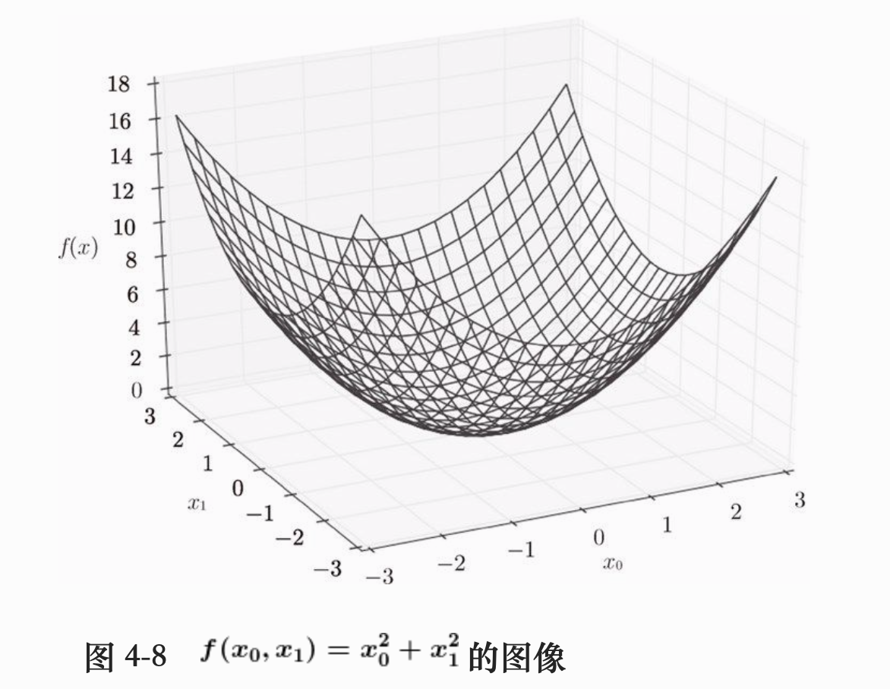</div>

下面我们用来画出该函数各点处的梯度：

```
import numpy as np
import pickle
import matplotlib.pylab as plt
from dataset.mnist import load_mnist
from common.gradient import gradient_descent

def _numerical_gradient_no_batch(f, x):
    h = 1e-4 # 0.0001
    grad = np.zeros_like(x)
    for idx in range(x.size):
        tmp_val = x[idx]
        x[idx] = float(tmp_val) + h
        fxh1 = f(x) # f(x+h)

        x[idx] = tmp_val - h 
        fxh2 = f(x) # f(x-h)
        grad[idx] = (fxh1 - fxh2) / (2*h)
        
        x[idx] = tmp_val # 还原值
    return grad

def numerical_gradient(f, X):
  if X.ndim == 1:
    return _numerical_gradient_no_batch(f, X)
  else:
    grad = np.zeros_like(X)
    for idx, x in enumerate(X):
      grad[idx] = _numerical_gradient_no_batch(f, x)
    return grad

def function_2(x):
  if x.ndim == 1:
    return np.sum(x**2)
  else:
    return np.sum(x**2, axis=1)
     
if __name__ == '__main__':
  # 根据 x0，y0生成一组网格点
  x0 = np.arange(-2, 2.5, 0.25)
  x1 = np.arange(-2, 2.5, 0.25)
  X, Y = np.meshgrid(x0, x1)
  
  # 展开成一维数组
  X = X.flatten()
  Y = Y.flatten()
  
  grad = numerical_gradient(function_2, np.array([X, Y]) )
  plt.quiver(X, Y, -grad[0], -grad[1],  angles="xy",color="#666666")#,headwidth=10,scale=40,color="#444444")
  plt.xlim([-2, 2])
  plt.ylim([-2, 2])
  plt.xlabel('x0')
  plt.ylabel('x1')
  plt.grid()
  plt.show()
```

输出的图形是这样的：

<div align="center"></div>

注意，`plt.quiver` 函数的参数，我们传的是 `-grad[0]` 和 `-grad[1]` ，也就是说我们这里画的是负梯度的方向，可以看到梯度的负方向是指向函数减小最多的方向，所以梯度下降法中负梯度的方向就是变量更新的方向。

# 梯度下降法

神经网络学习时的主要任务是找出最优参数（权重和偏置），这里所说的最优参数是指损失函数取最小值时的参数。一般而言，损失函数很复杂，参数空间庞大，我们不知道他在何处能取到最小值。但我们巧妙地以梯度为线索，沿着梯度的方向更新一点点，再重新计算梯度，再沿梯度的方向更新一点点，这样来寻找函数的最小值的方法就是梯度下降法。

注意，这里梯度是指向函数值减少最多的方向，但是无法保证梯度所指的方向就是函数真正的最小值方向，有可能只是某个范围内的最小值。

梯度下降法的公式如下：

<div align="center"></div>

式子中我们没有更新整个梯度，而是只更新梯度的一部分。这里的 `η` 乘以梯度就是每次更新的量。我们把 `η` 叫做学习率。学习率需要事先确定好某个值，比如0.01或0.001，一般而言，这个值过大或过小都不能抵达一个"好的位置"。在神经网络的学习中，我们有时候会一边改变学习率，一边确认学习是否在正确进行。

接下来我们用代码实现一下梯度下降算法：

```
# f 表示损失函数
# init_x 表示损失函数的参数，就是权重
# lr 代表学习率
# step_num 表示迭代次数
def gradient_descent(f, init_x, lr = 0.01, step_num = 100):
  x = init_x
  for i in range(step_num):
    grad = numerical_gradient(f, x)
    x = x - lr * grad
  return x
```

函数多了一个 step_num 参数，表示的是变量更新多少次后结束，因为变量更新一定次数后，会在最小值附近跳动，这时候就没必要再更新了。

# 手写一个神经网络

了解了上面的损失函数，梯度下降法这些理论知识后，接下来我们就根据前面所学的知识来手写一个2层的神经网络(隐藏层为1层)。神经网络中最重要的就是学习的过程，等学习到合适的权重参数后，就可以用来预测新数据的结果了。

神经网络中的学习步骤是这样的：

```
步骤1：从所有数据中随机筛选出一小部分数据（mini-batch），我们的目标是减少 mini-batch 损失函数的最小值
步骤2：计算损失函数的梯度
步骤3：将权重参数沿着梯度的方向进行微小更新
步骤4：跳回步骤1，重复一定的次数
```

因为这里是随机选择的 mini-batch ，所以又称为 `随机梯度下降法` 。下面直接贴代码：

```
# two_layer_net.py

import numpy as np
from common.functions import *
from common.gradient import numerical_gradient
import collections

class TwoLayerNet:
  # 初始化权重
  # input_size 输入层的神经元个数
  # hidden_size 隐藏层的神经元个数
  # output_size 输出层的神经元个数
  def __init__(self, input_size, hidden_size, output_size, weight_init_std=0.1):
    self.params = {}
    # 初始化第一层和第二层权重和偏置参数为一些随机值
    self.params["W1"] = weight_init_std * np.random.randn(input_size, hidden_size)
    self.params["W2"] = weight_init_std * np.random.randn(hidden_size, output_size)
    self.params["b1"] = np.zeros(hidden_size)
    self.params["b2"] = np.zeros(output_size)

  # 预测
  def predict(self, x):
    # 取出权重和偏置
    w1, w2 = self.params["W1"], self.params["W2"]
    b1, b2 = self.params["b1"], self.params["b2"]
    # 经过第一层的输出
    a1 = np.dot(x, w1) + b1
    # 经过第一层的激活函数
    z1 = sigmoid(a1)
    # 经过第二层的输出
    a2 = np.dot(z1, w2) + b2
    # 经过输出层的激活函数
    y = sigmoid(a2)
    return y

  # 计算损失函数的值
  def loss(self, x, t):
    y = self.predict(x)
    return cross_entropy_error(y, t)

  # 计算权重参数的梯度
  def gradient(self, x, t):
    def f(W):
      return self.loss(x, t)
    grads = {}
    # 第二个参数 self.params["W1"] 并不是传给 f函数 作为参数用的，而是在 numerical_gradient 内部有一个循环，正确执行循环用的，
    # 这里不写 grads["W1"] = numerical_gradient(self.loss, self.params["W1"]) 是因为 self.loss 由三个参数，而 numerical_gradient 内部会把 self.params["W1"] 传给 self.loss 作为参数，这是不对的，所以我们上面重新定义了一个函数 f(W)
    # 保存第一层的权重梯度
    grads["W1"] = numerical_gradient(f, self.params["W1"])
    # 保存第一层的偏置梯度
    grads["b1"] = numerical_gradient(f, self.params["b1"])
    # 保存第二层的权重梯度
    grads["W2"] = numerical_gradient(f, self.params["W2"])
    # 保存第二层的偏置梯度
    grads["b2"] = numerical_gradient(f, self.params["b2"])
    return grads
```

其中， numerical_gradient ， cross_entropy_error ， sigmoid 这三个函数都是之前实现过的，由 common.functions 和 common.gradient import 进来的，这里就不重复贴了。

神经网络的核心代码已经实现了，那么怎么用呢？我们下面的这个例子是使用 MNIST 手写数字图像集，MNIST 是机器学习领域最有名的数据集之一，被应用于从简单的实验到发表论文研究等各种场合。

MNIST 数据集由 0-9 的数字图像构成，训练集有6w张，测试集有1w张，可用于神经网络的学习和预测。如下图：

<div align="center"></div>

每张图片数据是 28 * 28 的灰度图像。每个图像数据都相应地标有正确的“7”，“2”，“1”等标签。

```
import numpy as np
from dataset.mnist import load_mnist
from common.gradient import gradient_descent
from two_layer_net import TwoLayerNet

if __name__ == '__main__':
  # 使用 load_mnist 导入 x_train 训练集，t_train 训练真实标签，x_test 测试集，t_test 测试真实标签
  (x_train, t_train), (x_test, t_test) = load_mnist(normalize=True, one_hot_laobel = True)
  # 记录每次更新权重后，损失函数的值如何变化
  train_loss_list = []

  # 超参数
  # 权重迭代次数
  iters_num = 10000
  # 训练集大小
  train_size = x_train.shape[0]
  # 每个 batch 的大小
  batch_size = 100
  # 学习率
  learning_rate = 0.1

  # 初始化神经网络，输入层神经元784个（因为是高宽 28 * 28 的图像），隐藏层神经元50个（自定义），输出层10个（识别 0-9 十个数字）
  network = TwoLayerNet(input_size=784, hidden_size=50, output_size=10)

  for i in range(iters_num):
    # 步骤1：获取 mini-batch，从6w个训练集中随机获取100个，组成一个batch，batch_mask里面是0-6w的随机数字
    batch_mask = np.random.choice(train_size, batch_size)
    # 根据随机数字取出训练集和训练监督标签
    x_batch = x_train[batch_mask]
    t_batch = t_train[batch_mask]

    # 步骤2：计算一个 batch 的梯度
    grad = network.gradient(x_batch, t_batch)

    # 步骤3：将权重参数沿着梯度的方向进行微小更新
    for key in ('W1', 'b1', 'W2', 'b2'):
      network.params[key] -= learning_rate * grad[key]
    # 记录学习过程
    loss = network.loss(x_batch, t_batch)
    print(loss)
    train_loss_list.append(loss)
    # 步骤4：步骤1-3重复 iters_num 次
```

上面有个超参数的概念，这个超参数表示人为设定的参数，比如学习率，权重迭代的次数等等。和权重偏置那些参数是不一样的。

以上的代码运行后，我们把每次计算的 loss 变量打印出来，可以看到 loss 的值越来越小，这是神经网络正常学习的信号。

但是真实的情况是，上面代码运行后 `print(loss)` 这行代码一值没有输出，原因是一直卡在了 `grad = network.gradient(x_batch, t_batch)` 这句。主要原因是我们使用数值微分的方法计算梯度，计算量实在太大。所以以上代码理论上可行，但是实际应用中不可能使用类似 numerical_gradient 这种方式计算梯度的。我们需要更快的计算梯度的方法。

# 反向传播法

上一章，我们用了数值微分的方法求梯度，然后沿着梯度的方向前进一点点，再求梯度，再前进一点点，如此反复，到达损失函数的最小值的位置。但是这有一个致命的缺点，就是计算速度非常慢，达到了不能忍受的范围。接下来介绍的方向传播法可以用来快速求出梯度。

数值微分法我们求了隐藏层每一层的梯度，求每一层的梯度就是求每一层每一个神经元权重和偏置的导数。