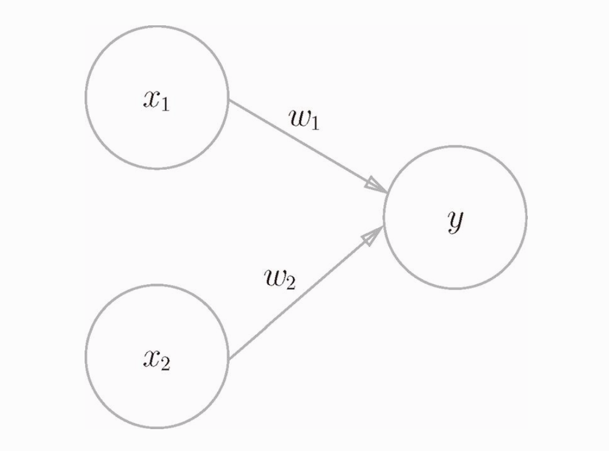
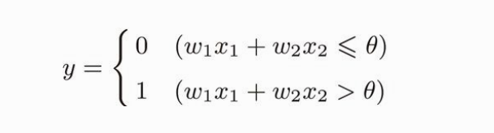
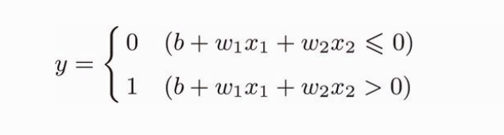

本篇主要是总结最近看的一本《深度学习入门：基于Python的理论与实现》这本书做的一些总结。这本书非常不错，日本人写的书，讲的很细，从零开始手把手教你撸一个深度学习的神经网络。（而且还有 epub 格式的电子书）

目录：

- [python 基础](#python-基础)
- [感知机](#感知机)

# python 基础

书的最开篇，按照惯例，事先学习 python（3.x） 的基本语法和 NumPy 计算库，NumPy 库提供了遍历的矩阵操作方法。还有 Matplotlib 库是用来画图的，可以把一些函数用图片的方式直观的展示出来。

NumPy 和 Matplotlib 都是第三方库，需要用 pip install 一下。

NumPy 库中常用的方法说明：

```
import numpy as np

# 创建一个矩阵
A = np.array([[1,2],[3,4]])
# 矩阵 A 的形状，这里返回 (2, 2) ，表示2行2列的矩阵
A.shape
> (2, 2)
B = np.array([[3,0],[0,6]])

# 相当于是进行普通的两个矩阵乘法运算（A * B）
np.dot(A, B)
> array([[ 3, 12],
       [ 9, 24]])

# 以 0.1 为单位，生成0～5的数据
C = np.arange(0, 6, 0.1)
```

Matplotlib 库中常用的方法说明：
```
import matplotlib.pyplot as plt

# 以 0.1 为单位，生成0～5的数据
x = np.arange(0, 6, 0.1)
y = np.sin(x)

# 绘制图形
plt.plot(x, y)
# 显示 x 轴标签
plt.xlabel("x")
# 显示 y 轴标签
plt.ylabel("y")
# 显示图形
plt.show()
```

# 感知机

看完 python 基础，这节我们要来实现一个“感知机”（虽然听不懂，但是好像很牛b的东西）。

感知机是作为神经网络（深度学习）的起源算法。学习感知机能了解神经网络到底是个什么东西。

感知机接收多个输入信号，输出一个信号。这里说的信号可以想像成电流或者河流一样的东西，感知机的信号会形成流，向前方输送信息。但是感知机的信号只有流或不流两种取值（1 或 0），1对应传递信号，0对应不传递信号。

下图是一个有两个输入的感知机的例子：

<div align="center"></div>

x1 和 x2 是输入信号，w1 和 w2 是权重，y 是输出。图中的三个圆圈称为神经元或者节点。输入信号传递到神经元时，会分别乘以固定的权重。y神经元会计算传递过来的信号的总和，只有当这个总和超过了某个阈值(theta)，y神经元才会输出1。

用公式表示就是

<div align="center"></div>

但是考虑到更通用的形式，我们把式子改成如下形式

<div align="center"></div>

θ 符号移到了左边变成了 -θ ，命名为 b ，但表达的内容是完全相同的。w1 和 w2 叫做权重，b 在这里叫做偏置。感知机会计算输入信号和权重的乘积，再加上某个偏置，如果这个值大于0，则输出1，否则输出0。

具体地说，w1 和 w2 是控制输入信号重要性的参数，b 则是调整神经元被激活的容易程度。

那到底感知机有什么用呢？接下来我们用感知机来解决一个简单的问题。

我们用感知机来实现逻辑电路里的"与门"。

与门
| x1 | x2 | y |
|----|----|---|
| 0  | 0 | 0 |
| 0  | 1 | 0 |
| 1  | 0 | 0 |
| 1  | 1 | 1 |

上图中得知，与门是只有在 x1，x2 都为1的情况下，输出才为1。事实上，满足这个条件的参数有无数种，比如 w1，w2 为 0.5，b 为 -0.7，或 w1，w2 为 1.0，b 为 -1.0 都可以。

我们再来看一下"与非门"和"或门",

与非门：

| x1 | x2 | y |
|----|----|---|
| 0  | 0 | 1 |
| 0  | 1 | 1 |
| 1  | 0 | 1 |
| 1  | 1 | 0 |

或门：

| x1 | x2 | y |
|----|----|---|
| 0  | 0 | 0 |
| 0  | 1 | 1 |
| 1  | 0 | 1 |
| 1  | 1 | 1 |

与非门是与门的取反，或门是只要有一个输入信号为1，输出就为1。

那么我们来考虑一下权重w和偏置b。

在与非门中 w1，w2 为 -0.5，b 为 0.7 就可以，事实上就是与门参数的取反。

或门中 w1，w2 为 0.5，b 为 -0.2 就可以。

这很容易，看图就能看出来。


