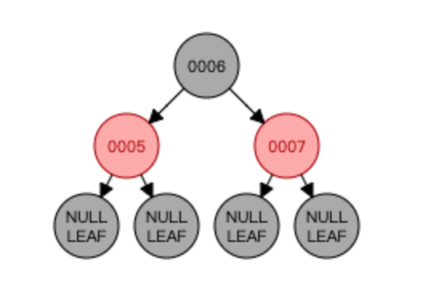
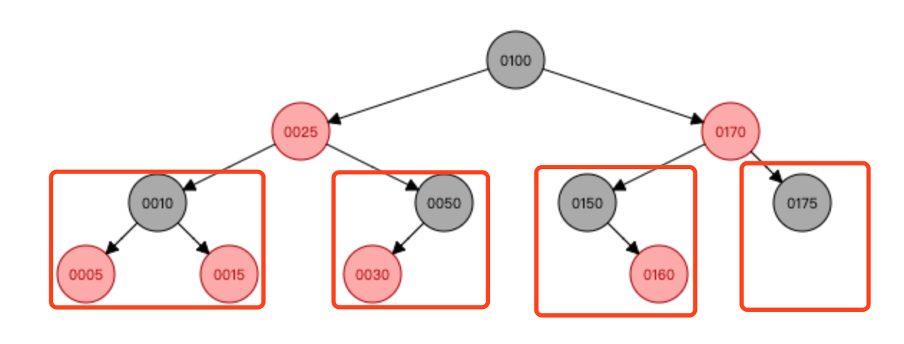
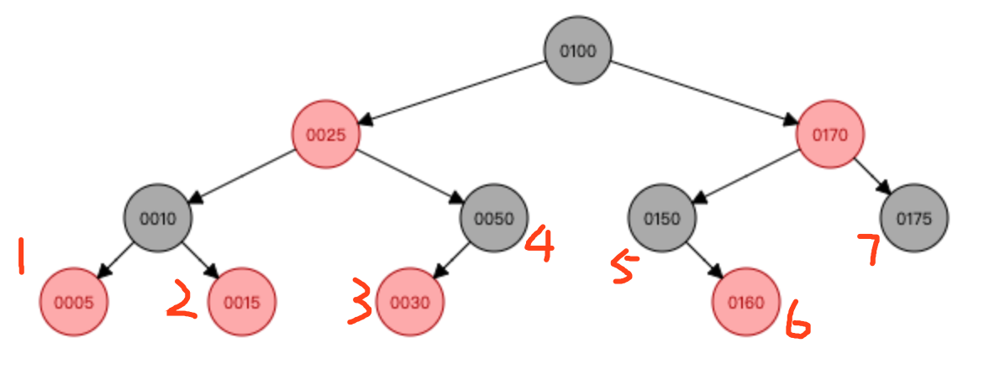
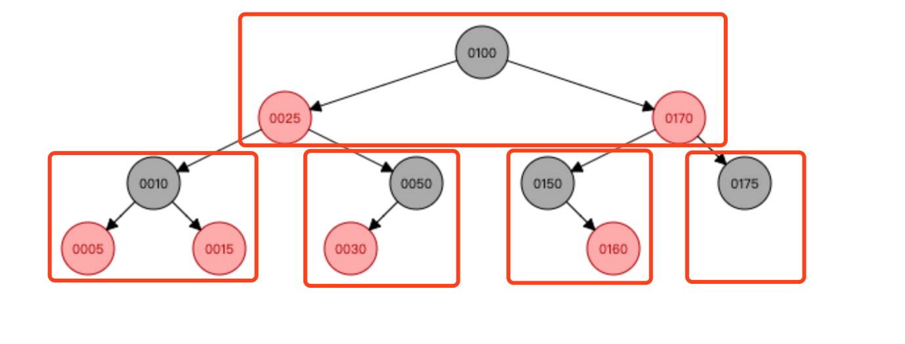
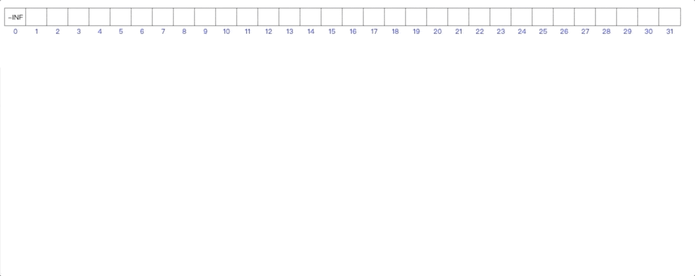

# 数据结构

- [动态数组](#动态数组)
- [链表](#链表)
- [栈](#栈)
- [队列](#队列)
- [二叉搜索树](#二叉搜索树)
- [平衡二叉搜索树](#平衡二叉搜索树)
- [红黑树](#红黑树)
- [集合和映射](#集合和映射)
- [哈希表](#哈希表)
- [二叉堆](#二叉堆)
- [并查集](#并查集)
- [图](#图)

在学习数据结构之前，我一直不知道语言提供的数组，set，map 类型的底层是怎么实现的，也没有这个概念。为什么数组还分为长度不可变数组和动态数组。为什么 set，map 这些类型存取海量的元素速度这么快。本例中的例子都是 `go` 的。

## 复杂度

复杂度包括时间复杂度和空间复杂度。`时间复杂度`表示执行一段代码所需的时间，`空间复杂度`表示执行一段代码用到的内存空间大小。

## 动态数组

数据结构中最简单的就是动态数组了。

我们知道，数组之间的元素，他们的内存地址应该是连续的，也就是说申请内存的时候，就要事先指定申请多大的内存。比如下面的代码：

```
var arr = [10]int{}
```

在 `golang` 中，平时我们使用的一般都是 `slice` ，也就是动态数组。动态数组的长度是不固定的，你往里面添加多少元素都可以。

那么动态数组是怎么办到的呢？

实际上，动态数组的原理类似于给数组封装了一层，自己内部实现插入和删除元素的逻辑。

插入元素的时候，如果是插入到某个中间位置，则会让这个位置后面的元素全部往后挪，如果发现当时申请的数组元素个数不够用了，这时就需要`扩容`，申请一段更大的内存空间，然后把老的内存空间上面的元素全部复制过去，然后使用新申请的内存。

删除元素的时候，如果删除的是某个中间的元素，那么会把那个元素后面的元素全都往前挪。而且删除元素可能会发生`缩容`，在发现数组的空闲容量太多的情况，这时候需要申请一段小一点的内存空间，然后把所有数据复制过去。

这些操作对外部都是不可见的，实际使用的人不用管什么扩容和缩容的操作。

动态数组的各个元素在内存中都是连续的，这就表示获取某个元素的时候可以直接定位到那个元素的内存地址，时间复杂度是 `O(1)` ，但是删除原属和添加元素的时候，会让该元素后面的元素全部往前或往后挪，所以删除和插入元素的时间复杂度是O(n)

## 链表

链表和动态数组类似，在外界看来可能都是一个数组，但是链表的内部实现和动态数组不太一样。

链表内部的元素内存地址是不连续的。以双向链表为例，链表内部会有一个 first 指针 和 last 指针指向链表的第一个元素和最后一个元素。每个元素称为一个节点（node），每个节点内部会有一个 next 指针指向下一个节点，一个 prev 指针指向前一个节点。第一个节点的 prev 指针为 nil，最后一个节点的 next 指针也为 nil）。比如说我想访问链表中的第五个元素，就要通过 first 指针找到第一个元素，通过第一个元素的 next 指针找到第二个元素，以此类推，直到找到第5个。

链表相对于动态数组，他的插入元素和删除元素的速度非常快，只需要找到插入位置的前一个节点，改变他的 next 指针指向就可以了。复杂度是 `O(1)` 。

但是链表的查找元素就比较慢了，链表不能直接定位到某个元素的内存地址，而是要先找到第一个，再找第二个元素...依次找下去，所以查找元素的时间复杂度是 `O(n)` 。

`golang` 的官方标准库中也有链表，是一个双向链表，只是我平时很少用，给个例子：

```
import (
	"container/list"
)

func main() {
  list := list.New()
  for i := 0; i <= 10; i++ {
    list.PushBack(i)
  }
  // 遍历链表
  for p := list.Front(); p != list.Back(); p = p.Next() {
    fmt.Println("Number", p.Value)
  }
}
```

如果需要频繁的插入和删除元素应该选用链表，如果频繁的获取元素应该用动态数组。


## 栈

这里的`栈`是一种数据结构，和内存中的栈空间完全不是一个东西。

栈这种数据结构的特点是`后进先出`，只能在一端进行操作，最后添加进来的元素最先出去，添加元素称为入栈（push），获取元素称为出栈（pop）。

栈这种数据结构其实可以用上面的动态数组或链表来实现都可以。


## 队列

`队列`只能在头尾两端进行操作。

只能从对尾添加元素，只能从对头移除元素。往队尾添加元素叫做入队(EnQueue)，从队头移除元素叫做出队(DeQueue)，

队列优先使用双向链表来实现，因为队列主要是在对头和对尾进行操作。


## 二叉搜索树

想象一个需求，在n个整数中如何查找某个整数是否存在。

如果利用我们上面说的动态数组，链表，栈，队列这些数据结构都可以实现，但是时间复杂度都是O(n)，需要遍历和比较所有的元素才行。

那么有没有更好的方案呢？

答案是有的，就是使用二叉搜索树。二叉搜索树的查找，添加，删除的时间复杂度都是 `O(logn)` 。

`二叉搜索树`是一种树形的数据结构（动态数组，链表都是线形的），二叉搜索树中的元素都是可比较的。顾名思义是两个叉的，每个节点都有 `left` 和 `right` 两个指针，比她小的就存左边，大的就存右边。

以下是`二叉搜索树`的接口定义：

```
type Tree interface {
	// 添加元素
	Add(e interface{})
	// 删除元素
	Remove(e interface{})
	// 是否包含某个元素
	Contains(e interface{}) bool
	// 树中的元素个数
	Size() int
	// 是否为空
	IsEmpty() bool
	// 清空树
	Clear()
	// 树的高度
	Height() int
	// 前序遍历
	// cb 回调方法
	PreOrder(cb func(e interface{}) bool)
	// 中序遍历
	InOrder(cb func(e interface{}) bool)
	// 后序遍历
	PostOrder(cb func(e interface{}) bool)
	// 层序遍历
	LevelOrder(cb func(e interface{}) bool)
}
```

往树中添加的元素是泛型的，但是有一个明确的规定是`往树中添加的元素必须具备可比较性`。如果往树中添加的元素是 int ， string 这种类型，他们本身具备可比较性了，所以可以直接添加。但是如果是自定义类型，比如 struct ，这种类型需要实现一个我自定义的 comparable 接口，自定义两个 struct 怎么比较大小，才能作为树中的元素。以下是 comparable 接口定义：

```
// Comparable 如果一个元素想要加入到二叉搜索树中，必须实现可比较方法
type Comparable interface {
	// 自定义比较规则
	// 返回值 == 0 说明大小相等，返回值 >0 说明大于e，返回值 <0 说明小于e
	CompareTo(e interface{}) int
}
```

虽然外部调用接口传递的是 interface 参数，但是树内部的每个节点，我们需要定义一个内部 struct ，结构是：

```
type binarySearchTreeNode struct {
	value  interface{}
	parent *binarySearchTreeNode
	left   *binarySearchTreeNode
	right  *binarySearchTreeNode
}

```

添加一个元素的时候，会先和根节点比较，比根节点小，就往左走，反之往右走，直到比较的那个节点没有子节点了，就添加在那个节点的左边或右边。搜索一个元素的时候，也是和根节点比较，比他小就往左边搜索，比他大就往右边搜索。也就是说，添加，删除，搜索的时候，每经过一次比较，就可以排除一般的元素，所以性能是非常好的。

`二叉搜索树` 还提供遍历的接口：
前序遍历的 `前` 字表示根节点在前遍历，就是先访问根节点，再访问左子树，最后访问右子树。
中序遍历的 `中` 字表示根节点在中间遍历，先访问左子树，再访问根节点，最后访问右子树。
后序遍历的 `后` 字表示根节点在最后遍历，先访问左子树，再访问右子树，最后访问根节点。

中序遍历有个特点就是遍历出来的元素是从小到大排列的。

树的高度：树的高度是根节点离最远的叶子节点之间的距离。理论上树的高度越小越好，因为这样搜索才会比较快。

在实现 `二叉搜索树` 的时候有一些注意点：

1. 前序遍历，中序遍历，后序遍历需要注意外界如果返回了stop，表示想要停止遍历，如果只是这么写是不行的：
`if cb(node.value) { return }`
2. 要检查元素是否为空


## 平衡二叉搜索树

二叉搜索树的缺点是在一些特殊情况下会 `退化成链表` ，这样的话再做添加搜索删除的操作，时间复杂度就和链表是一样了，失去了树的优势。所以我们需要一种机制能防止二叉搜索树退化成链表。

这种机制叫做 `平衡` 。平衡二叉搜索树也叫做 `AVL树` 。

平衡二叉搜索树使用 `平衡因子` （balance factor）来实现平衡。保证树中所有节点的 `左右子树的高度差的绝对值不超过1` 。如果超过1了，就说明这个节点不平衡了，需要做一些操作来使这个节点重新恢复平衡。

这里涉及到两个概念，`节点的高度`和`树的高度`。节点的高度等于当前节点到最远叶子节点的路径上饿节点总数。树的高度取所有节点高度中的最大值。

既然上面说左右子树的高度差超过1了就不平衡了，那么怎么恢复平衡呢？

就是通过旋转。旋转分为`左旋转`和`右旋转`。旋转是什么意思呢？

我们直接来看动画，图片中节点的左上角有个数字，表示那个节点的高度，并不是平衡因子。在加入7这个节点后，节点5的左子树高度是0，右子树高度是2，相差为2，就是平衡因子为2，表示5这个节点不平衡了，需要对5这个失衡的节点进行左旋转。

<div align="center"></div>

对失衡的节点进行旋转很好理解，但是图中这种情况为什么是左旋转？这就要看比较高的子树是在失衡节点的哪一边，图中是失衡节点5的右子树太高了，所以要进行左旋转。同理，如果是左子树太高了，就进行右旋转。

以下是右旋转的例子：

<div align="center"></div>


通过旋转那个失衡节点，使那个失衡的节点往下走，让他比较高的那个子树往上走，然后这个失衡的节点成为子节点的子节点，来达到平衡。

这里需要注意的是：添加节点的操作只要把第一个失衡的节点恢复平衡，整棵树就恢复平衡了。删除节点会导致失衡节点的高度变小，这样的话可能会导致祖先节点再次失衡。

## 红黑树

虽然AVL树很美好，但也有一些缺陷，就是AVL树在删除节点的时候，最坏的情况是会发生 `logn` 次的旋转调整（一直失衡到根节点）。所以接下来引入红黑树，删除元素的只要 `O(1)` 次旋转就可以了。

红黑树也是一种自平衡树，但是平衡的方法和AVL树不一样，红黑树只遵循5条性质，只要遵循了这5条性质，这颗红黑树自然就平衡了。红黑树上的节点不是红色就是黑色，这个颜色不代表任何东西，只是单纯的为了满足他的性质。这5条性质是：

1. 红黑树中的节点不是红色就是黑色。
2. 根节点必须是黑色。
3. 叶子节点都是黑色。
4. 红色节点的子节点都是黑色。
5. 从任意节点到叶子节点的所有路径都包含相同数目的黑色节点。

只要一棵树满足了这5个条件，这棵树就很神奇的平衡了。注意：红黑树不是靠平衡因子来平衡的，所以在红黑树中没有平衡因子这个概念。

关于第三条性质需要讲一下，这说的叶子节点并不是真实的叶子节点，而是假想出来的，比如下面这张图，假想了黑色的 null 叶子节点，而实际上真实的叶子节点可以是红色的。（对于第三条性质比较疑惑，既然100%能满足为什么还要有这条性质）

<div align="center"></div>

对于为什么满足上面5点就能平衡，这个就不讲了。简单来说红黑树和4阶B树是等价的，可以相互转换，只要把红色节点上移一层，和上层的黑色节点合并为一个超级节点，其实就是4阶B树。红黑树添加删除元素也是和4阶B树是一样的。

我们来看一下红黑树的添加节点过程，确实是满足上面5点的。

<div align="center"></div>

接下来我都是把红色节点和他们的黑色父节点看作是一个超级节点。

对于红黑树，新添加的节点必然是添加到树的最后一层的，新添加的节点只会遇到四种情况。

<div align="center"></div>

第一种情况，新添加的节点添加到了 【05，10，15】 这个超级节点上，比如我们新添加了 01 这个节点。由于四阶B树的特性是超级节点最多只能有3个元素，所以该节点会发生上溢现象，取中间的一个元素 05 上溢到上一层，图中这个例子中 05 这个节点上溢到上一层后，上一层的超级节点数量已经是3个了【25，100，170】，所以又回发生上溢现象，最终导致树的高度增加。

代码中的处理为：让 grand 节点上溢，把 grand 节点看作新添加的节点递归调用 afterAdd 方法，所以 grand 要设置为红色，然后因为 grand 节点上溢和上层的超级节点合并了，那么 grand 节点的原来的左右子树会独立为两个节点，所以都应设为黑色。

第二种情况，比如我们新增了 29 这个节点，很明显是添加到 30 的左边，而且新添加的节点 29 也是红色的（因为我们默认新添加的节点都是红色），这个时候会导致 29 和 30 两个连续红色的节点，与性质4不符。所以我们修复性质4的方法就是右旋转 50 这个节点， 50 节点下来，30 节点上去，让 30 这个节点作为子树的根节点，让 30 变为黑色， 50 变为红色，这样就可以了。

如果我们新增的是 31 节点，那么会添加在 30 节点的右边，和上面的情况类似，也是需要修复性质4，但是是让 31 这个节点作为超级节点的根节点，所以这种情况需要做两次旋转，先对 30 做左旋转，再对 50 做右旋转，在让根节点变黑色，两边变红色。

如果我们新增的是 51 ，那么很简单，只要添加到 50 节点的右边就可以了，什么都不用做，因为红黑树的性质并没有被破坏。

第三种情况，和第二种情况类似，就不多说了。

第四种情况，最简单的一种情况，不管添加到 175 的左边或右边，红黑树的性质都不会被破坏。

红黑树的删除比较复杂，也分为四种情况，我在下图中给叶子节点标了号。

<div align="center"></div>

删除只可能会删除最后一层的元素，这里的最后一层指的是红色节点和他们的父节点组成的超级节点看作是一层。

哎。有人会说了，如果我删除的是 25 怎么办？在二叉树中删除度为2的节点，实际上是删除那个节点的`前驱`或者`后继节点`，所以实际上删的还是最后一层的节点。

好了，既然我们确定了删除只有8中情况了，那么接下来看。

第一种情况：如果我删除的是 1，2，3，6 这几个红色节点，直接删掉就行了，因为不会破坏红黑树的性质。

第二种情况：删除的是 4 和 5 两个节点，那就让他们的红色子节点变为黑色代替他们就好了。

第三种情况最复杂，如果把 7 号的节点删了，会发生`下溢`现象。这时7好那个位置的节点为空了，需要向父节点拿一个元素，我这里说的节点都是超级节点。如下图，红框框起来的都是超级节点。

<div align="center"></div>

如果把 175 这个节点给删了，那么下层最右边的超级节点就空了，这是不行的，他会去父节点获取一个元素下来，这里会把 170 这个节点拉下来，但是拉下来后，上层的超级节点就少了一个元素了，他们会把空掉的超级节点的兄弟节点（图中是【150,160】这个节点）拿一个元素上去。

兄弟节点这时又有多种情况，兄弟节点有多个元素，需要借一个元素给父节点。会借最大或最小的元素上去，取决于那个空的超级节点是兄弟节点的哪一边。

还有一直情况是兄弟节点本身也就只有一个元素，没有东西可借了，这时候会拉父节点一个元素下来和两个兄弟节点一起合并为一个超级节点。

而且以上的删除操作可能会导致父节点上溢，这时只需要把父节点当作是要删除的节点递归调用删除节点的函数就可以了。


## 集合和映射

集合和映射对应与 golang 里面的 map 。 golang 没有直接的 set 类型，因为 map 这种类型可以当 set 用。只要把 map 的 value 设置为 true 就可以了。那么 map 这种数据结构底层是怎么实现的呢？

就是上面说的红黑树。实际上用AVL树也是可以的，但是因为红黑树要优于AVL树，所以我们接下来都是用红黑树。

只要我们这样定义树中的节点：

```
type node struct {
  key interface{}
  value interface{}
  parent *node
  left *node
  right *node
  color bool
}
```

树中的每一个节点都是存有 key， value 的，而且我们红黑树中的比较是根据 key 来比较往左还是往右的，这样不就可以了吗。

但外界传来一个key时，我们拿 key 来根红黑树中的节点一个个比较，最终定位到 key 相等的那个节点，最后把 value 值返回出去就可以了。

既然是这样的话，那么我们的 map 这个数据结构的查询，添加，删除的时间复杂度是 `O(logn)` 。

实际上 golang 的 map 内部是用哈希表实现的，哈希表是一种空间换时间的一种数据结构。查询，添加，删除的时间复杂度是 `O(1)` 。

## 哈希表

哈希表也叫做`散列表`（hash 有剁碎的意思）。哈希表有一个很重要的特征是哈希表里的元素不需要具备比较性。像我们上面说的红黑树，AVL树，都是需要元素具备可比性，用红黑树实现的map也是一样，map里的元素需要具备可比性。这是一个很重要的区别。

哈希表是一种结合`动态数组`和`红黑树`的结构。为了达到哈希表的查询，添加，删除时间复杂度是 `O(1)` 级别的，就需要用到数组，因为数组访问下标的元素时间复杂度都是 `O(1)` 的。但是如果用纯数组的话，会极大的浪费内存空间，所以我们要结合红黑树。

原理是这样的，比如下面这句代码：

```
m := make(map[string]string, 0)
m["key"] = 22
```

哈希表内部维护一个数组，当外部传进来一个 key 时，我们先对这个 key 做 hash 运算，产生一个整数，这个整数经过运算映射到数组中的一个索引位置，再把 22 放到数组的这个索引位置上。数组中每个索引的位置也成为`桶`。

当然，哈希运算的算法的一个要求就是计算的哈希码要尽可能的均匀分布在数组的索引中。

需要注意的是，经过哈希运算获取的 hash 码并不是唯一的。两个完全不同的对象有可能计算出相同的哈希码，这就产生了一个`哈希冲突`的问题。

因为存在哈希冲突，所以有可能两个完全不同的key索引到了数组的同一个位置，所以哈希表内部的数组的每个位置不能只放一个元素。实际上，数组中的每个索引都对应着一颗红黑树。所以拿到哈希码定位到数组的某个元素后，这个元素是红黑树的根节点，需要一步步比较下去，直到 key 相同为止。

那么既然用户设置的 key 肯定是没有顺序的，可能是整数，浮点数，字符串，也可能是自定义对象，但是红黑树里的元素是要有可比性的，这个怎么办呢？

我们可以比较哈希值，上面说到哈希值是整数，这不正好可以比么。

那如果哈希值一样呢？

虽然概率比较低，但是还是有可能发生的，当哈希值一样的时候，这时候其实是不好比的，可能每种语言的实现都不一样，有些语言会比较key的内存地址大小，有些会先看元素本身有没有可比性，或者有没有实现可比较的一些方法。但是其实你直接写死让元素往左或往右也是可以的。

正因为有 key 无法比较的时候，所以我们在查找key这时候，定位到具体的桶之后，需要遍历这个桶的整棵红黑树。

## 二叉堆

这里的 `堆` 是一种数据结构，和内存中的堆空间不是一个东西。

二叉堆里面存放的也是可比较的元素，有最大堆和最小堆两种。

最大堆是表示元素最大的放最顶上，也叫大顶堆。最小堆表示元素最小的放最顶上，也叫小顶堆。

二叉堆可以看作是一颗完全二叉树，但是底层是用数组实现的。

上面讲的比较抽象，我们直接来看动画：

<div align="center"></div>

以上动画中，我依次添加了 10，9，8，7，6，5，4，3 这几个整数。

如图所见，图中的顶上部分是一个数组，每当新添加一个元素的时候，都是添加到数组的最后一个元素。反映到逻辑结构二叉树中就是先保证这是一颗完全二叉树，新元素都是从上到下，从左到右添加到树中的，添加完了之后再和根节点做比较。

也是因为二叉堆是一颗完全二叉树，所以才能用数组来表示。

二叉堆的接口如下：

```
type Heap interface {
	// 获得堆顶元素
	Get() interface{}
	// 添加元素
	Add(e interface{})
	// 删除堆顶元素
	Remove() interface{}
	// 删除堆顶元素的同时插入一个新元素
	Replace(e interface{}) interface{}
	// 是否为空
	IsEmpty() bool
	// 元素个数
	Size() int
	// 清除所有元素
	Clear()
}
```

二叉堆添加一个元素的过程如下（以最小堆为例）：

1. 将新添加的元素添加到数组最后，先保证是一个完全二叉树。
2. 然后和他的父节点比较大小，如果比父节点小，则和父节点交换位置，循环此操作，直到他比父节点大。

二叉堆的删除默认是删除堆顶元素，逻辑如下：

1. 删除堆顶元素的值，为了符合完全二叉树的性质，我们先拿数组的最后一个元素放到堆顶。
2. 现在虽然是一颗完全二叉树，但是不符合最小堆的性质，我们让堆顶的元素依次和左右两个元素比较，和左右两个元素中最小的做交换，如此循环，直到左右的元素都比他大。

了解了添加和删除的逻辑后，二叉堆主要有两个重要的方法， `上滤` 和 `下滤` ，上滤是指一个元素持续和他所在子树的根元素比较，看看要不要往上串，下滤就是指定一个元素和他的左右子树比较，看看要不要往下串。 `上滤` 对应的是添加， `下滤` 对应的是删除。

知道了上滤和下滤后，还有一个 `批量建堆` 的方法，就是把一个数组转换成一个堆的形式，可以用来解决很多问题。

批量建堆一般用的是 `自下而上的下滤` 。

## 并查集

并查集是一种树形的数据结构，但是在底层的实现用的是数组。

并查集适合用来处理一些集合和合并和查询问题，主要有以下两个接口：

```
type UnionFind interface {
	// 合并两个元素所属的集合（一般是合并两个不相交的集合）
	Union(e1 int, e2 int)
	// 查看两个元素是否在同一个集合内
	IsSame(e1 int, e2 int) bool
}
```

并查集有两种实现方式，一种叫 `quick find` ，还有一种叫 `quick union` 。按字面意思来看，就是一种查找元素比较快，一种合并比较快。

`quick find` 是查找比较快，也就是调用 IsSame 接口的速度很快，是 `O(1)` 级别的，但是合并两个集合的速度很慢，是 `O(n)` 级别的。他的实现原理是这样的：

底层是一个数组，在最开始的时候数组中的每个元素都是属于不同的集合，可以用数组的索引代表当前元素的集合。在查找两个元素是否属于同一个集合的时候，只要把 e1， e2 当作索引找出对应的值，判断两个值相不相等就可以了。但是合并很慢，需要遍历整个数组，把 e1 同一集合的元素全部改成 e2 集合。

还有一种是 `quick union` ，我们主要就是用这种方式实现的，这个方法的平均复杂度可以优化至 O(5) 以内。

`quick union` 的原理是这样的：

底层也是一个数组实现的，最开始数组中的每个元素也都是属于不同的集合，数组中每个元素的值就是他们的索引。但是在合并的时候，他们会找出两个元素的根节点进行合并。

因为我们不能控制用户调用 union 的顺序，所以并查集内部的树结构到后面可能会变得很高，甚至可能退化成链表，所以这里还有优化的空间。

优化的常见方法有两种，一种是基于 `size` 的优化，还有一种是基于 `rank` 的优化。

基于 `size` 的优化意思是在合并两个集合的时候，元素比较少的集合嫁接到元素比较多的集合中。
基于 `rank` 的优化意思是矮的树嫁接到高的树上面去。

这两种都是需要申请额外的数组来保存每个集合的 size 或 rank 。

虽然有了基于 size 和 rank 的优化，但是随着 union 次数的增多，并查集树的高度肯定是越来越高的。

这时还有一种优化方式就是 `路径压缩` 。可以进一步优化。

`路径压缩` 的原理是：在并查集内部的 find 方法内，因为 find 一个元素会返回他所在集合的根节点，那我们就顺便让他在找根节点的过程中，让所有的中间节点都指向根节点。

## 图

数组，链表是线性结构，二叉树，平衡树，二叉堆是树形结构，接下来我们讲讲图形结构。

图这种数据结构主要由顶点和边组成。

图分为有向图和无向图，只要掌握了有向图就可以了，无向图就是在添加边的时候同时加上两个方向的边。

图这种数据结构的接口一般有：

```
type Graph interface {
	// 添加一个顶点
	AddVertex(v interface{})
	// 添加一条边
	AddEdge(from interface{}, to interface{})
	AddEdgeWithWeight(from interface{}, to interface{}, weight interface{})
	// 移除一个顶点
	RemoveVertex(v interface{})
	// 移除一条边
	RemoveEdge(from interface{}, to interface{})

	// 顶点的个数
	VerticeSize() int
	// 边的条数
	EdgesSize() int

	// 广度优先遍历，又称为宽度优先，Breadth First Search
	BFS(begin interface{}, cb func(v interface{}) bool)
	// 深度优先遍历，Depth First Search
	DFS(begin interface{}, cb func(v interface{}) bool)
}
```

### 广度优先搜索

`广度优先搜索` 是从起始节点出发，先遍历第一层节点，遍历完第一层节点再开始遍历第二层，以此类推。

实现步骤如下：
1. 创建一个队列 queue 和已访问顶点的集合 set 。把起始顶点加到队列中。
2. 如果队列元素为空，说明已遍历完所有的顶点，否则让队头顶点出队
3. 查看该顶点是否在已访问的集合内，如果已访问过该顶点，回到第二步
4. 访问该顶点
5. 把该顶点的 outEdge 中 to 的顶点加入到队尾
6. 把该顶点加入到已遍历的集合中
7. 回到第二步

核心代码如下：

```
for !queue.IsEmpty() {
  v := queue.DeQueue()
  visitVertex := v.(*vertex)
  if visitedVertice[visitVertex] {
    continue
  }
  stop := cb(visitVertex.value)
  if stop {
    return
  }
  for _, edge := range visitVertex.outEdges {
    queue.EnQueue(edge.to)
  }
  visitedVertice[visitVertex] = true
}
```

### 深度优先搜索

`深度优先搜索` 的逻辑和广度优先差不多，只不过用的是 `栈` ，而不是队列。

核心代码如下：

```
for !stack.IsEmpty() {
  vt := stack.Pop()
  visitVertex := vt.(*vertex)
  if visitedVertice[visitVertex] {
    continue
  }
  stop := cb(visitVertex.value)
  if stop {
    return
  }
  for _, edge := range visitVertex.outEdges {
    stack.Push(edge.to)
  }
  visitedVertice[visitVertex] = true
}
```
