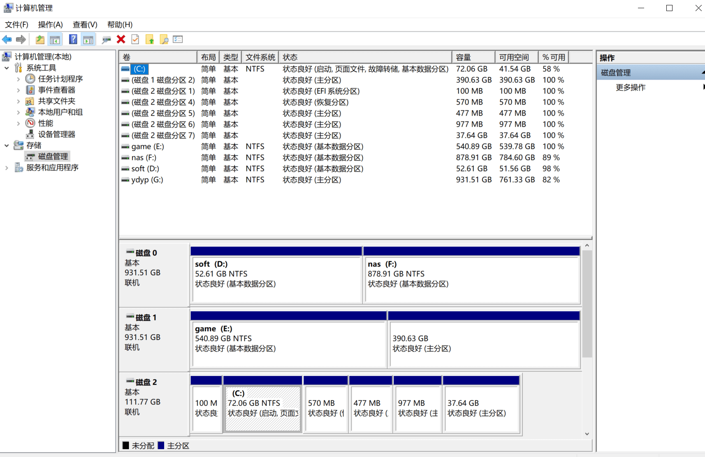
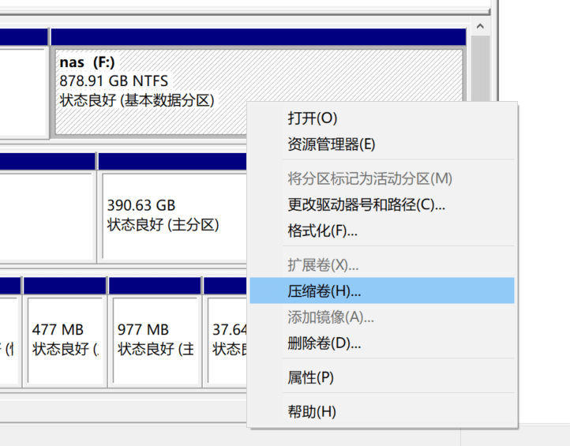
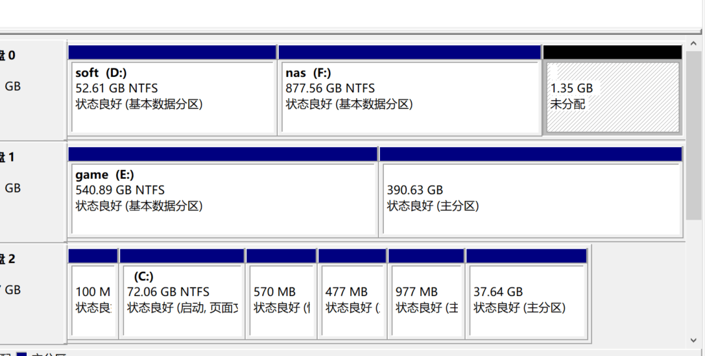
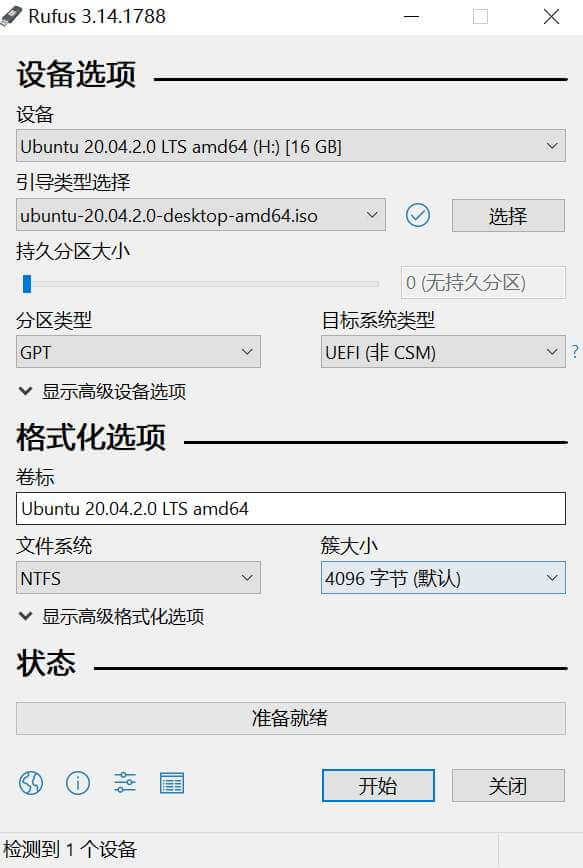
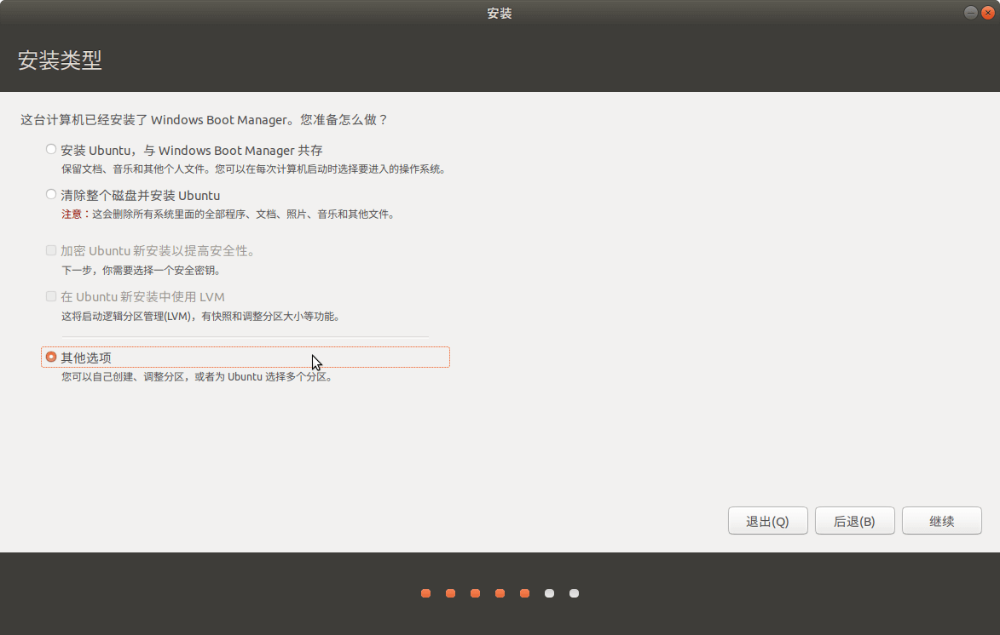
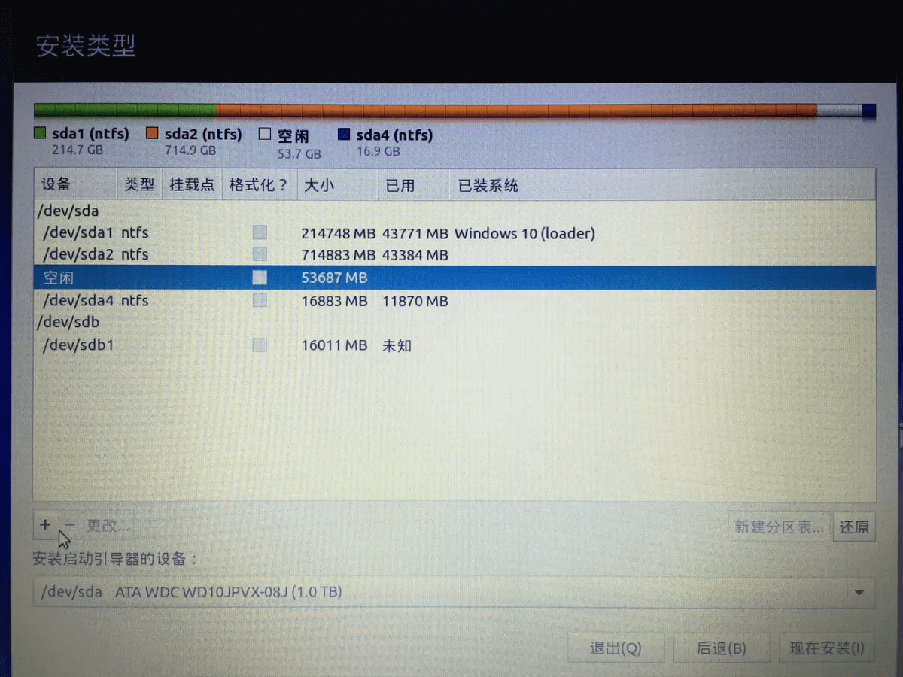

# 如何安装双系统（windows10 和 Ubuntu 20.4 详细教程）

最近因为要开始学深度学习了，需要牛逼点的显卡，我有一个 GTX 1070，但是在我家那台台式电脑上，用的是 windows，起初尝试在 windows 上安装 tensorflow，安装倒是没问题，也能用，但就是不能使用 GPU 来训练。安装官方的文档折腾了很久也不行，官方强烈建议用 Ubuntu 系统来跑深度学习，可以避免很多不必要的麻烦。就研究了一下双系统怎么安装。

先说一下我这个教程里面是`在 windows10 的基础上安装 Ubuntu 20.4 版本`的双系统。下面来详细讲讲。

安装双系统跟安装单个系统是很类似的，只是装双系统时磁盘要准备一个未分配的分区给第二个系统。
# 磁盘准备未分配空间

打开 `我的电脑 -> 鼠标右键 -> 管理 -> 磁盘管理`，就能看到磁盘的一些信息，我们要在这些磁盘里再分一个分区出来。

选中一个还有空间的磁盘，右键点击压缩卷，从这个盘分一些空间出来。

输入要分配的空间，我们就能看到一块未分配的磁盘，这个未分配空间是给 Ubuntu 用的，分配的空间大小按你们自己来，图上的1G只是做一个例子，磁盘操作到这里就结束了，我们接下来开始制作 Ubuntu 启动盘。

# 用 U 盘制作一个 Ubuntu 的启动盘

制作启动盘推荐使用 [rufus]()。还要下载一个 Ubuntu 的 iso 镜像，去官网很容易就下载到了。

打开 rufus，按如下选项点击开始制作启动盘。

# 安装 Ubuntu 系统

重启电脑，进 bios 页面，选择 U 盘启动。顺利的话就会进入 Ubuntu 的安装界面。

> 但是我第一次做了一个 Ubuntu 18.4 版本的启动盘，不知道为什么 U 盘启动后进入了 grub 命令行。后面又重新做了一个 Ubuntu 20.4 版本的启动盘就不会了。

安装引导页面里面只有一个挂载磁盘比较重要需要说一下，其他设置根据提示自己就可以决定。

在`安装类型`这个步骤，我们选择`其他选项`，就是说我们要自己去创建和调整分区。

还记得我们一开始在 windows10 系统中划出了一个未分配的磁盘么？首先我们要先找到这个磁盘。

实际上这里可能会显示很多空闲的盘，看右边大小是不是我们刚刚弄出来的未分配磁盘的那个大小。

这里是参考网上其他文章的，主要有4个目录要挂载：

> /boot 分区，分配 500 M 差不多了，作用是安装 grub，存放 linux kernel 以及 iniyrd 映像，都是启动时必须的东西。

> / 根目录，50G 差不多了，要想 Ubuntu 使用固态硬盘，就把根目录挂载在固态硬盘上。

> /home 实际工作目录，也可以不设置挂载点。如果不搞 home 目录就把所有空间都分配给根目录。

> /swap 交换分区，是内存不够的时候会使用到，网上有说建议是设置成和内存一样大小，但是我感觉 16G 内存应该不会不够用把，这里我只设置成 1G。

找到我们的未分配磁盘后，在未分配磁盘上点击添加，根据上面的划分规则依次添加进去。然后点击下一步。

安装完成后重启就会进入系统选择的页面。

# 更改默认启动的系统

以上安装好后会每次开机会进入系统选择的页面，但是如果我想每次开机进入 windows。这就需要进 bios 设置启动顺序，我用的是华硕 B150 主板，里面可以更改启动顺序的，把 windows 启动盘移到最上面就行了，如图。