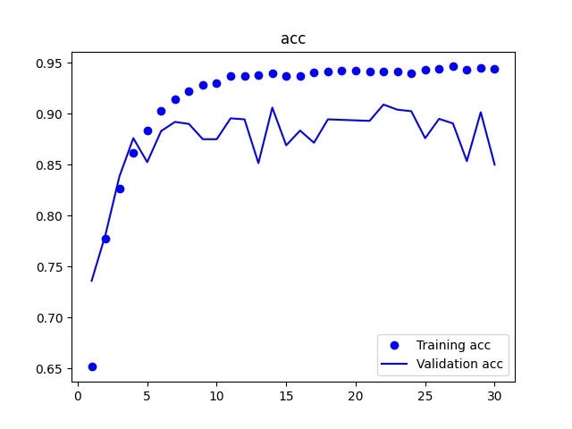
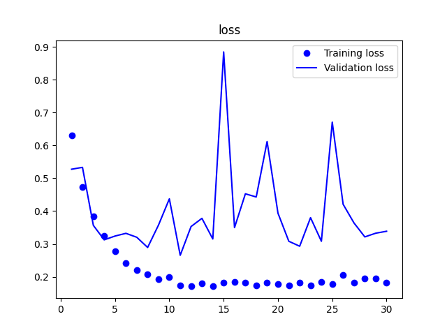

# 初探 Keras 深度学习框架

上一篇，我们了解了[神经网络的原理](./2019.12.28-深度学习入门.md)，现在，我们就用 Keras 来做一个实际的项目 - 猫狗分类器。

为什么要使用 Keras 呢，因为 Keras 比较主流，遇到问题比较好查。

我们可以在百度 AI studio 官网上面寻找训练集，官方专门有一栏 数据集的导航，里面有很多类型的数据集。找到[猫狗训练集](https://aistudio.baidu.com/aistudio/datasetdetail/23234)，

猫狗的数据集下载好后，我们还要进行一些前期的准备工作。

注意：如果要下载源码自己训练模型的话，最好是有支持 GPU 的 tensorflow 环境，我自己测试在 GPU 下训练完大概要 20-30 分钟。使用 CPU 训练的话可能要半天。[Ubuntu 下支持 GPU 的 tensorflow 安装教程](./2021.05.30-Ubuntu安装基于docker安装支持GPU的tensorflow.md)。

# 准备适合于 Keras 的数据集

Keras 规定的目录结构如下图，这样 Keras 就能知道有几个分类和对应分类下的图片了。

```
--- CatAndDog
|- test
  |- cat
  |- dog
|- validation
  |- cat
  |- dog
|- train
  |- cat
  |- dog
```

# 开始构建模型

源码在[CatDogClassifier.py](https://github.com/huangqiangqiang/dl-learning/blob/master/CatDogClassifier.py)

先说一下 `CatDogClassifier.py` 文件的用法。全部的实现都在这个 `CatDogClassifier.py` 文件里面，第一次执行的时候直接执行 `python CatDogClassifier.py` 命令，就会开始训练，训练完毕后会在当前目录生成一个 CatDogClassifier_model.h5 文件，是调用模型的 load_weight 方法生成的，我们知道，训练神经网络就是让参数去拟合训练集，load_weight 这个方法就是保存训练好的权重。对应还有一个 save 方法是保存整个模型，包含了权重和模型层级的结构。

`CatDogClassifier.py` 接受 -d 和 -f 两个参数，-d（--directory） 需要传一个目录，会预测这个目录下的所有文件，-f（--file）表示预测单张图片。

```
python CatDogClassifier.py -f dataset/test/1.jpg
```

# 代码解析

### 载入数据
了解了 `CatDogClassifier.py` 脚本的用法后，我们详细说说上面代码的含义和遇到的坑。

首先，程序的入口是 `if __name__ == '__main__'`，我们实例化了 CatDogClassifier 类并调用 train 方法。

在 train 方法中，我们首先调用了 load_data 方法，这个方法返回了 train_generator 和 val_generator， generator 是 keras 的一个概念，后面在拟合数据的时候就是从 generator 里面去批量的获取数据的，因为几万张图片不可能一次性载入到内存中，只能一个 batch 一个 batch 的获取，而且 generator 还能进行数据增强，就是对 图片数据进行随机的旋转，缩放，平移，翻转等操作，数据增强的代码如下：
```
train_datagen = image.ImageDataGenerator(
    rescale=1./255,
    rotation_range=40,
    width_shift_range=0.2,
    height_shift_range=0.2,
    shear_range=0.2,
    zoom_range=0.2,
    horizontal_flip=True,
    fill_mode='nearest'
)
```

这里需要注意的是，我们只能对训练集进行数据增强，而不能对验证集进行增强。

后面在生成 generator 时调用的参数指定了多少张图片为一个批次（batch_size），因为我们是二分类，所以 class_mode 为 binary，这个参数会影响对应的 label 标签，所以是哪种分类一定要填对。

```
train_generator = train_datagen.flow_from_directory(train_directory + '/train', target_size=(150, 150), batch_size=32, class_mode='binary')
```

load_data 之后是 createModel，创建模型。模型创建好后可以调用 model.summary() 查看模型的摘要，我这边使用的是 4 层卷积池化层+全连接层，摘要信息如下：

```
Model: "sequential"
_________________________________________________________________
Layer (type)                 Output Shape              Param #   
=================================================================
conv2d (Conv2D)              (None, 148, 148, 32)      896       
_________________________________________________________________
max_pooling2d (MaxPooling2D) (None, 74, 74, 32)        0         
_________________________________________________________________
conv2d_1 (Conv2D)            (None, 72, 72, 64)        18496     
_________________________________________________________________
max_pooling2d_1 (MaxPooling2 (None, 36, 36, 64)        0         
_________________________________________________________________
conv2d_2 (Conv2D)            (None, 34, 34, 128)       73856     
_________________________________________________________________
max_pooling2d_2 (MaxPooling2 (None, 17, 17, 128)       0         
_________________________________________________________________
conv2d_3 (Conv2D)            (None, 15, 15, 128)       147584    
_________________________________________________________________
max_pooling2d_3 (MaxPooling2 (None, 7, 7, 128)         0         
_________________________________________________________________
conv2d_4 (Conv2D)            (None, 5, 5, 256)         295168    
_________________________________________________________________
max_pooling2d_4 (MaxPooling2 (None, 2, 2, 256)         0         
_________________________________________________________________
flatten (Flatten)            (None, 1024)              0         
_________________________________________________________________
dropout (Dropout)            (None, 1024)              0         
_________________________________________________________________
dense (Dense)                (None, 512)               524800    
_________________________________________________________________
dense_1 (Dense)              (None, 1)                 513       
=================================================================
Total params: 1,061,313
Trainable params: 1,061,313
Non-trainable params: 0
```

为什么需要池化层，因为池化层能增大感受野。什么意思？每经过一个池化层，Output Shape 的输出就能减半，这就可以让最后一层的过滤器尽量包含整体的输入信息。假设模型中没有池化层，那么到 conv2d_4 这层，图片的尺寸还有 140 * 140 这么大，而 conv2d_4 这层的 3 * 3 的过滤器还是只能看到局部的信息，这可能还不足以学会对猫狗进行分类。我们需要让最后一个卷积层的特征包含输入的整体信息。

而且池化层基本只用最大池化，而不是平均池化，因为特征中往往编码了某种模式或概念在特征图的不同位置是否存在，而观察不同特征的最大值而不是平均值能给出更多信息。而且，合理的子采样应该生成密集的特征图，然后观察特征每个小块上的最大激活，而不是查看输入稀疏窗口或对输入图块取平均，因为后两种方法可能导致错过或弱化特征是否存在的信息，所以步幅我们基本也只用 (1, 1)。

注意：网络中特征图的深度在逐渐增大，从 32 到 256，而特征图的尺寸在逐渐缩小，从 150 到 2，这几乎是所有卷积神经网络的模式。

model 中的每一层都有名字。
第一列的 Layer (type) 就是显示的层的名称。
第二列 Output Shape 表示当前层的输出形状，因为我们的输入层为 (x, 150，150, 3)，x 为数据集的大小，经过卷积层之后由于卷积层的性质，高宽会减少 2，由于第一次有 32 个过滤器，所以输出的形状为 (148, 148, 32)。
第三列 Param 表示的是当前层的权重个数，表示当前层有多少个参数需要训练。第一层有 896 个参数需要训练。这个数字是怎么得来的呢？公式：32 * (3 * (3*3) + 1) == 896，32个过滤器，每个过滤器高宽都为 3，有 3 个通道，最后 +1 是因为存在偏置。

模型的构建我在实战的过程中也总结出了一些经验。

模型构建好了，接下来调用 compile 方法编译模型，一般就那么几类参数，如果是猫狗二分类问题的话，固定这么写就可以了

```
model.compile(optimizer='rmsprop', loss='binary_crossentropy', metrics=['acc'])
```

接下来我们调用 fit_generator 方法来拟合，它和 fit 方法相同，只是 fit 要一次性的把 数据载入到内存中，而 fit_generator 则是创建一个生成器，实时生成数据。generator 是一批一批地生成数据的，正因为数据是不断生成的，Keras 模型需要知道一次性从生成器中获取多少个样本，这就是 batch_size 的作用。虽然是实时生成数据的，但是数据量也不是无限大的，`虽然增强了数据集，但是数据集的大小还是原来那么大，只是在返回原始图片的时候会对图片进行随机的增强，返回增强的图片，这是需要注意的`。

```
history = model.fit_generator(train_generator, epochs=30, validation_data=val_generator)
```

fit_generator 是实际开始训练模型的方法，我们的代码会阻塞在这一行， fit_generator 这个方法第一个参数就是传入 train_generator， epochs 代表训练的轮数，训练集中所有的图片都遍历一次算一轮（这个说法不准确，实际上还有一个 steps_per_epoch 参数来控制多少算一轮，除非你不想用到所有的训练集才设置这个值），这里我们训练 30 轮。validation_data 这个参数传入验证集，每训练完一轮就会拿当前状态的模型跑一遍验证集，把结果给记录下来，存到 history 变量里。

history 变量保存每一轮的 loss 和 acc 的值，方便我们分析。

最后，我们调用 showAcc 和 showLoss 函数把这 30 轮的训练过程通过图表的形式展现出来。

# 分析 history

<div align="center"></div>

<div align="center"></div>

上面一张表示预测的准确度。原点表示在训练集中的预测精确度，折线表示在验证集中的精确度。从图中可以看到，经过长时间的训练，模型在训练集中的精确度一直在提高，但是在验证集中的准确度却没有提高，在训练到 7-8 轮的时候差不多就已经到达峰值了，也就是说，在 7-8 轮之前，模型是欠拟合的，7-8 轮之后，模型过拟合了，所以，我们可以把 epoch 参数从 30 改为 7 就可以了。这就是验证集的作用，指导我们调节超参数。

从第二张图中的损失值中，我们也可以得出相同的结论，这里就不再说明了。
