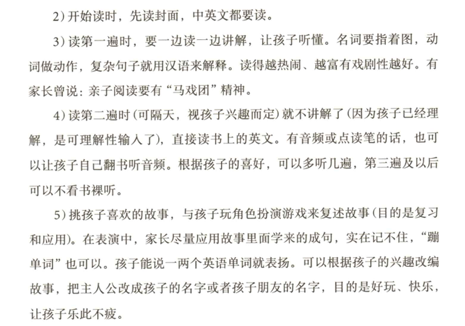

# 小孩英语学习记录

## 前言

为什么要这么早学英语？

以前我也是觉得不用这么早学英语，等到小孩三四年级之后再开始学也不迟，太早开始会跟语文的拼音搞混之类的，这些都是我当时的一些主观想法。直到后面经历过一些事情，才慢慢转变了想法。而且**英语是唯一一门在小学阶段就能达到国内高中水平的学科。**

---

## 错误的方法

英语学习需要正确的方法。

我最开始给孩子学英语用的是牛津少儿英语 **Lets Go**，这是小学英语老师推荐的教材。学习方式是：让他听着音频，听一句跟读一句。教材每一章的内容结构基本都差不多：开头是常见对话，接着是一首英文歌，然后学习几个单词，最后再教一点字母发音。

一段时间学下来后效果并不好。比如我们读到第三章了，再回顾第一章和第二章的内容，里面的对话问他什么意思，或者问他“你好吗”的英语怎么说，这个对话在第一二章出现过，但他大概率会说不知道。

我们学习了两个月，这段时间 **孩子很痛苦，我也很痛苦**。

---

## 令我惊讶的例子

后来遇到一个朋友，他也在教小孩子英语，已经有9个月了。他孩子目前的进度是 **可以听懂小猪佩奇的音频**。

最开始我其实不太相信。我们很多人学了将近10年的英语，看小猪佩奇动画片都未必能完全听懂，一个小孩子学不到一年怎么可能？

有一次我打开小猪佩奇的视频，随便播放了一集，没有让孩子看画面，只让他听音频。听了几句之后，他确实能说出大概意思，还会挑出句子里的某个单词问我知不知道意思。从这个情况看，他确实是听懂了。

---

## 好的学习方式应该是什么样

这位朋友推荐我看盖兆泉的两本书：

- [《做孩子最好的英语学习规划师》](https://anyflip.com/sckew/vzjl/)
- [《做孩子最好的英语学习规划师2：懒人解决方案》](https://online.anyflip.com/sckew/irvl/mobile/index.html)

  
  

他说这两本书是 **国内很多英语博主和机构的底层逻辑来源**。

第一本书主要讲理论，第二本书讲实践，比如从3岁开始学的孩子，学习路线是什么，用哪些学习资料，怎么使用这些资料，都写得非常详细。

看完之后，我以前的一些观念基本被推翻了。书里有几个核心观点：

1. **学英语越早越好，3岁以后就可以开始。**  
2. **英语应该当作一门语言来学，而不是一门学科。**  
3. **要区分“学得”和“习得”。**

关于第一点，我以前一直觉得一年级开始学太早，而且担心会和拼音混淆。事实证明，孩子可能会混几次，但很快就能区分出这是两种不同的语言。

关于第三点：

**学得（Learning）**  
有意识地学习语言，比如背单词、学语法，这是传统的英语学习方式。

**习得（Acquisition）**  
通过大量接触语言，在潜移默化中学会，比如孩子学习母语。

我们很多人小时候都是通过“学得”学英语，所以会觉得这种方式很正常。但对孩子来说，这种方法其实并不适合，因为需要一定的自控力和理解能力。

像我们学习中文母语，都是小时候先大量听，然后才会说，接着才进入学校学习读和写。  
学英语其实也是一样的，**听 → 说 → 读 → 写** 的顺序最好不要打乱。

---

## 重新开始

后来朋友推荐我使用 **RAZ 分级阅读**。RAZ 是一套英语分级阅读材料，从 AA 到 Z 共 27 个等级。

因为孩子已经是一年级下学期，所以我让他 **听和读一起进行**。从 AA 开始，每一页通常只有一两个单词，再配上插图，即使零基础也能理解。

在陪孩子学习的过程中，我也慢慢开始在小红书上找资料，看别人分享的一些学习方法。这个过程中经常会遇到一些词，这里简单说明一下：

- **原版娃**：按照听说读写顺序学习英语的孩子，就像学习母语一样。  
- **桥梁书 / 章节书**：桥梁书图多字少，章节书图少字多。  
- **AR值 / 蓝思值**：表示阅读难度，数值越大难度越高。

---

## 2025年3月 - 4月

虽然可以直接读 RAZ，但我还是花了一个多月时间让孩子积累最初的 **200个词汇量**。

主要方法是看动画：

- 巧虎学英语
- WOW English

在陪看的过程中，我自己也学到了一些日常口语，比如：

- **wake up**（起床）
- **wash your hands**（洗手）

平时生活中尽量用英语表达，比如能用英文说的词就用英文说，尽量给孩子创造一个英语环境。

每看完一集动画，我都会和孩子玩一些小游戏来复习刚学到的单词。例如：

我说 **head**，孩子就指头；  
动词就通过做动作的方式表达。

通过这种游戏互动的方式，很快就能积累最初的100到200个单词。

另外我还买了一个 **倾听者**，它有一个屏幕，但不能播放视频，只能听音频。这个设备非常适合用来拉听力。

盖兆泉的理论是：**学英语首先是听，而且要听可理解的内容**。听完全听不懂的音频其实意义不大。所以像看过的动画片或者读过的 RAZ，就非常适合反复听。

这个阶段我们主要听：

- WOW English  
- 巧虎英语音频  

通常是在孩子玩玩具、吃饭、刷牙或者骑车的时候播放。

每天大概：

- 陪他学习和玩游戏 **1小时**
- 听英语 **30分钟**

---

## 2025年5月 - 6月

开始正式读 **RAZ**。

因为之前已经积累了一些词汇，从 AA 开始读会比较轻松。阅读方式是 **滚动阅读**：

每天读：

- 新书 5 本  
- 旧书 5 本  

如果有不会的单词就用点读笔。

这个阶段需要家长在旁边陪着，否则小孩子一个人很难坐得住。这样持续了两个月左右，读到了 **RAZ B**。

同时还在看 **Little Fox Level1** 的动画，比如：

- single stories  
- where am i  
- who am i  
- kelly's class  

动画看完后，就把音频放进倾听者里反复听。

---

## 2025年7月 - 10月

这段时间 RAZ 从 **C 读到 E**。从 C 开始明显感觉速度慢下来了，因为句子变长了，每页的单词也更多，所以每天阅读的数量减少了一些。

动画方面继续看 Little Fox，例如：

- bat and friends  
- bird and kip  

后来开始尝试每天看 **4集小猪佩奇**，大约20分钟左右。半个月左右把第一季看完，然后继续听音频。

刚开始孩子说看不懂，我就把台词打印出来，读几遍再配合音频听，过一段时间后就慢慢适应了。

读完 RAZ E 之后，我还让孩子尝试唱一些英文歌曲，例如：

- A little love  
- Monsters  
- Dream it possible  

看着歌词和翻译一起唱。

---

## 2025年11月 - 2026年1月

这个阶段读到 **RAZ F** 时明显感觉有些吃力，于是开始增加一些其他阅读材料，比如 **Fly Guy**。

阅读安排调整为：

每天  
- 新 2 本  
- 旧 2 本  

同时继续每天看 **4集小猪佩奇**，有空就听佩奇音频。

后来我意识到一个问题：**听力积累还远远不够**。朋友的经验是，当听力词汇达到 **3000词** 时，阅读 RAZ 会轻松很多。判断方法是：如果在没有看过动画的情况下直接听小猪佩奇音频还能听懂，说明差不多达到这个水平。

很明显，我孩子当时还远远没有达到。

于是读完 F 后，我 **暂时停止了 RAZ 阅读**，开始重点练听力。每天听两集佩奇音频，听一句让孩子复述一句，如果两遍还没听懂就看一下台词。

白天有空就见缝插针播放音频，最好是前一天刚听过的内容。

一段时间之后，我发现孩子的听力进步非常明显。以前看英文版小猪佩奇会排斥，现在有时会自己主动打开看。而且小孩子的听力和记忆力真的比大人强，很多时候我需要听好几遍才能听出来的句子，他听一遍就能说出来，甚至还能接出下一句。

---

## 2026年2月至今

在把佩奇第一季全部听过一遍之后，我们开始读 **Frog and Toad**。

阅读方式是每天读两章，如果有比较难的句子就问孩子知不知道意思，不知道再解释一下，确保读完后能理解。基本上这时候大部分句子他已经可以自己读懂了。

大概 **4天读完一遍**，然后每天听两章音频，大约 **10天听完**。

寒假时我给孩子测了一下词汇量，使用的网站是：

https://testyourvocab.com

测试结果大概在 **2000-3000词之间**。

最近开始让他学习 **雪梨老师的自然拼读课程**。虽然听力词汇量还没有完全达到理想水平，但可以先慢慢接触。

自然拼读和音标解决的其实都是同一个问题：**单词发音**。自然拼读是学习字母和字母组合的发音规则，然后根据规则去猜单词怎么读，大约70%到80%的情况可以读对。

不过自然拼读并不适合完全零基础的孩子。正确的使用方式是：**孩子先有足够大的听力词汇量**，最好达到3000词左右。这样在阅读时遇到新单词，可以通过自然拼读猜读音，再和脑海里已经听过的声音进行匹配，就能理解这个词的意思。

如果孩子之前没有听过这个词，就算能读出来，也不知道是什么意思。

目前我已经意识到孩子的 **听力积累还不够**，所以也在慢慢减少阅读时间，增加听力时间。看看过一段时间之后效果会不会更好。

先记录到这里，**几个月后再更新。**